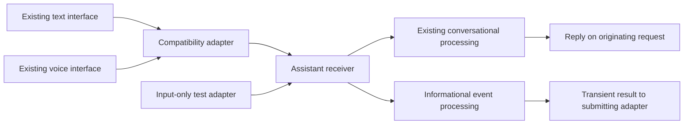

# 274. Channel inputs share an assistant receiver, and reply delivery is optional

- Status: Partially superseded by ADR-0275 (§1, §3 and §5–§8's event/context and speech-ending persistence, capture reporting and post-processing cleanup)
- Date: 2026-09-17
- Scope: [Milestone 1](https://github.com/leonapivato/ai-assistant/milestone/1), [#2521](https://github.com/leonapivato/ai-assistant/issues/2521).
- Owner authorization: Reviewed and authorized for ratification on 2026-09-18; the owner assigned ADR-0274.
- Partially superseded: 2026-09-18 by ADR-0275 — Permit post-processing persistence of
  event/context and new speech endings, add required capture reporting and bounded
  recording cleanup; the informational processor itself still owns no writer and
  performs the same one completion. Existing input/reply combinations and processing
  policies remain. These scoped replacements take effect on ratification of ADR-0275,
  which remains Proposed. This reciprocal header record accompanies the numbered draft
  under ADR-0070 and ADR-0082; prior supersessions and the ratified body below are
  preserved.

## Context

The agreed first scope of milestone 1 is a common channel/input contract for
existing conversational interfaces and a representative input-only adapter.
Channels identify where input arrives; modality identifies how it was supplied.
Channel context is optional, and a channel need not support replies. Existing
conversation continuation, streaming, and spoken delivery remain requirements.

The owner reviewed the working proposal and selected informational-only
processing for the input-only demonstration. It creates no conversation, goal,
or episode. The proposed operation is a transient factual summary of supplied
event material, returned to the submitting adapter without a user-facing reply.
After reviewing the draft and clarifying the distinction between input channels
and independently initiated output, the owner authorized ratification. This
decision keeps channels scoped to incoming input and their optional replies;
independently initiated output remains with existing tool and notification
mechanisms.

The inspected baseline is `cc5c6788`. `AssistantEngine.converse`,
`AssistantEngine.converse_streaming`, and `AssistantEngine.converse_spoken` in
`core/protocols.py` expose the existing inputs. `Engine._run_turn` in
`orchestration/engine.py` begins a conversation, reads its history, associates
a goal, and invokes the existing processing workflow. Its conversation ID also
participates in read footing, goal engagement, and capture. An input-only event
cannot enter that method by setting an ID to `None`: that starts a conversation.

`ConversationLifecycle.begin` in `orchestration/conversations.py` delegates
allocation to the store. `Engine._converse_spoken` transcribes before starting
a turn, so a recording with no words creates no conversation. Those facts affect
where channel identity can be resolved.

`wire/surface.py` derives operations and validators from `AssistantEngine`.
Its `_reaches_audio` walks typing arguments but not pydantic model fields.
Nesting audio inside a new envelope therefore needs an explicit extension of
its refusal protection. The new envelope also has a size cost; counting it on
legacy calls would shrink their previously supported inputs and replies.

## Decision

### 1. Status and scope

> **Normative.** This ADR remains `Proposed` until the owner has reviewed it and
> authorizes ratification; neither successful automated review nor completion of
> this drafting task authorizes changing its status to `Accepted`.

> **Normative.** Implementations against the changed shared contracts wait until
> this ADR has an assigned number, is ratified, and is merged separately under
> ADR-0015 §5.

> **Normative.** This decision establishes channel identity, input/context
> carriage, receiver operations, existing conversational conversion, and the
> informational event operation in §7; it adds no durable activation lifecycle,
> episode redesign, event scheduling, observation, archive retrieval, workspace,
> new external integration, or change to goal association or the six phases.



### 2. Identity and initial supported policies

> **Normative.** A channel identity is the pair `channel_type` and `instance_id`;
> equality compares both normalized fields, and neither field conveys authority,
> output audience, modality, memory ownership, or ownership of ongoing work.

> **Normative.** `conversation` identifies the existing conversational policy,
> with the existing store-minted conversation ID as `instance_id`; typed and
> spoken inputs in the same conversation have the same channel identity.

> **Normative.** `informational_event` identifies §7's policy; its adapter supplies
> a source-local instance ID, and the receiver neither registers a channel row
> nor requires that ID to name a conversation or any other stored entity.

> **Normative.** Channel type is an `Identifier`, not a new closed enum, but these
> two strings are the complete supported dispatch set in this decision; any
> other type is refused with `ValueError` before processing or model I/O.

> **Normative.** `NewConversation` requests store-owned allocation and is valid
> only for the conversational combinations in §4; an existing conversation ID
> that is absent or deleted remains `UnknownConversationError` whenever the
> corresponding existing operation would resolve it.

> **Normative.** Allocation and continuation occur at the current lifecycle
> point, once per conversational request; a spoken input producing no words
> creates no conversation and performs no new conversation existence check.

An adapter-supplied event ID is a label within the already authenticated
caller's input, not proof of a sensor's authenticity. There is no registration,
inheritance hierarchy, registry discovery protocol, or channel store here.

### 3. Public data shapes

> **Normative.** Add the models and aliases defined in the following tables to
> `core/types.py`; all new models are frozen pydantic models with `extra="forbid"`,
> all tuple contents are typed, and their listed fields are the complete shapes.

Existing types below retain their own validators. `Literal` tags have their
listed values as defaults. Other defaults are shown explicitly; an unmarked
field is required. The tables define data, not a requirement to spell Python
declarations in a particular order.

| Model | Fields |
| --- | --- |
| `ChannelIdentity` | `kind: Literal["channel"]`; `channel_type: Identifier`; `instance_id: Identifier` |
| `NewConversation` | `kind: Literal["new_conversation"]` |
| `TextChannelPayload` | `modality: Literal[Modality.TEXT]`; `text: EncodableText` |
| `SpeechChannelPayload` | `modality: Literal[Modality.SPEECH]`; `audio: SpokenAudio` |
| `ChannelContextItem` | `text: NonBlankEncodableText \| None = None`; `item_id: Identifier \| None = None`; `source: NonBlankEncodableText \| None = None` |
| `ChannelContext` | `history: tuple[ChannelContextItem, ...] = ()`; `reply_to: ChannelContextItem \| None = None` |
| `ConversationInputOptions` | `reference: TurnReference \| None = None`; `delivery: SpokenDeliveryReport \| None = None` |
| `ChannelInput` | `target: ChannelTarget`; `payload: ChannelPayload`; `context: ChannelContext =` a fresh empty value; `conversation: ConversationInputOptions \| None = None` |
| `WholeTextReply` | `kind: Literal["whole_text"]` |
| `StreamingTextReply` | `kind: Literal["streaming_text"]` |
| `SpokenReply` | `kind: Literal["spoken"]`; `plays: tuple[SpokenAudioFormat, ...]` |
| `TextChannelResult` | `kind: Literal["text"]`; `outcome: TurnOutcome` |
| `SpokenChannelResult` | `kind: Literal["spoken"]`; `outcome: SpokenTurn` |
| `InformationalEventResult` | `kind: Literal["informational_event"]`; `summary: NonBlankEncodableText` |
| `ChannelResult` | `channel: ChannelIdentity \| None`; `result: ChannelOutcome` |

| Alias | Members and discriminator |
| --- | --- |
| `ChannelTarget` | `ChannelIdentity \| NewConversation`, discriminated by `kind` |
| `ChannelPayload` | `TextChannelPayload \| SpeechChannelPayload`, discriminated by `modality` |
| `ReplyCapability` | `WholeTextReply \| StreamingTextReply \| SpokenReply`, discriminated by `kind` |
| `ChannelOutcome` | `TextChannelResult \| SpokenChannelResult \| InformationalEventResult`, discriminated by `kind` |

> **Normative.** Reuse ADR-0221's `Modality.TEXT` and `Modality.SPEECH`, serialized
> as `text` and `speech`; a textual event is text modality, and no second modality
> enum or independent contradictory modality flag is introduced.

> **Normative.** A `ChannelContextItem` contains text, an item ID, or both;
> source attribution alone is invalid, and every `history` member contains text.
> The order of `history` is supplied oldest first and preserved without sorting.

> **Normative.** A replied-to item's ID is local to the input's channel; it is
> not a fetch instruction, a cross-channel reference, a memory ID, or a
> `TurnReference`, and the receiver performs no lookup on its authority.

> **Normative.** `SpokenReply.plays` is nonempty and retains caller preference
> order; selection and degradation follow the existing spoken operation.

> **Normative.** Snapshot and validate the complete input, reply declaration,
> and nested values before the first await that admits processing; caller
> mutation afterward cannot change the input processed, its identity, or its
> reply route, including mutable values nested in otherwise frozen models.

> **Normative.** Typed text and the transcript produced from speech retain their
> exact supplied bytes at the channel boundary; current downstream request
> normalization is unchanged, and no adapter invents a transcript for a channel
> providing no history.

### 4. Receiver methods and supported combinations

> **Normative.** Add exactly the following two methods to `AssistantEngine`,
> with one positional subject and required keyword-only `reply` and `timeout`;
> `receive_streaming` is a regular method returning an async iterator, whose
> first union arm is the chunk and second is the terminal result.

```text
async def receive(
    self,
    input: ChannelInput,
    *,
    reply: WholeTextReply | SpokenReply | None,
    timeout: timedelta,
) -> ChannelResult

def receive_streaming(
    self,
    input: ChannelInput,
    *,
    reply: StreamingTextReply,
    timeout: timedelta,
) -> AsyncIterator[ReplyChunk | ChannelResult]
```

> **Normative.** The following table is the complete admitted combination set;
> any other combination raises `ValueError` before processing, with no model,
> store, transcription, or reply-delivery side effect.

| Target | Payload | Method and reply | Processing policy |
| --- | --- | --- | --- |
| `NewConversation` or `conversation` identity | Text | `receive`, `WholeTextReply` | Existing `converse` |
| `NewConversation` or `conversation` identity | Text | `receive_streaming`, `StreamingTextReply` | Existing `converse_streaming` |
| `NewConversation` or `conversation` identity | Speech | `receive`, `SpokenReply` | Existing `converse_spoken` |
| `informational_event` identity | Text | `receive`, `None` | §7 |

> **Normative.** A text conversational input admits `reference` and refuses
> non-`None` `delivery`; a spoken input admits `delivery` and refuses non-`None`
> `reference`; an event refuses any non-`None` `conversation` options object.
> Omitted options and an empty options object are equivalent only for
> conversational inputs.

> **Normative.** Preserve all current `TurnReference` and playback-report
> validation and resolution rules, including refusal of a delivery report on
> `NewConversation` or with `UNKNOWN` state, and benign discard where the named
> earlier turn does not resolve under the existing spoken operation's rules.

> **Normative.** Resolve the processing policy from the validated combination
> using code-owned mappings; there is no caller-supplied audience, permission,
> budget multiplier, or hidden legacy-policy selector on the new surface.

> **Normative.** A conversational call preserves the timeout meaning of its
> corresponding old operation, including the whole speech-call budget and
> current planning-operation budgets; §7 alone defines the event deadline.

### 5. Context reaches processing without acquiring authority

> **Normative.** The common receiver passes a per-call, immutable resolved input
> to the production processing entry point: resolved channel identity, supplied
> text or speech transcript, original modality, and the attached context; a
> blank spoken input returns through §6 before that entry point is invoked.

This resolved carrier is orchestration-local, not another public Protocol or
persisted record. The raw recording is transient input to the existing speech
stage; the carrier retains its modality after transcription.

> **Normative.** Conversational processing receives supplied context separately
> from `ConversationLifecycle.history`; supplied context neither replaces nor
> duplicates the store history read, and its absence does not disable ordinary
> memory retrieval or existing continuation behavior.

> **Normative.** The first conversational conversion does not insert supplied
> context into prompts, memory, conversation history, or authority records;
> its acceptance obligation is intact delivery to processing, not a new
> interpretation or reference-resolution behavior.

> **Normative.** A source label, claimed speaker, or replied-to item does not
> establish an assistant-authored message, an owner instruction, or permission;
> in §7's prompt every supplied value is quoted source data, never a model role
> or system instruction, following ADR-0098 §2.

### 6. Results, routing, and compatibility

> **Normative.** Every successful text conversational result has a
> `conversation` channel whose instance ID equals its enclosed
> `TurnOutcome.conversation_id`; every nonempty spoken result has the same
> invariant against its enclosed outcome, and incompatible shapes fail model
> validation.

> **Normative.** A blank spoken result wraps the existing empty `SpokenTurn`
> with `channel=None`, whether its input named a conversation or requested a
> new one; no unvalidated existing ID is reported as a resolved identity.

> **Normative.** An informational result has the input's `informational_event`
> identity and no `TurnOutcome` or `SpokenTurn`; the existing meanings and
> validators of those old models, including a `None` conversation ID on certain
> resumptions, are unchanged.

> **Normative.** Replies and results return only on their originating call or
> iterator, including overlapping calls with the same channel identity; the hub
> does not dial a spoke or route by a mutable current-channel slot.

> **Normative.** Reply declarations contain no callback, destination URI, or
> remote address; `reply=None` produces no conversational reply, audio, stream,
> fallback notification, or independently scheduled delivery.

> **Normative.** `receive_streaming` yields zero or more `ReplyChunk` values and
> exactly one final `ChannelResult` on successful iteration; the enclosed
> `TurnOutcome` remains authoritative and its reply matches the emitted chunks
> under ADR-0173's existing success and partial-degradation rules.

> **Normative.** Closing or losing a conversational stream preserves ADR-0173's
> existing completion/capture behavior and the caller's iterator-closing
> obligation; an error terminating iteration is not a successful terminal result.

> **Normative.** Keep the old three methods' signatures, return types, errors,
> lifecycle, disclosure, capture, and operation budgets; they construct the
> corresponding channel input and share receiver admission and production
> dispatch, then project the result to the old return shape.

> **Normative.** Compatibility adaptation uses shared private receiver machinery
> without the receiver calling the public old method again; one request admits
> one unit of tracked work, resolves its conversation at most once, and performs
> no extra model call, history read, capture, or playback-report application.

> **Normative.** The first delivery leaves existing CLI commands, browser HTTP
> routes, and rendering contracts in place; their existing calls nevertheless
> reach the common receiver through compatibility adaptation, and no new generic
> browser or unauthenticated event endpoint is added.

### 7. Informational event processing

> **Normative.** Add an orchestration-local `InformationalEventStage`, injected
> into `Engine` already wired by `app`, whose only content-processing capability
> is an injected `ModelProvider`; `Engine` does not gain direct access to a
> model provider, a store hidden inside another stage, or a provider SDK.

This follows the placement of `ComposingStage` under ADR-0170 §2. The stage
needs no new cross-subsystem Protocol: it is within orchestration, while its
model collaborator uses the existing Protocol.

> **Normative.** The application wires that stage with the existing configured
> ordinary model route and its existing wrappers, limits, and accounting; no
> separate event-model setting, adapter-provided model override, or new external
> data fetch is introduced.

> **Normative.** The stage originates exactly one `ModelProvider.complete` call
> for an admitted event, unless its deadline expires before the call; it adds
> no orchestration retry or repair loop, while existing provider retry/routing
> policy remains in force.

> **Normative.** The event model input consists only of a fixed summarization
> instruction and the supplied event text and context encoded as quoted source
> data; the stage asks for one short factual summary, explicitly treats source
> instructions as material to describe, and retrieves no assistant memory,
> context-provider state, archive data, or conversation history.

> **Normative.** The stage neither calls a planner, goal associator, tool,
> synthesizer, notification service, nor any content-store writer; it creates
> no conversation, goal, attempt, plan, episode, or archive entry.

> **Normative.** A usable completion has role `ASSISTANT` and nonblank encodable
> text; retain that text without truncation in `InformationalEventResult.summary`,
> and construct the result's identity from the accepted input, never model output.

> **Normative.** The summary is an interpretation of supplied material, not a
> verified fact, stored belief, authorization, or evidence that an action ran;
> the submitting test adapter inspects it as an operational result and sends no
> message back to the source or to a user interface.

For example, `informational_event / thermostat-1` can supply "The thermostat
entered eco mode at 18:00" and receive a transient summary of that fact. This
test distinguishes processing from an input recorder returning "accepted".
Its deterministic guarantee is routing and validation, not arbitrary model
output's factual accuracy.

> **Normative.** Event `timeout` is a monotonic wall-clock budget starting at
> receiver admission and ending after result validation; a nonpositive budget
> performs no model call, expiry cancels and awaits active work, and the full
> remaining budget covers the configured provider's retry/fallback behavior.

> **Normative.** Event calls participate in the engine's existing admission,
> shutdown, and in-flight tracking; delivered cancellation propagates after
> cleanup, while ordinary transport disconnect follows the hub's existing
> in-flight-call lifecycle and does not create a durable job or delivery promise.

> **Normative.** No event payload or summary is written to application logs,
> traces, or content stores by this operation; existing required operational
> telemetry and model accounting remain in force without copying those values
> into them, and the operation introduces no content-retention setting.

> **Normative.** Channel identity is not an idempotency key; two submissions run
> twice, and this decision provides no durable receipt, replay, automatic
> resubmission, or exactly-once event processing.

### 8. Validation, errors, and payload accounting

> **Normative.** Apply the existing identifier normalization, UTF-8 validation,
> decode/validate/measure order, canonical encoding, and deployment payload limit
> from ADR-0085 and ADR-0087 to new calls, counting attached context and all
> public input/result wrapper fields; no context is silently dropped or truncated.

> **Normative.** Public `receive` and `receive_streaming` calls measure their
> declared shapes, while compatibility calls measure the old operation's
> declared shapes; the trusted entry method selects the measurement projection,
> which is internal data and is not supplied over the wire or by the caller.

> **Normative.** Internal envelope construction never reduces a legacy call's
> allowed request size, reply room, or audio allowance; streaming room is computed
> against the actual public terminal projection before yielding each chunk.

> **Normative.** Apply the existing spoken audio limit and synthesis-size
> degradation using the selected public result projection; if removing rendered
> audio still leaves an oversized result, raise `OversizedValueError`, and
> neither partial audio nor truncated context substitutes for a valid result.

> **Normative.** An oversized new text or event result raises
> `OversizedValueError`; conversational work already committed is not rolled
> back merely because its result cannot cross the boundary, retaining ADR-0085
> §8e's residual and ADR-0173's stronger streaming ceiling.

> **Normative.** Add `ChannelProcessingError(AssistantError)` and its subclass
> `ChannelProcessingTimeoutError` in `core/errors.py`, each with only the standard
> message constructor and no content-bearing detail fields, for §7's failures.

> **Normative.** The following error partition is complete for the new behavior;
> unexpected defects propagate rather than being relabeled as successful or
> degraded processing, and old conversational failures keep their types.

| Condition | Result |
| --- | --- |
| Malformed models, unsupported channel/combination, invalid options | `ValueError` before processing; current transport refusal encoding remains applicable |
| Oversized input, audio, or output | `OversizedValueError`, with the projection and speech exceptions above |
| Missing conversation when the corresponding conversational operation resolves it | Existing `UnknownConversationError` |
| Conversational transcription, planning, context, audit, or other declared failure | Existing corresponding operation's failure/degradation partition |
| Event budget expiry or provider `ModelTimeoutError` | `ChannelProcessingTimeoutError` |
| Other event provider `ModelError`, including a classified refusal | `ChannelProcessingError` |
| Event completion with wrong role, blank text, or unusable encoding | `ChannelProcessingError` |
| Event caller cancellation | Propagated cancellation after cleanup |

> **Normative.** Event error messages are fixed application-authored summaries;
> translated errors retain no original exception chain or supplied content, and
> no success-shaped receipt represents an error or a merely admitted event.

> **Normative.** Nested-audio validation at any new parsing entry point preserves
> ADR-0200 §9's non-disclosure rule; extend audio-bearing detection through
> pydantic fields and typing aliases with cycle protection, and never echo or
> chain rejected audio through validation errors, transport errors, or logs.

### 9. Transport and subsystem boundaries

> **Normative.** The new operations are on the existing authenticated hub/wire
> boundary and its `EngineClient`; method reflection, codec rules, error
> reconstruction, frame correlation, and existing connection concurrency limits
> remain applicable, with `ReplyChunk | ChannelResult` as the streaming union.

> **Normative.** No transport or interface obtains new authority from channel
> metadata, and existing gateway method exposure restrictions remain unchanged;
> a generic receiver cannot tunnel an otherwise unavailable hub operation.

> **Normative.** Move `PROTOCOL_VERSION` by exactly one in the contract-surface
> implementation slice and update its closure/version tests and client methods
> together; the existing version-mismatch behavior applies, with no claim that
> old wire binaries can invoke the new surface.

> **Normative.** Keep adapters thin, production processing in orchestration,
> concrete construction in `app`, and shared types/Protocols in `core`; no
> subsystem gains a concrete import from another subsystem to implement the
> receiver or its stage, and the existing import boundary checks remain binding.

### 10. Relationship to existing decisions

This is a substantive shared-contract decision under ADR-0015 §5. The
reconciliation below identifies the one replaced inventory clause and the
existing rules used unchanged. The accompanying earlier-ADR records take effect
with ratification of this decision.

> **Normative.** The new receiver's conversational combinations are alternate
> entries to the existing conversational operations, not new audience or work
> policies; clauses keyed to `converse`, `converse_streaming`, or
> `converse_spoken` apply to their mapped combination, including delivery
> stamping, origin/modality, goal association, routing, planning budgets, and
> cancellation behavior.

| Decision | Reconciliation |
| --- | --- |
| ADR-0074 §§1–3, §5 | Preserve store-owned allocation, history, and capture for every conversational turn. The §7 informational operation is not a conversational turn and creates no `TurnOutcome`; it does not weaken capture on any existing operation. |
| ADR-0084/0085 | Extend the promoted surface and its transitive type closure with §3/§4 and the two event errors. Partially supersede ADR-0085 §1's restriction to its listed request methods "and nothing else" by adding the two receiver operations; no existing type's fields change. Preserve authentication, size enforcement, canonical transport behavior, and old method signatures. |
| ADR-0170 §2 | Preserve the engine's lack of a direct model-provider capability by injecting an already-wired orchestration stage. The event summary is not `TurnOutcome.reply`. |
| ADR-0173 | Apply §4's method-reflected yielded-union rule to the new receiver's wrapper terminal type under the same chunk/result and disconnect rules. Its `converse_streaming` annotation and payload room are unchanged; no clause of ADR-0173 is superseded. |
| ADR-0199/0200/0203/0205 | Preserve spoken audience, narrowed supply, transient audio, transcription, capture, playback, and synthesis semantics for the mapped spoken combination. No new output audience is declared. |
| ADR-0221 | Reuse the existing modality values and capture semantics; no event capture is added. |
| ADR-0228 | Preserve each mapped conversational operation's own planning budget. Events do not enter its planning loop. |
| ADR-0249/0250 | Preserve goals, attempts, association, and control-reference semantics for conversations; informational events neither engage nor create them. |

> **Normative.** Ratification records the limited replacement of ADR-0085 §1's
> method-inventory restriction on its status line and in a dated header note,
> following ADR-0070/ADR-0082; the rest of that ADR and its earlier supersessions
> remain intact.

> **Normative.** Record an explanatory dated note on ADR-0173 for the additional
> receiver using its existing general reflection rule, with no status change or
> replacement of its `converse_streaming` contract; no older decision is rewritten
> to broaden event processing.

### 11. Delivery and evidence

> **Normative.** The contract, shared conformance coverage, canonical fake, and
> primary orchestration implementation land as the contract/implementation unit
> permitted by ADR-0137 §2; the wire version and client surface change accompany
> that unit as required by §9, and application wiring is a subsequent dependent
> composition slice, not an invented second dispatch queue in this document.

> **Normative.** Production application composition wires the event stage and
> existing compatibility paths before milestone acceptance; an unwired stage or
> a test-only replacement receiver cannot count as the delivered capability.

> **Normative.** The shared engine conformance suite and canonical fake cover
> every new public input/result/error shape; the production engine and wire client
> run the appropriate shared behavior checks, with fakes at collaborators rather
> than in place of the receiver being accepted.

> **Normative.** Acceptance evidence demonstrates every row below and retains
> the existing continuation, streaming, speech, disclosure, playback, and goal
> association regressions; an overall passing component count alone does not
> establish that an existing interface reaches the new boundary.

| Scenario | Required observation |
| --- | --- |
| Existing text interface | A real interface call crosses compatibility adaptation and the common receiver, then returns the existing response shape. |
| Identity | Two inputs in one conversation, including a text/speech transition, share an identity; another conversation differs. Allocation remains store-owned. |
| Voice | A real hub path with controlled transcriber/model/synthesizer retains speech modality, disclosure, spoken delivery, and playback reporting. Blank recordings allocate nothing. |
| Attached context | History and replied-to text/ID survive the wire and arrive intact at production processing, separately from trusted history and control references. |
| No supplied history | Empty context succeeds without a fabricated transcript; conversational memory retrieval remains available. |
| Input-only event | The real stage calls its injected model with supplied event/context, returns that completion in a typed result, and calls no conversation, goal, episode, tool, notification, or reply collaborator. |
| Concurrent inputs | Barriers overlap two different channel calls and two calls in one channel; identities, context, chunks, and results remain with their own requests. |
| Failure and mutation | Cover unsupported combinations, blank/unknown IDs, mutated nested caller data, event timeout/cancellation/model/invalid-result failures, and engine drain. No failure becomes a successful receipt. |
| Boundaries | Test near-limit legacy requests and replies, new wrapper-aware streaming and audio degradation, context overflow, nested-audio refusals without leaked input/exception chains, wire error reconstruction, and version mismatch. |

> **Normative.** A small live-model event exercise inspects whether the summary
> preserves the supplied facts and treats embedded instructions as source
> material; report the observed outputs and limitations rather than presenting
> deterministic dispatch tests as proof of model understanding.

> **Normative.** Record the tested revision, reachable interface evidence,
> residuals, and owner acceptance ruling on #2521; ratifying this contract,
> merging its implementation, or passing its tests does not itself accept the
> milestone.

## Consequences

The assistant gains a common input boundary without requiring every input to
pretend to be a conversation. Channel identity survives changes of modality;
reply routing remains naturally tied to the existing transport request. The
initial input-only exercise demonstrates actual model processing without
introducing persistence or unattended work.

The cost is additional public types and two receiver operations, compatibility
projections for payload accounting, nested-audio validation coverage, and one
small orchestration stage. Keeping old methods avoids a simultaneous interface
rewrite but leaves two public spellings of each conversational operation until
a later compatibility decision removes one.

Supplied conversational context is carried but not yet interpreted by a model.
Event summaries are transient and can be inaccurate; they supply neither memory
nor an action. Losing a result can cost a model call whose output is not
recoverable. These are explicit limits of this first scope.

Future event-driven durable work would revisit goal association, authority,
confirmation, persistence, and resumption. Additional input/output combinations,
channel types, or independently addressed replies would need explicit policies;
the common envelope alone does not settle them.

## Alternatives considered

- **Treat every input as a conversation.** This preserves the old engine shape
  but fails the agreed input-only demonstration and creates unintended work
  and history records.
- **Rename the three existing methods without a common input value.** This
  provides no shared context/identity boundary for an additional adapter.
- **A callback or reply URL on the envelope.** This adds outbound routing and
  transport obligations where returning on the initiating call already works.
- **A general activation engine in this delivery.** This would expand the
  owner-selected informational scope into durable event processing.
- **A fake event receiver returning an acknowledgment.** This demonstrates
  serialization and admission, but not assistant processing.
- **Move all conversational APIs to the new envelope immediately.** This creates
  unnecessary front-end churn and risks changing legacy size and error behavior.

## Authorization and review evidence

The owner reviewed the design, authorized ratification, and assigned ADR-0274
on 2026-09-18. Architecture and adversarial reviews of the original draft both
returned no findings in one paired round. Numbering and the accompanying
earlier-ADR records require the same review set on their own tree before the
one-line ratification commit, following `CONTRIBUTING.md` → "Finishing an ADR PR".
Review results are separate local artifacts. Implementation acceptance evidence
does not yet exist; owner approval of this contract is not milestone acceptance.
