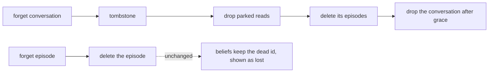

# 287. Episodes are kept until forgotten, and the transcript archive is retired

- Status: Proposed
- Date: 2026-10-03
- Scope: [M36](https://github.com/leonapivato/ai-assistant/milestone/2), reopened 2026-09-30 for [#2613](https://github.com/leonapivato/ai-assistant/issues/2613); step 3b of the plan recorded there on 2026-10-03, at the scope the owner ruled the same day, behind the cutover that steps 2 and 3 share.
- Dependency: ADR-0284, ADR-0285 and ADR-0286, implemented at `6dd92efa`.
- Authorization: on 2026-10-03 the owner ruled step 3b down to its minimum (#2613): keep today's forgetting rules, make `episode_retention` default to `None`, and retire the transcript archive with `ExchangeDisposition` ("I dont care much about getting the forgetting functionality perfect right now"). The same day the owner accepted proposal #2665 ("lgtm, convert it to the ADR") and directed its conversion into this ADR. The dispatcher assigned 0287, the next number on `main`. That authorizes drafting and numbering, not ratification or implementation.
- **Supersedes** [ADR-0225](0225-a-transcript-archive-keeps-the-exchange-as-text-and-nothing-but-the-user-reads-it.md) — **whole.** The transcript archive is removed (§2, §3 below). Its earlier partial supersessions by ADR-0248 and ADR-0283 stay on its status line as history.
- **Partially supersedes** [ADR-0074](0074-conversation-is-an-entity-and-every-turn-is-an-episode.md) — **one scope, §7's finite default.** This takes in: *"Captured episodes carry a finite `expires_at` by default"*; the setting's *"defaulting to a finite duration"*; `None`'s *"available only by the user setting it"*; the requirement that the default be finite, with the test it owes for an unset configuration; and the reasoning given for a finite default, meaning the three reconciliation bullets and the paragraph *"The default is finite, and the user may set it to unbounded"*. The default becomes `None` (§1 below). Several things stand: the setting and its type; `None` as "keep forever"; read-time enforcement and `purge_expired` under a finite window; the conversation reclaim as ADR-0283 left it; and §7's rule that `None` disables that reclaim. Every other clause stands too.
- **Partially supersedes** [ADR-0221](0221-an-episode-carries-the-reply-a-typed-disposition-and-how-the-turn-was-captured.md) — **one scope.** **§2:1–§2:5 entire, as ADR-0284 left them.** `ExchangeDisposition`, its members, their values and the two mapping functions that return them are removed (§2 below). Every other clause stands.
- **Partially supersedes** [ADR-0227](0227-a-record-the-citation-hop-reached-renders-its-reply-and-the-test-that-says-so-runs-the-real-renderer.md) — **one scope.** **§7:2's *and an `ExchangeDisposition` in `disposition`*, and its last sentence's *on a record that also carries a `disposition`***. No record carries either: ADR-0284 removed the field, and §2 below removes the type. §7:1, which says a test's records are shaped as the production capture site writes them, stands and decides the rest. Every other clause stands too.
- **Partially supersedes** [ADR-0259](0259-an-effect-is-claimed-once-per-goal-before-it-is-dispatched-and-a-turn-start-pass-reconciles-what-an-earlier-turn-left-uncertain-or-unfinished.md) — **one scope.** **§9:11's `ExchangeDisposition` limb**, from *"and **`ExchangeDisposition` gains exactly two members**"* to the clause's end. `ExchangeDisposition` and the two members it gained are removed (§2 below). §9:11's `Disposition` and `PROTOCOL_VERSION` limbs stand, and so does every other clause.
- **Partially supersedes** [ADR-0275](0275-an-episode-records-one-activation-after-processing-ends.md) — **six scopes.** **§8:3's and §9:1's archive member**: the check each of them places before the writes now comes before the episode's writes alone. **§8:5's archive projections, and its last sentence.** **§8:7's last sentence.** **§9:3 entire.** **§11:6's *through the archive-first sequence in §9*, and its third sentence.** **§13:2's ADR-0225 member.** Every other clause stands, including §9:2's retention under `episode_retention`.
- **Partially supersedes** [ADR-0283](0283-a-channels-history-is-its-episodes-and-the-turn-index-is-retired.md) — **three scopes.** **§7:2's *discards the archive entry***: where `record_turn` returns `None`, the writer deletes the episode and reports the capture degraded. **§8:1's *discards its archive entries***: deleting a conversation stamps it, drops its parked reads, then deletes its channel's episodes. **§9:1–§9:2 entire.** Every other clause stands.
- **Partially supersedes** [ADR-0284](0284-an-episode-is-the-experience-of-processing-its-activation.md) — **one scope.** **§5:3's second sentence**: `ExchangeDisposition` leaves now with the archive, as that sentence foresaw. §5:3's first sentence stands, and so does every other clause.
- **Partially supersedes** [ADR-0286](0286-an-episode-is-open-while-its-activation-runs-and-frozen-when-it-ends.md) — **five scopes.** **§2:2's archive member**: the admission write's timestamp is reused by `occurred_at`, by `expires_at` and by `record_turn`'s instant. **§3:5's *before the archive entry***: the read comes before `record_turn`, where a `record_turn` follows. **§4:4's archive entry**: once the freezing write is confirmed, a conversational finalization calls `record_turn`. **§5:3's archive member**: once the freeze is confirmed, a failure of `record_turn` is handled as ADR-0275 §8:7 and ADR-0283 §7:2 handle it. **§8:1's discard, and with it ADR-0225 §5:3's order**: `forget` on the address of an open episode marks the capture in flight there, as it does today, and then deletes the record, in the same call. Every other clause stands, including §8:2.

## Context

The owner's plan for #2613, recorded there on 2026-10-03, puts step 3b after the
observer's retirement (ADR-0285) and the open episode (ADR-0286). As first drawn, step
3b kept episodes until they are forgotten, retired the transcript archive, and made a
forget one delete that cascades to the beliefs derived from the episode. The owner then
ruled it down to the minimum the same day: keep today's forgetting rules, make
`episode_retention` default to `None`, and retire the archive with
`ExchangeDisposition`. The fuller forget cascade is deferred, and its excerpt gap is
parked as #2664.

Two things have changed under the decisions this ADR revisits. Since ADR-0284 the
episode carries the exchange itself, the input as it arrived and the response, so
the episode is the one record of an activation. Since ADR-0285 no pass distils a
conversation into beliefs, so what the user said lives in the episodes and is found
by recall (ADR-0281). ADR-0074 §7 gave episodes a finite default horizon because
they were "a different kind of thing with a shorter life": evidence that a belief
would carry past the horizon. Neither half of that holds any longer. The episode
is no longer a transient copy beside a durable record, and nothing distils it on a
schedule. A 30-day default now deletes the only record of what was said. ADR-0285
§9 anticipated this step: *"Once step 3 keeps episodes until they are forgotten,
nothing said is lost when the retention horizon passes."*

ADR-0225's archive exists because the episode used to expire: it is a second,
text-only copy of each exchange that outlives the horizon. With episodes kept until
forgotten, it is a duplicate. It has its own retention, its own destruction, and a
step in every deletion order to keep correct, all for one search command.

What the code shows, at `6dd92efa`:

- **Retention.** `Settings.episode_retention` defaults to 30 days. `None` already
  means "keep forever", and it already turns off the idle-conversation reclaim. The
  activation writer stamps `expires_at` from the setting. The store hides an expired
  record at read, and the scheduler's `retention_purge` job deletes it.
- **Two other readers borrow the window, and both handle `None`.** The
  authorization ladder in `orchestration/authorizing.py` takes ADR-0256 §1's rung
  from the window where it is finite. Where it is `None`, it falls to ADR-0256 §3's
  last rung and writes no row. The deferral store's question lifetime is
  `_DEFAULT_DEFERRAL_TTL`, its own 30-day constant (ADR-0078 §6), which is named
  after the window but does not read it.
- **The archive** (`archive/`, ADR-0225).
  - Its one write is the activation writer's, gated by `transcript_archive_enabled`.
  - Three paths discard an entry: the writer's compensation, `Engine.forget` and
    conversation deletion.
  - Its only readers are the user's explicit `assistant transcript` CLI group
    (search, show, forget, forget-conversation, size) and the engine operations
    behind it. Those operations are seven members of `AssistantEngine`:
    `transcript_search`, `transcript_conversation`, `transcript_entry`,
    `transcript_entries`, `forget_transcript_entry`,
    `forget_transcript_conversation` and `transcript_archive_size`.
  - The wire carries those seven operations, because `wire.surface.METHODS` is
    derived from the Protocol. The gateway exposes none of them. No model reads the
    archive (ADR-0225 §4).
- **`ExchangeDisposition`** exists only for `TranscriptEntry.disposition`, and
  `orchestration/engine.py`'s `_outcome_of` and `_routed_outcome_of` compute it.
  ADR-0284 §5:3 already says it "leaves with the archive in the third step".
- **Forget.** `Engine.forget` discards the archive entry and then deletes the
  record. Conversation deletion discards the conversation's archive entries, drops
  its parked reads and deletes its channel's episodes (ADR-0283 §8:1). A belief
  citing a forgotten episode keeps the dead id, and at read the citation shows as
  lost (ADR-0077 §6).

## Decision

### 1. Episodes are kept until forgotten

> **Normative.** `Settings.episode_retention` keeps its type, its validation and its
> `None` spelling for "keep forever", and its default becomes `None`.

> **Normative.** Where a deployment sets a finite `episode_retention`, the writer stamps
> `expires_at` from it, the store hides an expired record at read, and the scheduler's
> `retention_purge` job deletes it, exactly as today.

> **Normative.** `episode_retention` is not removed, and this ADR adds no retention
> setting, job or mechanism.

The default is the only thing that moves. The setting stays, for two reasons. Every
reader of it already handles `None`. And removing it would mean deleting, for this one
kind of record, the expiry machinery that other record kinds share.

ADR-0074 §7's idle-conversation reclaim waits for retention to empty a channel and
compares activity against the horizon. Under `None` it is switched off, as ADR-0074 §7
already rules, so under the new default it never fires. Deletion (ADR-0283 §8:1) is
then the only thing that removes a conversation, which is what a user who asked to keep
everything meant.

### 2. The transcript archive is retired

> **Normative.** `archive/` is removed, together with the `TranscriptArchive` and
> `TranscriptArchiveWriter` Protocols, their conformance suite and their canonical fake
> in `testing/archive.py`.

> **Normative.** `TranscriptEntry`, `TranscriptHit`, `TranscriptArchiveSize`,
> `TRANSCRIPT_EXCERPT_BYTES` and `ExchangeDisposition` are removed from `core/types.py`,
> and `TranscriptArchiveError` from `core/errors.py`.

> **Normative.** `Settings.transcript_archive_enabled` and
> `Settings.transcript_archive_retention` are removed.

> **Normative.** No capture writes an archive entry, and no forget, conversation deletion
> or capture compensation discards one.

> **Normative.** The engine computes no `ExchangeDisposition`, and
> `orchestration/engine.py`'s `_outcome_of` and `_routed_outcome_of`, which compute
> nothing else, are removed with it.

> **Normative.** The composition root builds no archive, and no data directory gains an
> archive database file.

> **Normative.** Nothing reads, migrates or deletes an archive database file that a data
> directory already holds.

The last clause costs nothing. The hub moves to a fresh data directory at the cutover
(ADR-0284 §9:1), so no deployed file written before this decision is ever opened by a
build after it. A development directory that still holds the file opens and works,
because nothing reads it.

**What the user loses** is text search over past exchanges. Episode inspection
(ADR-0275 §11) lists and shows episodes, but it does not search them. Episode search
is left open rather than kept alive through the archive: it can be built on the one
record when it is wanted.

### 3. The engine surface and the wire

> **Normative.** `AssistantEngine.transcript_search`, `transcript_conversation`,
> `transcript_entry`, `transcript_entries`, `forget_transcript_entry`,
> `forget_transcript_conversation` and `transcript_archive_size` are removed, and so
> are `Engine`'s, the wire client's and the canonical fake engine's.

> **Normative.** Each change that alters a shape crossing the wire advances
> `PROTOCOL_VERSION` in that change.

> **Normative.** The CLI's `transcript` command group is removed, and the `episode`
> command's help names no archive.

Three Protocols change: `TranscriptArchive` and `TranscriptArchiveWriter` are removed,
and `AssistantEngine` loses seven members. Each is a breaking contract change. The
members' removal alters the wire, because `wire.surface.METHODS` is derived from
`AssistantEngine`: a peer at the earlier version may call an operation the hub no
longer answers.

### 4. Forgetting keeps today's rules

> **Normative.** A forget and a conversation deletion change in nothing but the archive
> step §2 removes.

> **Normative.** This ADR adds no step to a forget: a belief citing a forgotten episode
> keeps the id, and a deferral, a goal or another record's excerpt of that episode is
> left as it is today.

So forgetting a record deletes it. Forgetting a conversation still takes the tombstone
and the grace period of ADR-0283 §8:1: it stamps the conversation, drops its parked
reads, deletes its channel's episodes and drops the conversation once the grace has
passed. A forget that names an open episode still marks the capture in flight, so
the writer deletes the episode at its next write (ADR-0286 §8). A belief whose cited
episode is forgotten keeps the dead id, and its citation still renders as lost
(ADR-0077 §6).

The fuller forget is deferred by the owner's ruling. Under it, forgetting an episode
would also remove its id from every belief, turn other episodes' excerpts of it into
ids, and delete the deferrals and goals tied to it. Every one of those gaps exists
today, so none of them is a regression here. #2664 holds the excerpt gap.

### 5. Relationship to earlier decisions

> **Normative.** This numbered draft records its replacements on each affected ADR's
> status line and in a dated header note, atomically with this ADR under ADR-0070 and
> ADR-0082, preserving their ratified bodies. The replacements take effect on this
> ADR's ratification.

> **Normative.** A clause is replaced here where it obliges, configures or permits an
> archive write, read, discard or surface, or `ExchangeDisposition`, or a finite default
> for `episode_retention`; or where it places an archive write or discard in a sequence
> or behind a check.

ADR-0275 §8:2's sequence and ADR-0283 §7:1's were both replaced by ADR-0286 §4. Their
archive step is therefore recorded once, where the sequence now lives, at ADR-0286
§4:4.

Applying ADR-0082 §1's test to the rest of the corpus leaves five kinds of clause
unrecorded. None of them becomes false in a way a reader would act on.

- **A prohibition on something removed**, which holds of nothing. Examples are the
  archive members of ADR-0275 §1:4, §11:1 and §12:1, ADR-0283 §7:3's and §7:4's *"writes
  no archive entry"*, ADR-0286 §5:2's and §7:3's, ADR-0228 §12:9, and ADR-0274 §1:3,
  §7:4 and §7:5. The same goes for the lanes of ADR-0226, ADR-0230, ADR-0231 and
  ADR-0240, which admit no archive entry anywhere.
- **A work order or test list of a lane that has merged.** Examples are ADR-0221 §11
  and §12, ADR-0248 §6:2, ADR-0283 §14 and ADR-0286 §15:3. The tests those lanes
  shipped lose their archive assertions in §6's lanes below, as the code they assert
  over goes.
- **A statement of what an earlier decision did not change.** Examples are ADR-0221
  §14:4, ADR-0222 §13:2 and ADR-0223 §9:3 ("`episode_retention` is unmoved"), ADR-0248
  §4:4 and §9:4 ("`archive/` changes not at all"), and ADR-0256 §6:3 ("ADR-0074 is read
  and not changed"). Each stays true of the decision that made it.
- **A deferral or a revisit trigger.** Examples are the archive-fetch kind (ADR-0225
  §12, as ADR-0226, ADR-0229 and ADR-0230 name it), ADR-0158's trigger *"A change to
  `episode_retention`'s default"* and ADR-0256's trigger for a deployment where the
  window is routinely `None`. This decision fires the last two (see Consequences) and
  answers neither.
- **A supersession of ADR-0225 by a later ADR**: ADR-0248's of §1:4's first limb, and
  ADR-0283's six scopes. Each lapses with ADR-0225 and needs no new record.

ADR-0244 §3's parked reads, which a conversation deletion drops, are unchanged.
ADR-0123's backups hold whatever was in the data directory when they were taken, and
a forget cannot reach them, as before.

The proposal's starting list of affected ADRs had four things wrong when read
against `main`, and it left three clauses out. First, ADR-0074 §8 never carried an
archive step: ADR-0225 §5 added the discard, and it goes with ADR-0225, so ADR-0074
records §7 alone. Second, ADR-0283 §5 is about resolving a resumed read and holds no
archive clause; the writer's discard, the deletion's discard and the archive's
address are §7:2, §8:1 and §9. Third, the type the proposal called
`TranscriptSearchHit` is `TranscriptHit`. Fourth, the engine methods behind the CLI
are members of `AssistantEngine`, so their removal is a third Protocol change and
decides how §6 cuts the lanes. The three clauses it missed are these: ADR-0286 §8:1
forgets an open episode in ADR-0225 §5:3's archive-first order; ADR-0259 §9:11 gave
`ExchangeDisposition` two more members, eighteen in all; and ADR-0227 §7:2 shapes
test records with an `ExchangeDisposition`.

| Earlier clause | What changes |
| --- | --- |
| ADR-0074 §7's finite default | `episode_retention` defaults to `None`. |
| ADR-0221 §2:1–§2:5 | No `ExchangeDisposition`. |
| ADR-0225 | Superseded whole. |
| ADR-0227 §7:2's `ExchangeDisposition` | Test records carry no disposition. |
| ADR-0259 §9:11's `ExchangeDisposition` limb | Its two added members go with the type. |
| ADR-0275 §8:3, §8:5, §8:7, §9:1, §9:3, §11:6, §13:2 | No archive write, discard, projection or semantics. |
| ADR-0283 §7:2, §8:1, §9:1–§9:2 | No archive discard; no archive address or rendering. |
| ADR-0284 §5:3's second sentence | `ExchangeDisposition` has left. |
| ADR-0286 §2:2, §3:5, §4:4, §5:3, §8:1 | No archive entry after the freeze, and no discard when an open episode is forgotten. |

### 6. Delivery

> **Normative.** Land this ADR ratified before any implementation lane. Then the
> implementation ships as separate PRs:
>
> 1. **`interfaces`**: the `transcript` command group, and the archive sentence in the
>    `episode` command's help (§3).
> 2. **`orchestration` with `app`**: the writer's archive step and its compensation's
>    discard, `Engine.forget`'s and conversation deletion's discards, the computation
>    of `ExchangeDisposition`, and the archive's composition wiring and database file
>    (§2, §4). The seven `AssistantEngine` members, `Engine`'s, the wire client's and
>    their codec registrations, the canonical fake engine's, and the `PROTOCOL_VERSION`
>    advance ride the same change under ADR-0137 §2's contract-plus-primary-implementation
>    widening, as ADR-0285 §11:1's lane 3 did (§3).
> 3. **`core`, `archive` and `testing`**: the package, the two archive Protocols with
>    their conformance suite and canonical fake, the five `core` names and the error,
>    the two archive settings, `episode_retention`'s default, `ai_assistant.archive`'s
>    entries in `pyproject.toml`'s import-linter contracts, and the `archive/` row of
>    `CLAUDE.md`'s architecture map (§1, §2).

> **Normative.** Lane 2 lands after lane 1, because the command group calls the
> `AssistantEngine` members lane 2 removes. Lane 3 lands after lane 2, because it
> deletes what lanes 1 and 2 stop using.

> **Normative.** Lanes 2 and 3 each remove members of `core/protocols.py`, so each owes
> the architecture review as well as the adversarial one.

> **Normative.** Lane 2's tests assert, through production composition: a conversational
> turn leaves no archive database file in the data directory; `forget` of an episode,
> and deletion of a conversation, each succeed with no archive composed; and
> `wire.surface.METHODS` carries none of the seven removed operations.

> **Normative.** Lane 3's tests assert that an episode written under the default
> `Settings` carries no `expires_at`, and that one written under a finite
> `episode_retention` carries `occurred_at` advanced by it.

> **Normative.** This decision ships no deploy of its own. It rides the cutover #2613's
> steps 2 and 3 share.

> **Normative.** The M36 addition's exit is ruled by the owner on #2613, with the
> tested revisions and live-hub evidence recorded there. A ratified ADR, merged lanes
> or a passing suite alone does not establish it.

The proposal cut the lanes differently: lane 1 `orchestration` and `app`, lane 2
`interfaces` and `wire`, running in parallel, and lane 3 `core`, `archive` and
`testing` after both. That cut cannot build on `main`, for two reasons. The engine's
transcript methods are `AssistantEngine` members, so `Engine` cannot lose them while
`core` still declares them; the hub's transport takes an `AssistantEngine` and is
handed the `Engine`. And the wire operations are derived from the same Protocol, so
the wire cannot drop them on its own. The contract and its primary implementation
therefore move together, after the one caller that reads them. ADR-0285 §11:1 took
the same order for the same reason.

Lane 3 changes `CLAUDE.md`, one of the standing review contracts. Every review
artifact recorded on any branch before that change merges is invalidated by it
(ADR-0209 §1), so lane 3 is best merged when no other lane is mid-review.

## Consequences

What a reader of the wiki's
[Episodes](https://github.com/leonapivato/ai-assistant/wiki/Episodes) page would find
different:

- "Kept for the episode retention period" becomes **kept until forgotten**. A
  deployment may still set a retention window.
- No page describes a transcript archive, and nothing says an archive may outlive an
  episode.

Beyond the wiki:

- **The episodic store grows without bound by default.** That is the cost ADR-0074 §7
  named when it refused this default: an ever-growing Tier 1 log of everything the user
  has typed, with no size cap decided behind it (ADR-0007 §5 deferred caps). It is now
  accepted, because the episode is the only record of what was said. A deployment that
  wants a horizon sets one, and a user who wants something gone forgets it.
- **There is no text search over past exchanges** until episode search is built.
- **Three Protocols change**: `TranscriptArchive` and `TranscriptArchiveWriter` are
  removed, and `AssistantEngine` loses seven members. The wire protocol advances, so
  a client and a hub must be redeployed together, as at every advance.
- **Fewer things can go wrong in forgetting.** Capture, forget and conversation
  deletion each lose a step that spanned a second store with no transaction (ADR-0225
  §5), and with it the archive-first ordering rules.
- **Under the default, a goal with no deadline gets no rung-3 authorization.** ADR-0256
  §3 becomes the common case rather than the deliberate one. Where the user stated no
  horizon and the goal carries no `deadline`, no authorization row is written, so each
  of that goal's calls asks under ADR-0148 §3's route (a) instead of reaching route (d)
  for 30 days. This is ADR-0256's own trigger for revisiting it, and with it ADR-0254
  §19's asking decision. Neither is answered here, and the goal machinery itself
  leaves with the planning rebuild (#2613's plan).
- **ADR-0158's revisit trigger fires.** The episodic supplement and recall can now
  reach every episode a deployment keeps, without a line of retrieval code changing.
- **The deferral lifetime no longer matches the episode horizon.** It stays its own
  30-day constant (ADR-0078 §6), so it is now shorter than the life of the episodes a
  deferred question is about, never longer.
- **Left open**:
  - episode search;
  - the excerpts a later episode keeps of a forgotten one (#2664);
  - the fuller forget cascade to beliefs, deferrals and goals;
  - backups, which forget cannot reach (ADR-0123).
- **What would revisit this**: a size cap or storage decision for the episodic store,
  or the deferred forget cascade, which would change what a forget reaches but not how
  long an episode is kept.

## Alternatives considered

- **Do the fuller forget now, the original 3b scope.** Forgetting an episode would also
  remove its id from every belief, deleting a belief whose last citation goes, with no
  confidence recompute; turn other episodes' excerpts of it into ids; and delete the
  deferrals and goals tied to it. That closes real gaps, but the owner ruled that
  forgetting does not need to be perfect now. Every one of the gaps exists today.
- **Remove `episode_retention`.** Changing the default is enough. Removal would strip
  expiry machinery that other record kinds share, and the two readers that borrow the
  window already handle `None`.
- **Keep the archive for its search.** It is a second copy of every exchange, with its
  own retention, destruction and deletion order to keep correct, all for one search
  command. Episode search can be built on the one record when it is wanted.
- **Supersede ADR-0074 §7 whole.** The setting, its `None` spelling, read-time
  enforcement, the purge and §7's rule that `None` disables the reclaim all stay in use
  wherever a deployment sets a window or keeps the default. Only the finite default and
  the argument for it are replaced.
- **The proposal's lane cut**, with lanes 1 and 2 in parallel. It cannot build while
  `AssistantEngine` declares the methods that lane 1 would remove from `Engine` and
  lane 2 from the wire (§6).
