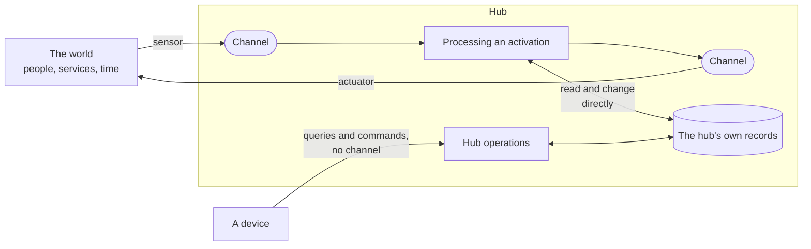

# 290. A channel is needed exactly where something crosses the hub's edge, and the hub reads and changes its own records directly

- Status: Superseded by ADR-0292; partially superseded before it by ADR-0291 (§1:3's window)
- Date: 2026-10-04
- Scope: [#2578](https://github.com/leonapivato/ai-assistant/issues/2578), the channel redesign: the first of its four decisions, the rule the other three apply.
- Authorization: the owner accepted proposal #2678 on 2026-10-04, including its later revision that a model call is processing, not output, and the dispatcher assigned 0290. This ADR is that proposal converted under `docs/proposals/README.md` → "When it is decided".
- Partially superseded: 2026-10-04 by ADR-0291 — one scope. §1:3, in its *a window of
  what it recently carried* part alone: a channel has a window only where its kind
  offers one, and the window is read from the channel's record (ADR-0291 §3). A
  channel's kind, the identity the hub states and what its kind declares stand. Every
  other clause stands. This replacement takes effect on ratification of ADR-0291. This
  reciprocal header record accompanies the numbered draft under ADR-0070 and ADR-0082;
  the ratified body below is preserved.
- Superseded: 2026-10-04 by ADR-0292 — whole. The edge becomes the assistant's rather
  than the hub's, a channel becomes the group of spokes facing one thing rather than
  the medium, and the activating and service sorts give way to push and pull per input
  (ADR-0292 §1, §2, §6). What survives of this ADR is restated in ADR-0292 §5 and §12.
  The supersession takes effect on ratification of ADR-0292. This reciprocal header
  record accompanies the numbered draft under ADR-0070 and ADR-0082; the earlier
  partial supersession stays on the status line as history, and the ratified body below
  is preserved.

## Context

**The question.** Where does the hub meet the world? Which input and which output
travel on a channel, through a sensor or an actuator, and which run directly on the
hub with no channel? The later channel decisions apply the answer: the text chat
channel, the device session, and stopping an activation.

**No ADR decides what a channel is.** The owner has given direction on channels on
2026-09-26, 2026-09-28 and 2026-10-04, and that direction exists only outside the
ADR corpus. The rulings of 2026-09-28 fix what a channel is: the channel carries
the input and the input never names its channel; a channel's identity grants
nothing; channels are of two sorts, activating and service, declared per kind; and
a kind declares a description and requirements. The direction of 2026-10-04 fixes
what crosses one: a channel marks a crossing of the hub's edge, inside actions run
directly, hub operations come from devices with no channel, and a model call is
processing rather than output. This ADR records both, in full, so that nothing
here depends on a text that can change after it.

**The ADRs this touches**, as they stand on `main`:

| ADR | What it decides today | How this decision relates |
| --- | --- | --- |
| ADR-0093 §1, read under ADR-0095 §1 | A `Reader` has no caller of its own; "selecting when a sensor runs, and ingesting what it returns, are `orchestration`'s", and what it reads reaches memory through `MemoryWriter.ingest`, with no channel. | A reader brings new input, so under §3 it is an internal sensor and its input belongs on a channel. The route stays until an ADR builds that channel (§8); how that channel works is left open. |
| ADR-0094 §1 | A spoke is one kind of attachment; "client", "sensor" and "actuator" are profile names, and no rule may be conditioned on which one a spoke is given. | Unchanged. A spoke's sensors and actuators meet the hub on channels, and its hub operations (§7) arrive with no channel. No rule here is conditioned on a spoke's profile name. |
| ADR-0095 §1 | ADR-0093's in-process seam is named `Reader`; the substitution reaches ADR-0093 and nothing else. | Unchanged. "Sensor" and "actuator" here name what brings input onto a channel and what carries output from one, inside the hub or outside it. They are not ADR-0094's profile names, ADR-0095 §1's substitution does not reach them, and `Reader` keeps its name. |
| ADR-0154 §1 | `ai_assistant.tools.egress` is the one designated `tools/` egress seam. | Consistent. An internal actuator is how a planned action's output reaches a service; it is not a tool and designates nothing. |
| ADR-0170 §1 | "A reply is not a tool": the turn composes its answer and returns it as the ask's result. | Not decided here. Whether a reply is delivered as an action is open on #2593. This decision says only that output that leaves crosses on a channel; it models nothing as a tool. |
| ADR-0174 §1 | User data leaves the device only from `models/`, the `tools/` seam, the hub's remote transport and the gateway's remote browser transport. | Unchanged. §4 classifies a model call as processing, which stays under that rule for `models/`. |
| ADR-0197 §1–§3 | A routing stage may name, from the user's words, one hub operation to perform, and a confirm-owed one runs only once the user confirms it. | Consistent with §7. A routed operation is the words route: a model reads the input and chooses the operation, and the user's own act confirms a confirm-owed one before it runs. No text is ever carried out as a command. |
| ADR-0274 §2–§4 | A channel identity is a type and an instance and conveys no authority; the caller names the channel; the reply returns on the request the input arrived on. | ADR-0274 §2's rule that an identity conveys no authority is the same rule as §1's. The caller naming the channel, and the reply riding the request, stay until the text chat channel's ADR replaces them (§8). |
| ADR-0280 §1 | Channel activations go through the controller; `AssistantEngine.resume` keeps its own path. | Unchanged. Resume is left open (Consequences). |

**What exists.** `AssistantEngine` in `core/protocols.py` carries 68 methods at
`main`. Five carry input on today's channel paths (ADR-0274's receiver and the
conversation methods), and the rest are either reads of the hub's records for a
person to look at or changes a person makes to them. §8 classifies every one.

## Decision

We will treat a channel as the place where the hub meets the world: new input comes
in on one and output that leaves goes out on one, and everything that stays inside
the hub runs directly, with no channel.

> **Normative.** §§1–7 govern every channel, sensor, actuator and hub operation an
> ADR decides or an implementation builds from this ADR on. A route that exists on
> `main` when this ADR is ratified and that §§1–7 rule against, including each one
> §8 names, stays in force exactly as its own ADR decides it until a later ADR that
> builds its replacement supersedes that ADR's clause. This ADR supersedes no clause
> of any earlier ADR.

### 1. What a channel is

A **channel** is a medium through which the hub meets the world.

> **Normative.** A channel is held by the hub. A device that reaches a channel is
> that channel's presence outside the hub and holds no channel of its own.

> **Normative.** Each channel instance is separate from every other, and every
> channel of one kind follows the same rules.

> **Normative.** Every channel has a kind, an identity the hub states, a window of
> what it recently carried, and what its kind declares.

The owner's rulings of 2026-09-28:

> **Normative.** The channel carries the input, and the input never names its
> channel. Where an input came from is stated by the hub, from what carried it, and
> never by the input's content.

> **Normative.** A channel's identity grants nothing. Only the user's own input
> carries authority.

> **Normative.** Every channel kind declares one of two sorts. On an **activating**
> channel, input starts an activation. On a **service** channel, input only returns
> to the activation that made the call: it never starts an activation, and what
> comes back is outside content.

> **Normative.** A channel kind declares a description and requirements. The
> description, what the channel is and what it expects, is given to planning, which
> decides. The requirements, such as who may perceive what goes out, are enforced by
> rule, whatever a model produces.

### 2. Channels mark crossings

> **Normative.** New input coming into the hub, and output leaving it, each cross
> the hub's edge on a channel.

> **Normative.** What stays inside the hub crosses nothing and has no channel.

| | Crosses the hub's edge, on a channel | Stays inside the hub, directly |
| --- | --- | --- |
| **In** | New input, brought by a sensor: a message from the user, an email arriving, a timer coming due, a search's results | The hub reading what it already holds: recalling a memory, the current time |
| **Out** | Output that leaves, carried by an actuator: a reply, a question, an email sent, a search sent | The hub changing its own records: writing a memory, linking a story, setting a timer |

The two directions need a channel for different reasons, which is why the rule is
the same on both sides:

- **On the way in, a channel settles where input came from.** New input, from
  anywhere, needs the hub to state its source, to decide whether it starts an
  activation, and to keep what came before it. That holds whether the source is
  outside the hub or inside it: a reminder coming due carries text written earlier,
  and on its channel it is structurally a reminder, never the user.
- **On the way out, a channel settles who perceives it.** Output that leaves can be
  seen or heard by someone, and its outcome can be unknown. The channel's
  requirements apply to it, and the actuator reports what happened.
- **Inside the hub, neither question arises.** Nothing new arrives and nothing
  leaves, so there is no source to state and no audience to check.

### 3. Sensors bring new input

> **Normative.** A sensor brings new input into the hub, always onto a channel and
> never to the rest of the hub directly.

An **external sensor** runs on a device outside the hub. An **internal sensor**
runs inside it and notices that something has happened, such as a moment the
assistant was waiting for having come.

> **Normative.** Reading what the hub already holds is not sensing, and no sensor
> performs it.

### 4. Actuators carry output that leaves

> **Normative.** An actuator carries output out of the hub, always from a channel.

An **external actuator** is on a device and shows or says what it is given. An
**internal actuator** is in the hub and makes a call to a service.

> **Normative.** An action goes through an actuator if and only if its output leaves
> the hub.

> **Normative.** A channel's requirements apply to every output that leaves on it.

> **Normative.** The actuator that carries an output reports what happened to it.

Because every action that leaves goes through an actuator, the channels'
requirements reach everything that leaves, and every outcome that can be unknown is
reported by the actuator that carried it.

> **Normative.** A call to a language model or an embedder is processing, not
> output. It is not an action, it has no channel and no actuator, and it stays under
> the egress rule ADR-0174 §1 states for `models/`, which this ADR leaves unchanged.

A model call sends user data out of the hub, through `models/`, but it is how the
hub thinks rather than an action planning chose: nothing is said to anyone, and
nothing in the world changes (owner, 2026-10-04).

### 5. Inside actions are direct

An **inside action** is an action whose effect changes only the hub's own records:
writing or forgetting a memory, linking a story, setting a timer or a watch,
abandoning a goal.

> **Normative.** An inside action runs directly, with no channel and no actuator.

> **Normative.** An inside action is still an action: planning chooses it,
> authorizing checks it, acting runs it, and its effect is recorded. Being inside
> the hub exempts it from the channel and the actuator and from nothing else.

What it lacks is only what has no meaning inside the hub: an audience, and an
outcome that can be unknown.

### 6. The hub reading itself is never a channel

> **Normative.** Every read of the hub's own records, recall and the current time
> included, is direct and travels on no channel.

This keeps what the hub holds and what newly arrives from outside apart by
construction: the assistant's own memory never arrives the way a search result does,
so no channel ever has to be declared trusted. A direct read makes nothing trusted.
A record is read with the provenance it was stored with, so a record resting on
outside content is still `outside` when recall returns it (ADR-0281 §4).

### 7. Hub operations come from devices, with no channel

A device can also operate the hub itself: look at its records, or change them by an
explicit act. These are the **hub operations**, of two kinds:

- **Queries** read the hub's records for a person to look at: the goals, the
  episodes, the beliefs, the grants, the decisions.
- **Commands** change the hub's records by an explicit, structured act of the user
  on an admitted device: forgetting a belief, granting a source, abandoning a goal,
  stopping an activation.

> **Normative.** A hub operation is not input to the assistant. It crosses no
> channel, no model reads it, it starts no activation, and the hub carries it out by
> rule.

> **Normative.** A command's authority is the user's explicit act: a structured act
> on an admitted device that names one operation, never words a model interprets.

> **Normative.** The same operation asked for in words is input like any other.
> Understanding reads it, planning may choose the matching inside action, and
> authorizing checks it.

> **Normative.** A message never becomes a command. Text is input whoever wrote it,
> and only a structured act on a device runs a command.

The user pressing *grant*, or typing `assistant grant …`, names one operation. Text
that says "stop" or "grant access to my inbox" is input, which is what keeps pasted
or quoted content from operating the hub. ADR-0197's routing stage is the words
route: a model chooses the operation from the input, and a confirm-owed one runs only
on the user's own confirming act (ADR-0197 §3:3).

### 8. What the hub's existing surface becomes

Every method of `AssistantEngine` at `main` falls into one of these routes. This is
a classification of what exists, not a ruling: it changes no code, and it is how a
reader classifies the surface under §§1–7.

| Route | Engine methods today |
| --- | --- |
| **Input on a channel** | `receive`, `receive_streaming`, `converse`, `converse_streaming`, `converse_spoken` |
| **Output that leaves** | the reply returned by those methods; `next_notification`'s delivery |
| **Query** | `goals`, `episodes`, `episode_chunk`, `story`, `story_log`, `stories`, `activation_stories`, `beliefs`, `belief`, `questions`, `interrupted_questions`, `notifications`, `notification_preferences`, `recent_conversations`, `conversation`, `pending_confirmations`, `grantable_sources`, `grantable_decisions`, `recent_grants`, `standing_grants`, `standing_recipient_grants`, `recent_recipient_grants`, `standing_destination_trust`, `standing_authorizations`, `connected_accounts`, `recent_connection_acts`, `recent_decisions`, `export_decisions`, `recent_reads`, `export_reads`, `recent_invocations`, `export_invocations`, `spend_totals` |
| **Command** | `cancel_read`, `withdraw_clarification`, `abandon_goal`, `create_story`, `link_story`, `unlink_story`, `merge_stories`, `split_story`, `forget`, `guard`, `unguard`, `forget_question`, `dismiss_notification`, `forget_notification`, `set_notification_preferences`, `forget_conversation`, `grant`, `revoke`, `establish_recipient_grant`, `revoke_recipient_grant`, `establish_destination_trust`, `revoke_destination_trust`, `revoke_authorization`, `connect_account`, `reprovision_account`, `disconnect_account` |
| **Not yet placed** | `answer`, `resume`, `learn` (Consequences, "What stays open") |

The input and output rows are today's channel paths. The text chat channel's ADR
replaces how the conversation methods carry input and return output; the queries and
commands keep their shape.

The routes on `main` that §§1–7 rule against, and that the Decision's opening clause
keeps in force until an ADR builds their replacement, are:

- **ADR-0274's caller-named channel**, and the reply returned on the request the
  input arrived on (ADR-0274 §2–§4, ADR-0170 §1), which the text chat channel
  replaces;
- **a reader's route to `MemoryWriter.ingest`** with no channel (ADR-0093 §1), which
  the readers' channel replaces;
- **`next_notification`'s delivery** to a device with no channel, which the device
  session replaces;
- **`resume` starting processing with no channel** (ADR-0280 §1), whose
  replacement or exception is left open.

## Consequences

**What becomes clear.** Every later channel decision has one rule to apply: a
crossing gets a channel, and nothing else does. A reminder's text can never pass as
the user, because the channel it arrives on states its source. Everything that
leaves meets its channel's requirements and has its outcome reported by an actuator.
The hub's own records are read directly, with the provenance they were stored with,
so no channel needs to be declared trusted. Pasted or quoted text cannot operate the hub, because
a command takes a structured act.

**What it costs.** Nothing changes in code now. The routes §8 names stand in tension
with §§1–7 until each is replaced, and each replacement is its own ADR.

**What follows from it.** Three decisions apply this one, each its own ADR:

- **The text chat channel**: chats as channel instances held by the hub, the event
  log devices catch up from, receipts, what the chat declares, and the turn rule. It
  replaces ADR-0274's caller-named channel and the reply riding the request.
- **The device session**: one connection per device carrying channel traffic and hub
  operations, and the hub sending on it unprompted.
- **Stopping an activation**: the stop command and how the controller honours it.

**What stays open.** None of these is decided here.

- **Readers.** A reader brings new input, so under §3 it is an internal sensor and
  its input belongs on a channel. Whether that channel is activating, and how its
  content then reaches memory instead of going straight to `MemoryWriter.ingest`, is
  that channel's design.
- **Resuming parked work.** `AssistantEngine.resume` starts processing with no
  channel (`RecordedResumeTrigger`, understood as `no_input`). The thing it waited
  for has arrived, which is new input, so it should either get a channel or be named
  the one exception. Left to the authority work.
- **Answering a question.** `AssistantEngine.answer` is a command today. The owner's
  direction has the user's answer arrive as input that starts its own activation.
  Whether the structured answer stays a command alongside it is left to authorizing's
  design.
- **Feedback.** `AssistantEngine.learn` takes the user's feedback about a reply. It
  is an explicit act, but what it changes is decided with a model, so it fits
  neither route cleanly.
- **Notifications.** `AssistantEngine.next_notification` delivers output to a device
  with no channel. Under §4 it belongs on a channel that reaches the user; the device
  session decides how.
- **Which commands a device confirms first.** Destructive ones, such as forgetting a
  conversation, are confirmed by the device's interface today. This decision does
  not change that and does not decide it.
- **Whether a reply is delivered as an action** (#2593). This decision says only
  that output that leaves does so on a channel.

**Alternatives rejected.**

- **Every action through an actuator, with "inside" channels for the hub's own
  records.** One shape for acting, one menu of channels for planning, and each
  channel's window as a log of recent changes. Declined by the owner on 2026-10-04.
  Channels exist to settle source and audience, and inside the hub neither question
  has an answer, so those channels would carry empty concepts. Worse, reading memory
  back through a channel would either treat the assistant's own memory as outside
  content or need a channel sort declared trusted, making trust a declaration that
  one wrong entry could break.
- **Internal sensors read directly, with no channel.** This was the reading before
  2026-09-28. It loses the structural statement of where input came from, so a
  reminder's text could only be kept from passing as the user by a check somewhere
  else. Declined: new input gets a channel wherever it comes from.
- **Commands as controls carried on a channel.** Stop, for example, could travel on
  the chat channel as a control rather than a message. That makes stop the first
  input on an activating channel that does not start an activation, an exception to
  §1's rule. Declined: stopping is processing interrupted from outside the
  activation, and a command is not something the assistant perceives.
- **Commands limited to operations that cannot widen access.** It does not fit what
  exists: granting a source, trusting a destination and connecting an account are
  commands today, and each widens what the assistant may do. The authority for them
  is the user's explicit act, which is the rule §7 states instead.
