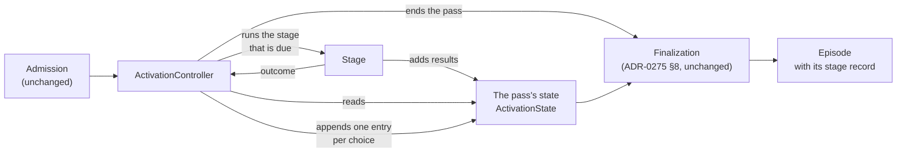

# An activation controller runs the stages by rules and records its choices

**The question:** what replaces the engine's hard-coded sequence of stages, so
that later milestones can add a stage or a rule instead of rewriting the engine,
and what does it record of the choices it makes?

Milestone: [M38 — Activation controller](https://github.com/leonapivato/ai-assistant/milestone/5),
design issue #2576 (which holds the rulings and the inventory this proposal
builds on).

## Words

**Stage and phase are not the same thing, and they do not map one to one.**

| Word | Where it comes from | What it names |
| --- | --- | --- |
| **Stage** | The code | A unit of processing the controller runs, such as transcribing, routing, associating a goal, the turn loop or composing. |
| **Phase** | The wiki's [Controller](https://github.com/leonapivato/ai-assistant/wiki/Controller) page | A job in the target design: recall, understanding, planning, authorizing, acting, digesting and closing. |

In this milestone the controller runs **stages**, and its record is a record of
stages. Only one stage lines up with one phase: the understanding stage does
the understanding phase's job. The rest fall into three groups:

- **Stages that span several phases.** The turn loop does planning and some
  acting (reads). Driving a step does authorizing and acting.
- **Stages that are no phase.** Transcribing, beginning the conversation,
  routing, associating a goal, reconciling and synthesizing.
- **Stages that are part of a phase's job.** Composing is part of what planning
  or closing will do.

Later milestones reshape the stages until they line up with the phases. This
proposal does not claim they already do, and it does not name a stage after a
phase it only partly performs.

## Baseline

- **Wiki:** [Controller](https://github.com/leonapivato/ai-assistant/wiki/Controller),
  read at wiki revision `f18ccf6`. It is owner direction, not ratified. This
  proposal builds only its skeleton: the controller, its rules and its record.
  None of the new phases it describes (recall, digesting, closing, the recall
  hook) are part of this change. The page's Channels section, where each
  channel declares what processing owes and its limits, is the baseline for the
  audience declaration below.
- **Code:** `main` at `8265b204`. `ActivationEngine._run_turn`
  (`orchestration/engine.py`) runs the stages of a conversation turn in a fixed
  order, and `_dispatch_channel` sends an informational event down a separate
  fixed path.
- **ADRs whose clauses this touches:**
  - ADR-0275 §1 excludes a "phase/tool history" from the episode. This change
    adds a history of stages.
  - ADR-0275 §4 defines `EpisodeProcessingRecord`. This change adds a field and
    a schema version.
  - ADR-0275 §8 says one coordinator finalizes each activation. That is
    unchanged; the controller runs before it.
  - ADR-0276 §5 places understanding after routing and before association.
    The same order becomes rules.
  - ADR-0274 §2 says a channel's identity carries no audience, and it resolves
    the processing policy from the validated combination through code-owned
    mappings. The declared audience below belongs to that mapping, never to
    the identity.
  - ADR-0249 §6's `AttemptPhase` is **not touched**. Its stamping stays inside
    the stages (owner ruling, 2026-09-27).
  - ADR-0250 §15, ADR-0203 §1 and ADR-0199 §3 are the audience rules that today
    appear as "is this a spoken turn?".

## Rulings already made (on #2576)

- The controller is built to the target shape. **Existing behaviour may break
  temporarily** until the later phases land, typed turns included, as long as
  each break is listed deliberately.
- The controller covers **channel activations only**: typed and spoken turns
  (a routed pass included) and informational events. `resume` stays on its
  legacy path. The entry points that are not activations (`answer`,
  `withdraw_clarification`, `abandon_goal`, `cancel_read`) are out of scope.
- `AttemptPhase` and the controller's record stay separate.

## This does not unblock observation

The blocked [observation milestone](https://github.com/leonapivato/ai-assistant/milestone/3)
(#2528) needs the history of what processing actually did: planning rounds,
reads, investigation, and revisions as they happened. M38's record does not
hold that. The turn loop is **one opaque stage** here, so a turn that planned
three times, serviced two reads and investigated once records a single
turn-loop entry.

That history arrives when the planning-and-acting milestone splits the turn
loop into stages the controller runs one by one. **#2528's prerequisite is not
met by M38 and must not be ticked off after it.** What M38 contributes is the
place that history will be written and the shape it will take.

## The change

### The parts

- **`ActivationController`** lives in `orchestration/`, in a new module
  `controller.py`. It is given the stages and the rules, and it runs one
  activation's pass:
  1. Find the first rule that makes a stage due, or that ends the pass.
  2. Run that stage.
  3. Record the entry.
  4. Repeat until a rule ends the pass.

  It never calls a model, and a stage never chooses what runs next.
- **A stage**, as the controller sees it, is a small object with a name and
  one method, `async run(pass_state) -> StageOutcome`. In this milestone each
  one wraps an existing stage or engine method; nothing is rewritten inside
  them.
- **The pass's state** is `ActivationState`, which already carries one
  activation's facts until finalization writes the episode. It gains three
  things:
  - the stage record;
  - the channel's **declaration** (below);
  - a typed **working set**: the in-flight results the rules read, such as the
    turn the loop returned, the association and the drive's disposition. Today
    these are local variables of `_run_turn`. The working set is never
    persisted; only the record is.

**The stage interface stays inside `orchestration`.** It is internal to
`orchestration`, not a Protocol in `core/protocols.py`: every stage the
controller runs is one of orchestration's own, and no other subsystem
implements or calls one. So there is no Protocol change (golden rule 5), and
the interface can change freely as later milestones reshape the stages.

### The channel declares its audience

Today association and the episode window are skipped when
`operation is CONVERSE_SPOKEN`, and the supply is narrowed by choosing
`UnboundedAudienceSupply` in `_converse_spoken`. The real rule is about the
audience: a reply spoken aloud may be heard by people other than the owner
(ADR-0199 §3, ADR-0203 §1, ADR-0250 §15). Renaming the check to "unbounded
audience" while still working it out from "is this spoken?" would be the old
check under a new name.

So the audience becomes something the channel **declares**, alongside what
processing owes and its limits, as the wiki's Channels section describes:

| Declared for | What processing owes | Audience |
| --- | --- | --- |
| A conversation, typed | A reply on the same request | Bounded (the owner) |
| A conversation, spoken | A spoken reply | Unbounded |
| An informational event | Nothing; a transient summary | Bounded (no reply goes out) |

- **The declaration is resolved once, at admission,** from ADR-0274 §2's
  code-owned mapping of the validated combination (channel type plus payload
  modality). It is a property of that mapping, never of the channel identity,
  so ADR-0274 §2's "identity conveys no audience" holds, and no caller can
  supply one.
- **Typed and spoken input still share one conversation channel identity.**
  The declaration is per combination, which is how the wiki's "Spoken" row
  sits beside "Conversation" without being a separate channel.
- **Everything reads the declaration:** the rule that makes association due,
  context assembly deciding whether understanding gets the episode window, and
  the choice of supply. None of them looks at the operation or the payload
  again.
- **A new channel declares its own audience.** A shared room display, for
  example, would declare "unbounded" and inherit every rule without a new
  check anywhere.

In this milestone the declarations give the same answers as today's checks.
What changes is that there is one place that says it.

### The rules

A rule is a named function over the pass's state and the last outcome. It
returns the stage that is due, the end of the pass, or nothing. The controller
tries the rules in a fixed order, and the first one that answers wins. The
rule's name is recorded as **why the stage was due**. This is the wiki's
"readiness, not a script": a rule looks at what the pass holds, not at which
stage ran last. That lets later milestones add a rule such as "a new
understanding version makes planning due" without a transition table to
rewire.

The skeleton's rules, sorted from the inventory on #2576:

| Rule | Makes due | Today's source |
| --- | --- | --- |
| `speech_untranscribed` | Transcribing | `_converse_spoken` |
| `no_words` | End: no content | `_converse_spoken` returns an empty turn |
| `conversation_unresolved` | Beginning the conversation | `_begin_channel_turn` (ADR-0074 §2) |
| `route_unchecked` | Routing (when wired, not yet tried) | `_run_turn` (ADR-0197 §1) |
| `route_taken` | The routed act | `_routed_pass` |
| `routed_act_done` | End | `_routed_pass` returns |
| `not_understood` | Understanding | `_run_turn`, `_dispatch_channel` (ADR-0276 §5) |
| `event_understood` | Summarizing the event | `_dispatch_channel` |
| `event_summarized` | End | `_dispatch_channel` returns |
| `association_due` | Associating a goal (declared audience bounded) | `_associate(associates=…)` (ADR-0250 §15) |
| `disambiguation_raised` | End with the fixed question | `_undecided` (ADR-0250 §3) |
| `continuing_unreconciled` | Reconciling | `_run_turn` (ADR-0259 §3) |
| `unplanned` | The turn loop | `loop.respond` |
| `plan_has_steps` | Driving the first step | `_run_turn`: no question raised and steps exist |
| `reply_owed` | Composing | `_run_turn`; the park check now lives in the composer |
| `speech_reply_owed` | Synthesizing | `_spoken_rendering` |
| `nothing_due` | End | The pass has nothing left to run |

`nothing_due` is the last rule and always answers, so every pass ends by a rule.

**"Compose is skipped on a park" moves into the controller.** Today the
composer checks `step.confirmation` and returns nothing. The check belongs in
`reply_owed`, which does not fire for a parked step.

**Bookkeeping stays in the stages.** The attempt's verify and end checks
(`_compared`, the `ends` gate, the `VERIFY`/`ENDED` stamps) are `AttemptPhase`
bookkeeping and stay inside the driving and composing stages. So do
persistence order, the reservation and the `ruled` callback.

**The routed act and the turn loop are opaque.** Each runs its internal
branches unchanged:

- The routed act handles reservation, confirmation and recording.
- The turn loop handles planning rounds, read servicing and investigation. Its
  future cut points are already visible:
  - the first planner call (`loop.py:2531`);
  - the read-servicing loop (`loop.py:2647`);
  - the investigation stop rule (`loop.py:1228`).

  When the planning-and-acting milestone splits it, each of those becomes a
  stage the controller runs and records. The record's shape does not change;
  it gains entries.

### Outcomes and fixed defaults

A stage returns an outcome instead of ending the pass by raising:

| Outcome | Meaning |
| --- | --- |
| `done` | The stage did its work, and its results are in the working set |
| `failed` | The stage raised an error. The error is kept on the outcome |
| `timed_out` | The deadline passed before or during the stage |

The controller applies a **fixed default** to `failed` and `timed_out`. In this
milestone, the default for every stage is to end the pass (`stage_failed` or
`stage_timed_out`, recorded like any end) and re-raise the kept error from the
controller. That preserves `terminal_status`'s classification (ADR-0275 §5,
ADR-0276 §6) and the errors callers see on the wire. The difference is that
the failure is now a recorded outcome the controller acted on, not a jump out
of the middle of `_run_turn`. A later milestone can give a stage a different
default by changing one rule, not by catching errors in the engine.

### The record

**Every choice is recorded, and the end of the pass is a choice.** The record
is a list of entries:

- one entry per stage run;
- **always exactly one final end entry**, naming the rule that ended the pass.

No meaning is carried by an entry's absence.

| Field | What it holds |
| --- | --- |
| `stage` | The stage's name, or `end` for the final entry (closed enum, added to, never renamed) |
| `due` | The rule that made it due or ended the pass (closed enum) |
| `started_at`, `ended_at` | Injected clock readings, like the record's own (ADR-0275 §4) |
| `outcome` | `done`, `failed` or `timed_out`; the end entry records `done` |

The end entry's `due` is always one of these:

| Kind of end | `due` |
| --- | --- |
| An end a rule chose | `no_words`, `routed_act_done`, `event_summarized`, `disambiguation_raised` |
| Nothing left to run | `nothing_due` |
| A fixed default applied to a failed stage | `stage_failed`, `stage_timed_out` |

**A pass cut short still ends with an entry.** If the pass is cancelled or
interrupted outside the controller's own choices, the controller writes the end
entry from its `finally`, with `due` `interrupted`, before finalization reads
the record. So an episode whose record has no end entry is a defect, never a
meaning.

**The record points, it does not copy.** An entry carries no stage results.
Those already live where the episode keeps them: understanding versions, links,
the response, the status and the reason. So the record stays small, and the
episode stays the single source.

**Where it lives:**

- `ActivationState` appends each entry as its stage ends, so the record can be
  read while the pass runs, from the same process.
- Finalization copies the record into
  `EpisodeProcessingRecord.stages: tuple[StageEntry, ...]` and bumps
  `schema_version` to 3.
- Nothing is written durably before finalization. Writing each step as it
  happens belongs to the milestone that makes effects durable. ADR-0275 §1's
  "no live activation log" stands until then.

**Bounded, and the ends always kept.** At most 64 entries. Past that, entries
are elided **from the middle**:

- the first entries are kept;
- the last entries are kept, **the end entry always among them**;
- a `stages_elided` count records how many are missing, the same pattern as
  `understanding_elided`.

The skeleton's longest pass has about ten entries; the bound is for the loops
later milestones add.

**Inspection.** The existing episode inspection (ADR-0275 §§10–11) shows the
record: `episodes` detail on the engine, the CLI and the wire. Exposing it on
the wire is a protocol version bump.

### What is expected to break

No break is needed for the skeleton itself. The allowance is used where
preserving the old behaviour would bend the design, and the implementation PR
lists each use with its reason. The candidates known now:

- **Engine tests that assert the internal call order of `_run_turn`**, not an
  outcome. They are rewritten against the controller's rules and the recorded
  path, or removed.
- **The streaming path's composer hand-off**, if lifting the park check out of
  the composer changes when the stream's first event is published.
- **Stored episodes at schema version 2** stay readable without a `stages`
  field. No migration is planned: the fresh data directory from M37 has few,
  and absence of the field means "recorded before the controller".

### How it is checked

- **The rules:** unit tests of each rule over constructed pass states, and of
  the controller over fake stages: order, ending, fixed defaults, the
  interrupted end entry, and elision keeping the end entry.
- **The declarations:** each combination resolves to its declared audience,
  and no rule or context decision reads the operation or payload modality
  directly.
- **The recorded path for each activation kind:** a test per kind asserting
  the exact entries, end entry included:
  - typed turn, driven and undriven;
  - spoken turn;
  - a spoken turn with no words;
  - routed pass;
  - disambiguation;
  - informational event;
  - a failure in understanding.

  These become the baseline that later milestones change on purpose.
- **The existing suite**, less the tests listed as changed or removed, each
  with its reason.
- **The gate** passes on every PR, as always.

## Options considered

- **A transition table** (stage → next stage) instead of readiness rules. It
  is simpler for today's fixed order. But every later rule the wiki names reads
  what the episode gained: a new understanding version, evidence, effects, a
  contest. A transition table would then carry the whole state in its edges.
  Rejected.
- **Naming the stages after the wiki's phases now.** It would read well. But
  the turn loop and driving each span several phases, and most stages are no
  phase, so the names would claim a mapping that does not exist yet. Rejected;
  stages get phase names only when they do a phase's job and nothing else.
- **Audience worked out from "is this spoken?".** It gives the same answers
  today, but it is the old check under a new name, and every new channel would
  need a new check. Rejected for a declaration.
- **The record in its own store**, written as each stage ends. It gives crash
  visibility now. It contradicts ADR-0275 §1's "no live activation log", and
  it arrives better with the durable-effects milestone, which needs a
  write-ahead record anyway. Rejected for now.
- **Folding the record into `AttemptPhase`.** Ruled out by the owner.
  Attempts belong to goals, and stories replace that structure.
- **The stage interface as a Protocol in `core`.** No other subsystem
  implements or calls a stage, so a Protocol would add an ADR-ratified
  contract, a conformance suite and a fake, all for an interface that is
  expected to change in each of the next four milestones. Rejected.
- **Wrapping `resume`.** Its admission happens partway through the runner,
  under the recovery lock, and the authority milestone replaces parks. Ruled
  out; the known gap is that resume episodes carry no stage record meanwhile.

## What it leaves open

- **`understanding_omitted`** (ADR-0276 §5) overlaps the record. Each of
  `routed`, `no_text`, `failed` and `not_reached` can be read off the entries.
  I'd keep it in this milestone so as not to churn ADR-0276's inspection, and
  retire it when the record has proven itself.
- **Routing's future.** It has no place in the wiki's phases. Whether the
  routed act's fixed actions move into planning or stay as a cheap path is
  later work.
- **The declaration's other fields.** This milestone declares audience,
  because rules read it today. The wiki's "what processing owes" and "limits"
  belong in the same declaration. They are added when the rules that read them
  arrive: closing reads what a channel owes, and the limits come with authority.
- **The exact bound** (64) and the enum values' final spelling are settled in
  the ADR.
- **How rules read stories.** When the stories milestone lands, some rules
  read the activation's stories as well as its episode. The rule signature
  (pass state plus last outcome) is expected to hold, because stories arrive
  as part of the pass's state.
