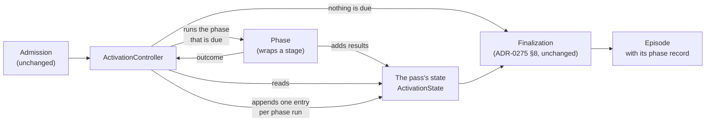

# An activation controller runs the phases by rules and records its choices

**The question:** what replaces the engine's hard-coded sequence of stages, so
that later milestones can add a phase or a rule instead of rewriting the engine,
and what does it record of the choices it makes?

Milestone: [M38 — Activation controller](https://github.com/leonapivato/ai-assistant/milestone/5),
design issue #2576 (which holds the rulings and the inventory this proposal
builds on).

## Baseline

- **Wiki:** [Controller](https://github.com/leonapivato/ai-assistant/wiki/Controller),
  read at wiki revision `f18ccf6`. It is owner direction, not ratified. This
  proposal builds only its skeleton: the controller, its rules and its record.
  None of the new phases it describes (recall, digesting, closing, the recall
  hook) are part of this change.
- **Code:** `main` at `8265b204`. `ActivationEngine._run_turn`
  (`orchestration/engine.py`) runs the stages of a conversation turn in a fixed
  order, and `_dispatch_channel` sends an informational event down a separate
  fixed path.
- **ADRs whose clauses this touches:**
  - ADR-0275 §1 excludes a "phase/tool history" from the episode. This change
    adds a phase history.
  - ADR-0275 §4 defines `EpisodeProcessingRecord`. This change adds a field and
    a schema version.
  - ADR-0275 §8 says one coordinator finalizes each activation. That is
    unchanged; the controller runs before it.
  - ADR-0276 §5 places understanding after routing and before association.
    The same order becomes rules.
  - ADR-0249 §6's `AttemptPhase` is **not touched**. Its stamping stays inside
    the stages (owner ruling, 2026-09-27).
  - ADR-0250 §15 and ADR-0203 §1 are the audience rules that today appear as
    "is this a spoken turn?".

## Rulings already made (on #2576)

- The controller is built to the target shape. **Existing behaviour may break
  temporarily** until the later phases land, typed turns included, as long as
  each break is listed deliberately.
- The controller covers **channel activations only**: typed and spoken turns
  (a routed pass included) and informational events. `resume` stays on its
  legacy path. The entry points that are not activations (`answer`,
  `withdraw_clarification`, `abandon_goal`, `cancel_read`) are out of scope.
- `AttemptPhase` and the controller's record stay separate.

## The change

### The parts

- **`ActivationController`** lives in `orchestration/`, in a new module
  `controller.py`. It is given the phases and the rules, and it runs one
  activation's pass:
  1. Find the first rule that makes a phase due.
  2. Run that phase.
  3. Record the entry.
  4. Repeat until no rule makes anything due, or a rule ends the pass.

  It never calls a model, and a phase never chooses what runs next.
- **A phase** is a small object with a name and one method,
  `async run(pass_state) -> PhaseOutcome`. In this milestone every phase wraps
  an existing stage or engine method; nothing is rewritten inside a stage.
- **The pass's state** is `ActivationState`, which already carries one
  activation's facts until finalization writes the episode. It gains two things:
  - the phase record;
  - a typed **working set**: the in-flight results the rules read, such as the
    turn the loop returned, the association and the drive's disposition. Today
    these are local variables of `_run_turn`. The working set is never
    persisted; only the record is.

**Phases stay inside `orchestration`.** The phase interface is internal to
`orchestration`, not a Protocol in `core/protocols.py`: every phase is one of
orchestration's own stages, and no other subsystem implements or calls one. So
there is no Protocol change (golden rule 5), and the interface can change freely
as later milestones split phases.

### The rules

A rule is a named function over the pass's state and the last outcome. It
returns the phase that is due, the end of the pass, or nothing. The controller
tries the rules in a fixed order, and the first one that answers wins. The
rule's name is recorded as **why the phase was due**. This is the wiki's
"readiness, not a script": a rule looks at what the pass holds, not at which
phase ran last. That lets later milestones add a rule such as "a new
understanding version makes planning due" without a transition table to
rewire.

The skeleton's rules, sorted from the inventory on #2576:

| Rule | Makes due | Today's source |
| --- | --- | --- |
| `speech_untranscribed` | Transcribe | `_converse_spoken` |
| `no_words` | End: no content | `_converse_spoken` returns an empty turn |
| `conversation_unresolved` | Begin conversation | `_begin_channel_turn` (ADR-0074 §2) |
| `route_unchecked` | Route (routing wired, not yet tried) | `_run_turn` (ADR-0197 §1) |
| `route_taken` | Routed act, then end | `_routed_pass` |
| `not_understood` | Understand | `_run_turn`, `_dispatch_channel` (ADR-0276 §5) |
| `event_understood` | Summarize event, then end | `_dispatch_channel` |
| `association_due` | Associate (bounded audience only) | `_associate(associates=…)` (ADR-0250 §15) |
| `disambiguation_raised` | End with the fixed question | `_undecided` (ADR-0250 §3) |
| `continuing_unreconciled` | Reconcile | `_run_turn` (ADR-0259 §3) |
| `unplanned` | Turn loop | `loop.respond` |
| `plan_has_steps` | Drive the first step | `_run_turn`: no question raised and steps exist |
| `reply_owed` | Compose | `_run_turn`; the park check now lives in the composer |
| `speech_reply_owed` | Synthesize | `_spoken_rendering` |

When nothing is due, the pass ends and finalization runs as it does today.

**Two rules change their wording, not their effect:**

- **Association and the episode window are rules about the audience.** Today
  the code asks "is this a spoken turn?". The actual reason is that a spoken
  turn's audience is unbounded: someone else may be in the room (ADR-0203 §1,
  ADR-0250 §15). So:
  - `association_due` fires only for a **bounded audience**;
  - context assembly gives understanding the episode window only for a bounded
    audience.

  Today spoken turns are exactly the unbounded ones, so nothing moves. The
  rules just say what they mean, and a future unbounded channel inherits them.
- **"Compose is skipped on a park" moves into the controller.** Today the
  composer checks `step.confirmation` and returns nothing. The check belongs
  in `reply_owed`, which does not fire for a parked step.

**Bookkeeping stays in the stages.** The attempt's verify and end checks
(`_compared`, the `ends` gate, the `VERIFY`/`ENDED` stamps) are `AttemptPhase`
bookkeeping and stay inside the drive and compose phases. So do persistence
order, the reservation and the `ruled` callback.

**The routed act and the turn loop are opaque phases.** Each runs its internal
branches unchanged:

- The routed act handles reservation, confirmation and recording.
- The turn loop handles planning rounds, read servicing and investigation. It
  is one phase here. Its future cut points are already visible:
  - the first planner call (`loop.py:2531`);
  - the read-servicing loop (`loop.py:2647`);
  - the investigation stop rule (`loop.py:1228`).

  When the planning and acting milestone splits it, each planner call becomes a
  planning entry and each serviced read an acting entry. The record's shape
  does not change.

### Outcomes and fixed defaults

A phase returns an outcome instead of ending the pass by raising:

| Outcome | Meaning |
| --- | --- |
| `done` | The phase did its work, and its results are in the working set |
| `failed` | The stage raised an error. The error is kept on the outcome |
| `timed_out` | The deadline passed before or during the phase |

The controller applies a **fixed default** to `failed` and `timed_out`. In this
milestone, the default for every phase is to end the pass and re-raise the kept
error from the controller. That preserves `terminal_status`'s classification
(ADR-0275 §5, ADR-0276 §6) and the errors callers see on the wire. The
difference is that the failure is now a recorded outcome the controller acted
on, and it is not a jump out of the middle of `_run_turn`. A later milestone
can give a phase a different default, such as "planning without an
understanding", by changing one rule and not by catching errors in the engine.

### The record

One entry per phase run:

| Field | What it holds |
| --- | --- |
| `phase` | The phase's name (closed enum, added to, never renamed) |
| `due` | The name of the rule that made it due (closed enum) |
| `started_at`, `ended_at` | Injected clock readings, like the record's own (ADR-0275 §4) |
| `outcome` | `done`, `failed` or `timed_out` |

An end the controller chose, such as `no_words` or `disambiguation_raised`,
also records the rule that ended the pass: a final entry with phase `end` and
that rule as `due`. A pass that ended because nothing was due has no end entry.
Its last entry is the last phase that ran.

**The record points, it does not copy.** An entry carries no stage results.
Those already live where the episode keeps them: understanding versions, links,
the response, the status and the reason. So the record stays small, and the
episode stays the single source. The observer reads the record to know which
phases ran and why, and it reads the rest of the episode to know what they
produced.

**Where it lives:**

- `ActivationState` appends each entry as its phase ends, so the record can be
  read while the pass runs, from the same process. The concurrency milestone's
  "in-progress activations are visible" builds on this.
- Finalization copies the record into
  `EpisodeProcessingRecord.phases: tuple[PhaseEntry, ...]` and bumps
  `schema_version` to 3.
- Nothing is written durably before finalization. Writing each step as it
  happens belongs to the milestone that makes effects durable. ADR-0275 §1's
  "no live activation log" stands until then.

**Bounded.** At most 64 entries, with a `phases_elided` count past that, the
same pattern as `understanding_elided`. The skeleton's longest pass has about
ten entries. The bound is for the loops later milestones add.

**Inspection.** The existing episode inspection (ADR-0275 §§10–11) shows the
record: `episodes` detail on the engine, the CLI and the wire. Exposing it on
the wire is a protocol version bump.

### What is expected to break

No break is needed for the skeleton itself. The allowance is used where
preserving the old behaviour would bend the design, and the implementation PR
lists each use with its reason. The candidates known now:

- **Engine tests that assert the internal call order of `_run_turn`**, not an
  outcome. They are rewritten against the controller's rules and the recorded
  path, or removed.
- **The streaming path's composer hand-off**, if lifting the park check out of
  the composer changes when the stream's first event is published.
- **Stored episodes at schema version 2** stay readable without a `phases`
  field. No migration is planned: the fresh data directory from M37 has few,
  and absence means "recorded before the controller".

### How it is checked

- **The rules:** unit tests of each rule over constructed pass states, and of
  the controller over fake phases: order, ending, fixed defaults and the
  bound.
- **The recorded path for each activation kind:** a test per kind asserting
  the exact entries:
  - typed turn, driven and undriven;
  - spoken turn;
  - a spoken turn with no words;
  - routed pass;
  - disambiguation;
  - informational event;
  - a failure in understanding.

  These become the baseline that later milestones change on purpose.
- **The existing suite**, less the tests listed as changed or removed, each
  with its reason.
- **The gate** passes on every PR, as always.

## Options considered

- **A transition table** (phase → next phase) instead of readiness rules. It
  is simpler for today's fixed order. But every later rule the wiki names reads
  what the episode gained: a new understanding version, evidence, effects, a
  contest. A transition table would then carry the whole state in its edges.
  Rejected.
- **The record in its own store**, written as each phase ends. It gives crash
  visibility now. It contradicts ADR-0275 §1's "no live activation log", and
  it arrives better with the durable-effects milestone, which needs a
  write-ahead record anyway. Rejected for now.
- **Folding the record into `AttemptPhase`.** Ruled out by the owner.
  Attempts belong to goals, and stories replace that structure.
- **The phase interface as a Protocol in `core`.** No other subsystem
  implements or calls a phase, so a Protocol would add an ADR-ratified
  contract, a conformance suite and a fake, all for an interface that is
  expected to change in each of the next four milestones. Rejected.
- **Wrapping `resume`.** Its admission happens partway through the runner,
  under the recovery lock, and the authority milestone replaces parks. Ruled
  out; the known gap is that resume episodes carry no phase record meanwhile.

## What it leaves open

- **`understanding_omitted`** (ADR-0276 §5) overlaps the record. Each of
  `routed`, `no_text`, `failed` and `not_reached` can be read off the phase
  entries. I'd keep it in this milestone so as not to churn ADR-0276's
  inspection, and retire it when the record has proven itself.
- **Routing's future.** It has no place in the wiki's phases. Whether the
  routed act's fixed actions move into planning or stay as a cheap path is
  later work.
- **The exact bound** (64) and the enum values' final spelling are settled in
  the ADR.
- **How rules read stories.** When the stories milestone lands, some rules
  read the activation's stories as well as its episode. The rule signature
  (pass state plus last outcome) is expected to hold, because stories arrive
  as part of the pass's state.
