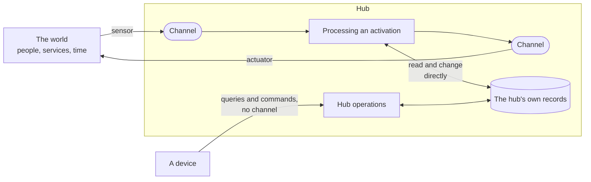

# The channel model: what crosses the hub's edge, and what does not

**The question.** Where does the hub meet the world? This proposal says which
input and which output travel on a channel, through a sensor or an actuator, and
which run directly on the hub with no channel. It is the rule the later channel
proposals apply: the text chat channel, the device session, and stopping an
activation.

## Baseline

Wiki pages, read at wiki revision
[`48d1c45`](https://github.com/leonapivato/ai-assistant/wiki/Channels/48d1c45):
[Channels](https://github.com/leonapivato/ai-assistant/wiki/Channels) (its
section *What crosses a channel* carries this proposal's direction, given by the
owner on 2026-10-04),
[Sensors](https://github.com/leonapivato/ai-assistant/wiki/Sensors),
[Internal sensors](https://github.com/leonapivato/ai-assistant/wiki/Internal-sensors),
[Actuators](https://github.com/leonapivato/ai-assistant/wiki/Actuators),
[Acting](https://github.com/leonapivato/ai-assistant/wiki/Acting) and
[Activations](https://github.com/leonapivato/ai-assistant/wiki/Activations).
Everything those pages say about channels is direction (2026-09-26, 2026-09-28
and 2026-10-04); no ADR decides what a channel is.

ADRs this touches, at `main`:

| ADR | What it says today | How this proposal relates |
| --- | --- | --- |
| ADR-0093 §1 (as renamed by ADR-0095 §1) | A reader has no caller of its own; "selecting when a sensor runs, and ingesting what it returns, are `orchestration`'s". Readers' content reaches memory through `MemoryWriter.ingest`, with no channel. | A reader that brings new input is an internal sensor, so its input belongs on a channel. This would partially supersede §1's ingestion route when a later ADR builds that channel; this proposal decides only the rule. |
| ADR-0094 §1 | A spoke is one kind of attachment; "client", "sensor" and "actuator" are profiles, and "a client carries a person". | Unchanged. A spoke's sensor and actuator meet the hub on channels; what ADR-0094 calls the client profile is where the hub's operations (§7 below) come from. |
| ADR-0154 | Every outbound call from the assistant passes one designated egress seam in `tools/`. | Consistent: an internal actuator is how a planned action's output reaches that seam. |
| ADR-0170 | "A reply is not a tool": the turn composes its answer and the outcome carries it. | Not decided here. Whether a reply is delivered as an action is open on [#2593](https://github.com/leonapivato/ai-assistant/issues/2593); this proposal only says that when output leaves, it leaves on a channel. |
| ADR-0274 §2–§4 | A channel identity is a type and an instance, conveys no authority, and is named by the caller; a reply returns on the request the input arrived on. | §2's "an identity grants nothing" is kept. The caller naming the channel, and the reply riding the request, are the text chat channel proposal's to replace. |
| ADR-0280 §1 | Channel activations go through the controller; resuming parked work keeps its own path. | Unchanged. Resume is listed under *What it leaves open*. |

## The change

### 1. What a channel is

A **channel** is a medium through which the hub meets the world. It is held by
the hub, and a device that reaches it is only its presence outside. Each channel
instance is separate from every other; channels of one kind follow the same
rules. A channel has a kind, an identity the hub states, a window of what it
recently carried, and what its kind declares.

These are the owner's rulings of 2026-09-28, which no ADR records yet. This
proposal would record them:

- **The channel carries the input; the input never names its channel.** Where
  input came from is stated by the hub, from what carried it, never by its
  content.
- **A channel's identity grants nothing.** Only the user's own input carries
  authority (ADR-0274 §2, kept).
- **Two sorts, declared per kind.** On an **activating** channel, input starts an
  activation. On a **service** channel, input only returns to the activation that
  made the call; it never starts one, and what comes back is outside content.
- **A kind declares a description and requirements.** The description, what the
  channel is and what it expects, is given to planning, which decides. The
  requirements, such as who may perceive what goes out, are enforced by rule
  whatever a model produces.

### 2. Channels mark crossings

**A channel is needed exactly where something crosses the hub's edge.** New input
coming in, and output going out, each cross on a channel. What stays inside the
hub crosses nothing and has no channel.

| | Crosses the hub's edge, on a channel | Stays inside the hub, directly |
| --- | --- | --- |
| **In** | New input, brought by a sensor: a message from the user, an email arriving, a timer coming due, a search's results | The hub reading what it already holds: recalling a memory, the current time |
| **Out** | Output that leaves, carried by an actuator: a reply, a question, an email sent, a search sent | The hub changing its own records: writing a memory, linking a story, setting a timer |

The two directions need a channel for different reasons, and that is why the
rule is the same on both sides:

- **On the way in, a channel settles where input came from.** New input, from
  anywhere, needs the hub to state its source, to decide whether it starts an
  activation, and to keep what came before it. That holds whether the source is
  outside the hub or inside it: a reminder coming due carries text written
  earlier, and on its channel it is structurally a reminder, never the user.
- **On the way out, a channel settles who perceives it.** Output that leaves can
  be seen or heard by someone, and its outcome can be unknown. The channel's
  requirements apply to it, and the actuator reports what happened.
- **Inside the hub, neither question arises.** Nothing new arrives and nothing
  leaves, so there is no source to state and no audience to check.

### 3. Sensors bring new input

A **sensor** brings new input into the hub, always onto a channel and never to
the rest of the hub directly. An **external sensor** runs on a device outside the
hub; an **internal sensor** runs inside it and notices that something has
happened, such as a moment the assistant was waiting for having come.

Reading what the hub already holds is not sensing. Recall, the current time and
anything else the hub looks up in its own records are direct reads, with no
sensor and no channel.

### 4. Actuators carry output that leaves

An **actuator** carries output out of the hub, always from a channel. An
**external actuator** is on a device and shows or says what it is given; an
**internal actuator** is in the hub and makes a call to a service.

**An action goes through an actuator if and only if its output leaves the hub.**
Because every action that leaves goes through one, the channels' requirements
apply to everything that leaves, and every outcome that can be unknown is
reported by the actuator that carried it.

### 5. Inside actions are direct

An **inside action** changes only the hub's own records: writing or forgetting a
memory, linking a story, setting a timer or a watch, abandoning a goal. It runs
directly, with no channel and no actuator.

It is still an action: planning chooses it, authorizing checks it, acting runs
it, and its effect is recorded. What it lacks is only what has no meaning inside
the hub: an audience, and an outcome that can be unknown. This is the split the
wiki already draws when it says that inside actions never make closing due.

### 6. The hub reading itself is never a channel

Recall and every other read of the hub's own records stay direct. This is what
keeps trusted material and outside content apart by construction: the
assistant's own memory never arrives the way a search result does, so no channel
ever has to be declared "trusted".

### 7. Hub operations come from devices, with no channel

A device can also operate the hub itself: look at its records, or change them by
an explicit act. These are the **hub operations**, of two kinds:

- **Queries** read the hub's records for a person to look at: the goals, the
  episodes, the beliefs, the grants, the decisions.
- **Commands** change the hub's records by an explicit, structured act of the
  user on an admitted device: forgetting a belief, granting a source, abandoning
  a goal, stopping an activation.

A hub operation is not input to the assistant. It crosses no channel, no model
reads it, it starts no activation, and the hub carries it out by rule.

**A command's authority is the explicit act.** The user pressing *grant*, or
typing `assistant grant …`, is a structured act that names one operation; it is
not words a model interprets. The same operation asked for in words ("forget
that", "delete this chat") is input like any other: understanding reads it,
planning may choose the matching inside action, and authorizing checks it.

**A message never becomes a command.** Text that says "stop" or "grant access to
my inbox" is input, whoever wrote it. Only a structured act on a device runs a
command, which is what keeps pasted or quoted content from operating the hub.

### What the hub's existing surface becomes

Every method of `AssistantEngine` (`core/protocols.py`) at `main` falls into one
of these routes. Nothing below changes code; it is how a reader should classify
what exists.

| Route | Engine methods today |
| --- | --- |
| **Input on a channel** | `receive`, `receive_streaming`, `converse`, `converse_streaming`, `converse_spoken` |
| **Output that leaves** | the reply returned by those methods; `next_notification`'s delivery |
| **Query** | `goals`, `episodes`, `episode_chunk`, `story`, `story_log`, `stories`, `activation_stories`, `beliefs`, `belief`, `questions`, `interrupted_questions`, `notifications`, `notification_preferences`, `recent_conversations`, `conversation`, `pending_confirmations`, `grantable_sources`, `grantable_decisions`, `recent_grants`, `standing_grants`, `standing_recipient_grants`, `recent_recipient_grants`, `standing_destination_trust`, `standing_authorizations`, `connected_accounts`, `recent_connection_acts`, `recent_decisions`, `export_decisions`, `recent_reads`, `export_reads`, `recent_invocations`, `export_invocations`, `spend_totals` |
| **Command** | `cancel_read`, `withdraw_clarification`, `abandon_goal`, `create_story`, `link_story`, `unlink_story`, `merge_stories`, `split_story`, `forget`, `guard`, `unguard`, `forget_question`, `dismiss_notification`, `forget_notification`, `set_notification_preferences`, `forget_conversation`, `grant`, `revoke`, `establish_recipient_grant`, `revoke_recipient_grant`, `establish_destination_trust`, `revoke_destination_trust`, `revoke_authorization`, `connect_account`, `reprovision_account`, `disconnect_account` |
| **Not yet placed** | `answer`, `resume`, `learn` (see *What it leaves open*) |

The input and output rows are today's channel paths. The text chat channel
proposal replaces how the conversation methods carry input and return output;
the queries and commands keep their shape.

## Options considered

**Every action through an actuator, with "inside" channels for the hub's own
records.** One shape for acting, one menu of channels for planning, and each
channel's window as a log of recent changes. Declined by the owner on
2026-10-04. Channels exist to settle source and audience, and inside the hub
neither question has an answer, so those channels would carry empty concepts.
Worse, reading memory back through a channel would either treat the assistant's
own memory as outside content or need a channel sort declared "trusted", making
trust a declaration that one wrong entry could break.

**Internal sensors read directly, with no channel.** This was the reading before
2026-09-28. It loses the structural statement of where input came from, so a
reminder's text could only be kept from passing as the user by a check
somewhere else. Declined: new input gets a channel wherever it comes from.

**Commands as controls carried on a channel.** Stop, for example, could travel
on the chat channel as a control rather than a message. That makes stop the
first input on an activating channel that does not start an activation, an
exception to §1's rule. Declined: the wiki's Controller page already describes
interruption as processing "stopped from outside", and a command is not
something the assistant perceives.

**Commands limited to operations that cannot widen access.** Considered in
discussion, it does not fit what exists: granting a source, trusting a
destination and connecting an account are commands today, and each widens what
the assistant may do. The authority for them is the user's explicit act, which
is the rule §7 states instead.

## What it leaves open

- **Model calls.** Calling a language model or an embedder sends user data out of
  the hub, through `models/` (ADR-0174 §1). The recommendation is that a model
  call is processing, the way the hub thinks, and not an action whose output
  leaves; it stays under the egress rules for `models/` and outside this model.
  Not yet discussed with the owner.
- **Readers.** A reader brings new input, so under §3 it is an internal sensor and
  its input belongs on a channel. Whether that channel is activating, and how its
  content then reaches memory instead of going straight to `MemoryWriter.ingest`,
  is that channel's design.
- **Resuming parked work.** `resume` starts processing with no channel
  (`RecordedResumeTrigger`, understood as `no_input`). The thing it waited for
  has arrived, which is new input, so it should either get a channel or be named
  the one exception. Left to the authority work.
- **Answering a question.** `answer` is a command today. The direction has the
  user's answer arrive as input that starts its own activation
  ([Permission and approval](https://github.com/leonapivato/ai-assistant/wiki/Permission-and-approval)).
  Whether the structured answer stays a command alongside it is left to
  authorizing's design.
- **Feedback.** `learn` takes the user's feedback about a reply. It is an
  explicit act, but what it changes is decided with a model, so it fits neither
  route cleanly. Left open.
- **Notifications.** `next_notification` delivers output to a device with no
  channel. Under §4 it belongs on a channel that reaches the user; the device
  session proposal decides how.
- **Which commands a device confirms first.** Destructive ones, such as
  forgetting a conversation, are confirmed by the device's interface today. This
  model does not change that and does not decide it.

## What follows from it

Three proposals apply this model, each its own ADR:

- **The text chat channel**: chats as channel instances held by the hub, the
  event log devices catch up from, receipts, what the chat declares, and the
  turn rule. It replaces ADR-0274's caller-named channel and the reply riding
  the request.
- **The device session**: one connection per device carrying channel traffic
  and hub operations, and the hub sending on it unprompted.
- **Stopping an activation**: the stop command and how the controller honours
  it.
