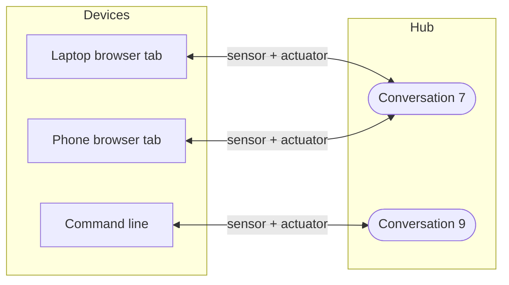
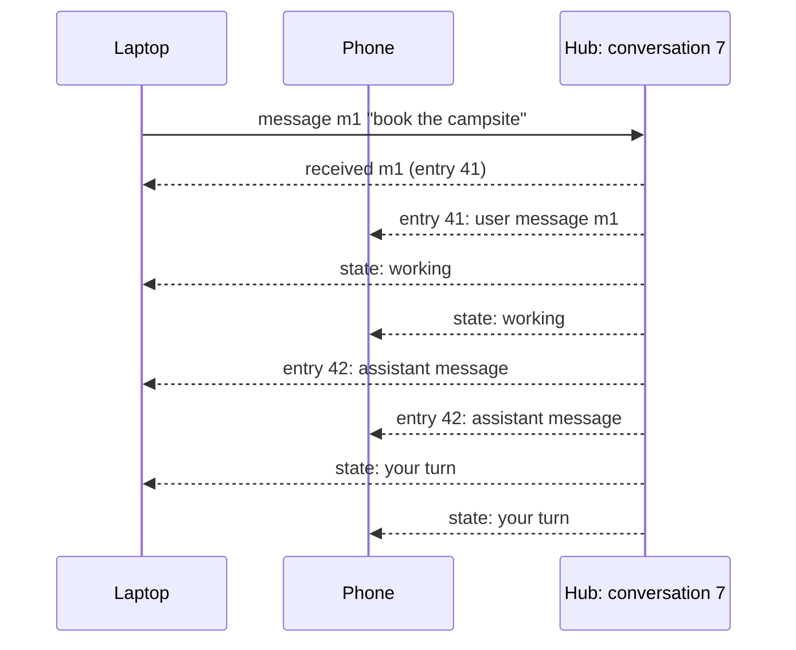

# The conversation channel

**The question.** What is the most basic channel for talking with the user, text in
and text out, now that a channel is a medium the hub holds (ADR-0290) and keeps its
own record where its kind chooses to (ADR-0291)?

This is the second of four proposals for the channel redesign
([#2578](https://github.com/leonapivato/ai-assistant/issues/2578)). It designs one
channel kind, **`conversation`**, against two accepted decisions:

- **ADR-0290:** a channel is needed exactly where something crosses the hub's edge.
  New input arrives on a channel through a sensor, output that leaves goes out
  through an actuator, and hub operations come from devices with no channel.
- **ADR-0291:** a channel's record is its own, separate from memory, and what it
  keeps is its kind's choice. Forgetting never reaches it, and deleting from it is
  the channel's operation.

How a device's connection carries all this is the third proposal, the device
session. How a running activation is stopped is the fourth.

## Baseline

Wiki pages, read at wiki revision
[`9a979ef`](https://github.com/leonapivato/ai-assistant/wiki/Channels/9a979ef6c46adff551e4f787e6bd7fc099284dd4):
[Channels](https://github.com/leonapivato/ai-assistant/wiki/Channels),
[Channel window](https://github.com/leonapivato/ai-assistant/wiki/Channel-window),
[External sensors](https://github.com/leonapivato/ai-assistant/wiki/External-sensors),
[Actuators](https://github.com/leonapivato/ai-assistant/wiki/Actuators) and
[Episodes](https://github.com/leonapivato/ai-assistant/wiki/Episodes).

What the code does at `main`, and the ADRs that decide it:

| ADR | What it decides today | What this proposal would do |
| --- | --- | --- |
| ADR-0274 §2–§4, §6 | A `ChannelInput` names its target channel (`conversation`, with the conversation id as instance) and declares the reply it accepts; the reply returns on the same request. | Supersede for the conversation: input arrives on the conversation through the device's sensor on it and names no channel, and the assistant's output is a message on a conversation, not the answer to the request. |
| ADR-0274 §5 | The caller may supply context: history items and a replied-to item. | Supersede for the conversation: the hub holds the transcript, so a device supplies no history. "This replies to item X" stays, as a reference into the transcript. |
| ADR-0276 §3:1–§3:2 | The conversation's window is its tail as history reads it from episodes; *"the assistant keeps no per-channel history table"*. | Supersede for the conversation: its window is read from its transcript (§4), which is a per-channel record. ADR-0291 names this supersession as owed. |
| ADR-0283 §4:1 | A conversation's history is the episodes on its channel. | Supersede: its history is its transcript. |
| ADR-0283 §8:1 | Deleting a conversation destroys every episode on its channel. | Supersede: deleting a conversation deletes its transcript; forgetting is memory's own command (§1). |
| ADR-0074 | A conversation is a first-class entity; the store mints its id. | Kept. A conversation is a channel instance with that id. |
| ADR-0286 §2–§4, §6, §7 | An episode opens at admission, each stage appends, the end entry freezes it; a restart closes an open episode as interrupted. | Kept. A message sent mid-activation is appended to the open episode as it is sent; a restart's close sends nothing (§9). |
| ADR-0280 §4, row 11 | `reply_owed`: a conversation turn with no composed reply makes `compose` due. | Not amended here. The kind declares it expects a reply (§7); rewording row 11 waits for the first milestone where an event can reach a reply ([#2598](https://github.com/leonapivato/ai-assistant/issues/2598) item 3). |
| ADR-0170 | A reply is not a tool; the turn composes its answer. | Not decided here ([#2593](https://github.com/leonapivato/ai-assistant/issues/2593)). The kind offers *send a message*; until the phases call it, today's compose stage does (§10). |

Unchanged: the spoken path (`converse_spoken`), which stays fenced at the channel's
edge until voice returns as its own kind; informational events (`receive`); and every
other query and command of the engine surface.

## The change

### 1. A conversation is a channel instance the hub holds

`conversation` is an **activating** channel kind. Each conversation is one instance,
a conversation in ADR-0074's sense with the id the store mints. It exists in the hub
whether or not any device is connected to it, and outlives every device. It carries
**text only**.

The operations on conversations themselves are **hub operations** (ADR-0290 §7), not
conversation input:

| Operation | Sort | What it does |
| --- | --- | --- |
| Start a conversation | command | Creates an empty conversation. No longer a side effect of the first message. |
| List conversations | query | As `recent_conversations` today. |
| Read a conversation | query | Its transcript after a cursor, and its current state (§9). |
| Delete a conversation | command | Deletes its transcript. Forgets nothing (ADR-0291 §5). |
| Delete a message | command | Deletes one entry of the transcript (§4). |
| Forget a conversation | command | Forgets what the assistant remembers of it: its episodes. Leaves the transcript (ADR-0291 §4). |

Deleting and forgetting stay **two commands**: there is no single command doing both
(owner, 2026-10-04). An interface may offer them side by side.

### 2. Devices connect a sensor and an actuator to a conversation

A device reaches a conversation by connecting the conversation's **sensor**, its
**actuator**, or both, on that device:

- A device may be connected to many conversations: a browser gateway connects one
  per open tab.
- A conversation may be connected from many devices: a phone and a laptop can be in
  the same conversation at once.
- The hub accepts a connection only for an admitted device and a conversation that
  exists.
- A connection carries a **label** the device declares, such as "iPhone" or "laptop
  browser". It is shown to the user and grants nothing.

**Which conversation a message is on is decided by the sensor it arrived through.**
The order is: a message arrives through a device's sensor on a conversation; the
message is on that conversation; the conversation starts an activation, which then
carries it. The activation cannot be where the conversation comes from, because it
does not exist until the message is on a conversation. And the message never names
its conversation (ADR-0290 §1): nothing typed can move it to another one.

Which conversation a person types into is the interface's choice: a conversation list
in the browser, `assistant chat --conversation <id>` on the command line.

### 3. A message in

A message from a device's sensor carries its text and a **message id the device
chose**.

- **Sending is safe to repeat.** A device that does not know whether its message
  arrived sends it again with the same id, and the hub treats a repeat as the same
  message: one admission, one entry, one episode.
- **Received is the answer to the send.** When the hub has admitted the message,
  written its transcript entry and opened its episode (ADR-0286 §2), it answers the
  send with the entry's place in the transcript. That answer is what lets a device
  stop showing *sending*, and its absence is what tells it to send again. It is not
  a receipt kept in the transcript.
- **A reply reference.** A message may name one earlier entry of the transcript it
  replies to.
- **Size.** A message over the kind's bound is refused, not cut.

### 4. The transcript

Each conversation keeps a **transcript**: its own ordered record of what was said on
it, held inside the hub and separate from the assistant's memory (ADR-0291 §2).

| Entry | Holds |
| --- | --- |
| A user message | Its text, message id, the connection it came from, and the entry it replies to, if any |
| An assistant message | Its text, and the entry it replies to, if any |
| A refused message | A message sent while an activation on this conversation was running, and that it was refused (§9) |
| Couldn't finish | The fixed message sent when an activation started on this conversation ended without sending one (§9) |

- **Order.** The hub assigns each entry a sequence number, increasing across every
  conversation the hub holds. A device following any set of conversations keeps **one
  cursor**, "the last entry I have is N", and catching up is one request for
  everything after N. A cursor too old to replay in full is answered with a
  **snapshot** of each conversation's recent entries, then new entries from there.
- **The window.** Understanding's "what came before on this conversation" is read
  **from the transcript** (ADR-0291 §3), not rebuilt from episodes.
- **Not memory.** An activation's episode still records what the assistant perceived
  and did, so a message's text is in both places. ADR-0291 §2 accepts that: the two
  are never kept in step. Forgetting an episode leaves the transcript as it was, so
  forgotten content can come back through the window; the interface shows that
  rather than hiding it (ADR-0291 §4).
- **Kept until deleted.** The transcript is kept until the user deletes it, a message
  at a time or the whole conversation. Deleting the user's data purges it
  (ADR-0291 §6).
- **Deleting a message deletes that entry alone.** The assistant's reply to it stays,
  and its reply reference then names a deleted entry, which the interface shows as
  such (owner, 2026-10-04). The assistant has no action that deletes (ADR-0291 §5).

### 5. A message out

An assistant message is output on a conversation: the action **send a message**,
carried by the conversation's actuator.

- **Planning chooses the conversation.** *Send a message* names its target
  conversation. Replying on the conversation the input came from is the usual case,
  not a rule (owner, 2026-10-04). The target's requirements apply wherever it is sent
  (§7), and authorizing checks the action like any other.
- **Any activation may send.** An activation not started on a conversation, by a
  timer or an event, may send into one. The assistant starting a conversation's next
  message on its own is the same action.

When it runs:

1. the message is appended to the sending activation's open episode;
2. an *assistant message* entry is added to the target's transcript;
3. it is pushed to every connected actuator on the target.

**The action is done when steps 1–3 have happened.** Whether anyone saw it is not
tracked (Out of scope). An activation may send more than one message: "looking into
it" and then the answer. A message may name the entry it replies to.

### 6. Streaming

An actuator may declare that it takes a message in pieces. It is then sent the pieces
as they are produced and the finished message at the end. **Only the finished message
enters the transcript.** A stream cut off before the end is recorded as cut off, with
the text that was sent, and never as a complete message.

### 7. What the kind declares

- **Its description**, given to planning: a private text conversation with the user,
  in which the user's own messages are input that carries their authority, and which
  expects a reply, a question or a notice to each of them.
- **Its requirements**, enforced by rule whatever a model produces:
  - **Audience: the owner only.** What may be said on a conversation is what may be
    said to the owner (ADR-0199). A connection may declare a narrower audience, never
    a wider one; a conversation others can see is a different kind.
  - **Size.** A message in or out is bounded; over the bound it is refused, not cut.
  - **Turns** (§9).
- **What it keeps** (ADR-0291 §3): the transcript of §4, ordered by sequence number,
  kept until deleted, with the window read from it.
- **What it allows deleting** (ADR-0291 §5): a single entry, or the whole
  conversation, by the user's command.

### 8. A conversation's current state

Whether an activation started on a conversation is running is the conversation's
**current state**, not history. It is not kept in the transcript; it is derived from
whether such an activation is running, and is:

- **queryable**, as part of reading a conversation (§1); and
- **pushed** to connected devices when it changes, so every device locks and unlocks
  its input together. How it is pushed is the device session's.

### 9. Turns

**The user may send on a conversation when no activation started on it is running.**

- An activation may send any number of messages. The user's turn opens when it ends.
- A message the user sends while one runs is **refused**, not queued, with a status
  the interface can show, and is recorded as a refused entry. Queuing would break the
  alternation; whether a new message should take over the running work is the
  concurrency milestone's.
- **The turn rule limits the user's sends, not the assistant's.** A message the
  assistant sends into a conversation (§5) is allowed whatever that conversation's
  state, and does not change it: it is the user's turn there before and after.
- **An activation started on a conversation that ends having sent nothing** sends the
  fixed message: it could not finish, listing any effects that did happen.
- **A restart sends nothing.** A restart closes an open episode as interrupted
  (ADR-0286 §7), so the record of what happened is there to inspect. Nothing is
  running afterwards, so the conversation's state is the user's turn without any step
  taken. Posting the fixed message on restart is left for later: it would add a write
  into the conversation from recovery, for a rare case.

Stopping a running activation is a hub command, the fourth proposal's subject.
Interrupting or cancelling with words is out of scope.

### 10. Until the phases send messages

Under the wiki's direction, planning chooses *send a message*, authorizing checks it
and acting runs it. None of that is built, and whether a reply is delivered as an
action is open (#2593). So the first build uses an **adapter**: the reply today's
compose stage produces is sent as one assistant message on the conversation the input
came from, and the adapter sends the fixed message when a pass ends without one.

The conversation therefore works before the phases are rebuilt, and the controller
work replaces the adapter without changing the conversation. Sending into another
conversation, and sending from an activation not started on one, need planning to
choose the target, so they arrive with the phases; the kind permits them from the
start.

### What the engine surface becomes

- `converse` and `converse_streaming` are replaced, for the conversation, by
  connecting to a conversation, sending a message, and reading the transcript after a
  cursor. How those travel to a device is the device session proposal's; this
  proposal fixes what they are.
- New commands: start a conversation, delete a conversation, delete a message.
- `recent_conversations` and `conversation` remain queries; reading a conversation
  gains its current state.
- `forget_conversation` becomes the memory-side command: it forgets the
  conversation's episodes and no longer deletes the conversation.

These are changes to `AssistantEngine` and to the conversation store's Protocol, which
gains the transcript, so the ADR this becomes is a contract change. Its triad
(Protocol, conformance suite, canonical fake) lands in one change with the
transcript's primary implementation (ADR-0137 §2).

## Options considered

**History read from episodes, with a text-less log pointing into them** (this
proposal's first draft). One copy of every message's text. Superseded by ADR-0291: a
conversation's history is its own, and receipts and refused messages, which are not
activations, could not live in episodes.

**Turn state as transcript entries.** Every device replays when the assistant was
working. Declined (owner, 2026-10-04): it is the conversation's current state, derived
from what is running, and keeping it would fill the history with entries that carry
no message.

**Delete-and-forget as one command.** One step for "make this gone". Declined (owner,
2026-10-04): deleting and forgetting are different acts, and a combined command makes
one quietly imply the other.

**Deleting a message takes its reply with it.** Avoids a reply to nothing. Declined
(owner, 2026-10-04): the user deletes exactly what they pick.

**Send only on the activation's own conversation.** Simplest to reason about.
Declined (owner, 2026-10-04): the assistant may message any conversation, and
excluding it would need a rule rather than removing one.

**One cursor per conversation instead of one per device.** Simpler sequence numbers,
but a device following ten conversations would track ten cursors and make ten
catch-up requests.

**Queue a message sent while the assistant works.** Friendlier in the moment, but the
queued message would be processed against a reply the user had not seen when they
wrote it. Declined until the concurrency milestone can judge takeovers.

**Keep the reply on the request.** No transport change. Declined: the reply would
reach only the device that sent the message, input and output stay welded, and the
assistant could not send on its own.

## Out of scope

- **Receipts beyond *received*.** *Shown* and *read* are deferred (owner,
  2026-10-04). ADR-0291 lets the kind add them to its transcript later.
- **Posting the fixed message on restart** (§9).
- Voice, and the spoken path generally; interrupting or cancelling with words.
- Editing a message; composing while offline; typing indicators.
- More than one person in a conversation; a native phone app and push notifications.
- Merging notifications into conversations.
- [#2520](https://github.com/leonapivato/ai-assistant/issues/2520)'s question of
  separate conversations versus one continuous one. One conversation stays one channel
  instance.

## What it leaves open

- **Snapshot size.** How much of a conversation's transcript a snapshot carries.
- **What a device sees of a running activation.** The user's own message and the
  assistant's sent messages are shown at once; the rest of an open episode stays
  owner-only inspection (ADR-0286 §6). Whether anything else is shown in the
  conversation, a progress line for example, is left open; the lean is none for now.
- **The cutover.** Existing conversations hold their history in episodes and have no
  transcript. Whether the cutover seeds each transcript once from its episodes or
  starts on a fresh data directory is the implementation's.
- **The spoken path's place.** A spoken turn runs on the conversation channel today
  and reads its tail from episodes; it is not added to the transcript. Where speech
  lands is voice's own kind.
