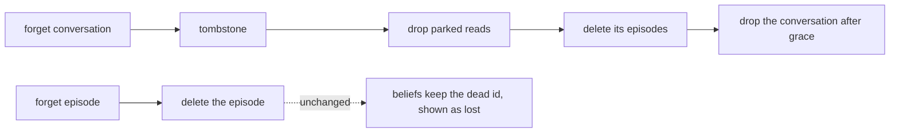

# Episodes are kept until forgotten, and the transcript archive is retired

**The question.** Now that the episode is the one record of an activation, should
episodes stop expiring after 30 days, and should the transcript archive, a second copy
of each exchange, be retired?

**The answer proposed.** Yes to both, at the minimum.

- `episode_retention` keeps its meaning, and its default becomes `none` ("keep forever").
- The transcript archive is removed, together with its Protocol, its settings, its CLI
  commands, its wire operations and `ExchangeDisposition`.
- Forgetting keeps the rules it has today. It simply has no archive entry left to
  discard.

This is step 3b of #2613. On 2026-10-03 the owner ruled it down to this scope ("I dont
care much about getting the forgetting functionality perfect right now"), and the ruling
is recorded on #2613.

## Baseline

The wiki, [Episodes](https://github.com/leonapivato/ai-assistant/wiki/Episodes), read
at `5fc536de`:

- "**Kept and forgotten as a whole.** An episode is kept for the episode retention
  period, and forgetting it removes every part, input and context included."
- "retention under `episode_retention` and forgetting every field: **Built**,
  ADR-0275 §9."

The code, at `6dd92efa`:

- **Retention.**
  - `Settings.episode_retention` defaults to 30 days. `none` already means "keep
    forever", and it already turns off idle-conversation reclaim.
  - The activation writer stamps `expires_at` from it.
  - The store hides an expired record at read, and the scheduler's `retention_purge` job
    deletes it.
- **Two readers borrow the window, and both already handle `none`.**
  - The authorization expiry fallback (`orchestration/authorizing.py`) takes its
    fourth rung where the window is `none` and writes no expiry row rather than invent
    one (ADR-0256 §3).
  - The deferral question lifetime (`memory/deferral_store.py`) is its own 30-day
    constant. It is named after the window but does not read it.
- **The transcript archive** (`archive/`, ADR-0225).
  - The writer's only call is `ActivationWriter._archive_once`, gated by
    `transcript_archive_enabled`.
  - Today forget, conversation deletion and the capture compensation each discard an
    entry.
  - The only readers are the user's explicit `transcript` CLI group (search, show,
    forget, forget-conversation, size) and its wire operations. The gateway exposes
    none of it.
  - No model reads it (ADR-0225 §4).
- **`ExchangeDisposition`** belongs to `TranscriptEntry.disposition` alone. Its
  docstring already says it "leaves with the archive" (ADR-0284 §5:3).
- **Forget, today.**
  - `Engine.forget` deletes the record and discards its archive entry.
  - `forget_conversation` deletes the conversation's episodes, archive entries and
    parked reads.
  - A belief citing a forgotten episode keeps the dead id. At read, the citation shows
    as lost and the displayed confidence drops (ADR-0077 §6, ADR-0091).

ADRs it would touch:

- **ADR-0074 §7**: retention's finite default. §8's deletion order loses its archive
  step.
- **ADR-0225** entire: the archive. It is superseded, not amended.
- **ADR-0221**: the typed disposition, where it survives only on the archive entry.
- **ADR-0275 §9**: retention "under `episode_retention`" stands; only the default
  changes.
- **ADR-0283 §5 and §8, and ADR-0284 §5:3**: the writer's sequence and conversation
  deletion each lose their archive step.
- **ADR-0286**: its tests and clauses that say "no archive entry".
- **ADR-0244 §3**: parked reads dropped with the conversation, which is unchanged. It
  is listed only to confirm that it is not touched.

## The change

### Episodes are kept until forgotten

`episode_retention` keeps its type, its meaning and its validation. Its default
changes from 30 days to `none`. A deployment that sets a finite window still gets
today's behaviour: the stamp, the read-time hiding and the purge. Nothing new is built.
The default is the only thing that moves.

The setting is kept rather than removed:

- Every reader of it already handles `none`.
- Removing it would mean deleting the expiry machinery that other record kinds share
  for this one kind.

The idle-conversation reclaim (ADR-0074 §8) waits for retention to empty a channel. So
under the new default it never fires, which is what `none` already does today.

### The transcript archive is retired

Since ADR-0284 the episode carries the exchange itself: the input as it arrived and the
response. The archive is a second, text-only copy of the same thing. It goes, in full:

- `archive/` and the `TranscriptArchive` and `TranscriptArchiveWriter` Protocols, with
  their conformance suite and the `testing/archive.py` fake;
- `TranscriptEntry`, `TranscriptSearchHit`, `TranscriptArchiveSize`,
  `TranscriptArchiveError` and `ExchangeDisposition` from `core`, and the engine code
  that computes a disposition;
- `transcript_archive_enabled` and `transcript_archive_retention`;
- the writer's archive step and its compensation;
- the `transcript` CLI group, its wire operations and the engine methods behind them;
- the archive's composition wiring and its database file.

The CLI retention notice, "An archive may outlive an expired episode", goes with it.

**What the user loses:** text search over past exchanges. Episode inspection lists and
shows episodes, but it does not search them. Episode search is left open (below)
rather than kept alive through the archive.

### Forgetting keeps today's rules

Nothing about forget changes except that the archive step is gone.

- Forgetting a record deletes it.
- Forgetting a conversation deletes its episodes and its parked reads, after the same
  tombstone and grace period.
- A belief citing a forgotten episode keeps the dead id, and its citation still renders
  as lost.

## What a reader of the wiki would find different

On [Episodes](https://github.com/leonapivato/ai-assistant/wiki/Episodes):

- "**Kept for the episode retention period**" becomes **kept until forgotten**. A
  deployment may still set a retention window.
- No page describes a transcript archive after this, and nothing says an archive may
  outlive an episode.

## Delivery

An ADR, then the implementation lanes. The lanes are cut by subsystem and are mostly
deletion:

1. **`orchestration` and `app`**: the writer stops archiving and forget stops
   discarding. The engine's transcript methods and the archive's composition wiring go.
2. **`interfaces` and `wire`**: the `transcript` CLI group and its wire operations go,
   with a `PROTOCOL_VERSION` advance.
3. **`core`, `archive` and `testing`**: delete the types, Protocols, settings, package,
   suite and fake once nothing uses them, and change `episode_retention`'s default.
   Removing a Protocol is a breaking contract change, so this lane runs both review
   lenses.

Lanes 1 and 2 can run in parallel. Lane 3 waits for both, because it deletes what they
stop using.

There is no deploy of its own. It goes out with ADR-0284, ADR-0285 and ADR-0286 in
#2613's one cutover, on a fresh data directory, so no migration of an existing
archive is owed.

## Options considered

**The fuller forget, the original 3b scope, deferred.** Under that scope, forgetting an
episode would also:

- remove its id from every belief, deleting a belief whose last citation goes, with no
  confidence recompute;
- turn other episodes' excerpts of it into ids;
- delete deferrals and goals tied to it.

It closes real gaps, but the owner does not need forgetting to be perfect now. Every
one of these gaps exists today, so none of them is a regression.

**Remove `episode_retention`.** Rejected, because changing the default is enough.
Removal would strip the expiry machinery that other record kinds share, and the two
readers that borrow the window already handle `none`.

**Keep the archive for its search.** Rejected. It is a second copy of every exchange,
with its own retention, destruction and deletion order to keep correct, all for one
search command. Episode search can be built on the one record when it is wanted.

## What it leaves open

- **Episode search**: user-facing text search over episodes, replacing the archive's.
  It is not built here.
- **Excerpts of a forgotten episode.** A later episode's recall
  (`RecalledItem.excerpt`) or understanding referent (`UnderstandingReferent.excerpt`)
  keeps up to 240 characters of another record's text. That text survives when the
  record is forgotten, as it does today. Parked as #2664.
- **Beliefs, deferrals and goals tied to a forgotten episode** keep today's behaviour,
  described above. Goals are retired with the planning rebuild.
- **Backups** (ADR-0123) hold whatever was in the data directory when they were taken,
  and forget cannot reach them. That is unchanged.
