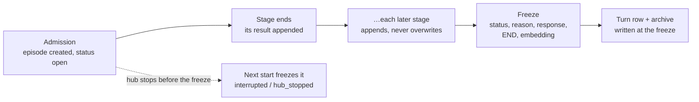

# One episode, open while the activation runs and frozen when it ends

**The question:** should the working episode and the saved episode be one
record, stored from admission, added to as each stage ends and frozen when
processing ends, instead of an in-memory working set that is saved once at the
end?

Tracked by [#2613](https://github.com/leonapivato/ai-assistant/issues/2613)
(milestone M36, reopened 2026-09-30). This proposal also covers
[#2608](https://github.com/leonapivato/ai-assistant/issues/2608), which saves
each phase's reads with the episode, because both need the same schema cutover.

## Baseline

Wiki, read at revision `ea98b15`:

- [Episodes](https://github.com/leonapivato/ai-assistant/wiki/Episodes): an
  episode is "written once, when processing ends, and never changed
  afterwards"; the page also says "an activation cut short by a crash may leave
  no episode". Its rule "A log, read through current views" already describes
  phases appending results that are never overwritten.
- [Controller](https://github.com/leonapivato/ai-assistant/wiki/Controller) and
  its child page Concurrent activations: other channels should be able to see
  activations that are still in progress.
- [Episode window](https://github.com/leonapivato/ai-assistant/wiki/Episode-window),
  [Recall](https://github.com/leonapivato/ai-assistant/wiki/Recall),
  [Activations](https://github.com/leonapivato/ai-assistant/wiki/Activations),
  [Stories](https://github.com/leonapivato/ai-assistant/wiki/Stories).

Code, at `5d872812`:

- **The working set.** `ActivationState` plus its `_ActivationPass` hold the
  working episode (ADR-0282 §2) only in memory.
- **Capture.** `ActivationCoordinator.finish` → `ActivationWriter.write` saves
  it once. That write has five steps:
  1. a preflight size check;
  2. `ConversationStore.append`, which allocates `conv:<cid>:<ordinal>`;
  3. an output check;
  4. the archive write;
  5. a `MemoryStore.write_atomic` insert-if-absent, then deletion verification
     and compensation.
- **Standalone episodes** use `activation:<id>`.
- **The saved record.** `EpisodeProcessingRecord` is frozen, at
  `schema_version` 4 and `EPISODE_RECORD_FORMAT` 4. `ProcessingStatus` has no
  running state. Both stores refuse any change to `processing_record` or
  `outcome` once written.

ADR clauses this would supersede or amend:

| ADR | Clause | What it says today |
| --- | --- | --- |
| ADR-0275 | §1 | M36 "adds no live activation log". |
| ADR-0275 | §2 | Activation ID and start time are "call-local state, with no durable start row". |
| ADR-0275 | §3 | "A later resumption … never rewrites the earlier episode's processing history". This one stands; noted only because an open episode is added to while running. |
| ADR-0275 | §6 | A conversational episode's address is the one `ConversationStore.append` allocates. |
| ADR-0275 | §8 | Capture happens once. "No captured processing envelope is updated in place afterward". "Restart never fabricates interrupted episodes". "Not a durable live-progress record". |
| ADR-0275 | §9 | Retention is stamped at capture. |
| ADR-0275 | §12 | Format 4, and the rule that "store updates … preserve that record's activation envelope". |
| ADR-0276 | §4 | The episode window reads with "no status filter". |
| ADR-0276 | §7 | Understanding versions are retained at capture. |
| ADR-0280 | §6 | Stage entries are "written **once**, at capture … nothing is written durably before finalization". |
| ADR-0282 | §1 | "Nothing this decision adds to the working episode is saved with the episode"; format stays 4. |

## The change

What a reader of those pages would find different afterwards.

### 1. One identity, from admission

Every episode's ID is `activation:<activation_id>`. The ID is allocated at
admission, where the activation ID already is (`admit_channel`, and
`_admit_control` for resume).

A conversation's turn row keeps its own place, `(conversation_id, ordinal)`.
The row's `episode_id` column holds the episode's ID instead of an address
derived from the ordinal. `conv:<cid>:<ordinal>` stops being an episode ID, and
the check that the stored ID equals the ordinal's spelling goes away.

The activation ID and the episode ID then name the same thing. The activation
ID stays as the field. M40's story members already point at the activation ID,
so they need no change.

### 2. Written through as each stage ends

The stored episode is created at admission with status `open`. It holds:

- the trigger (input, attached context, channel);
- `started_at`;
- the expiry, stamped from the episode retention period at creation.

As each stage ends, its result is appended in order and nothing is overwritten:

- the stage entry (ADR-0280 §6);
- an understanding version;
- recall's result;
- links;
- the conversation, once the begin stage allocates or resolves it;
- and, from #2608, the stage's reads: the window IDs understanding was shown,
  the IDs a stage fetched and those that returned nothing, and recall's score
  for each item it kept.

The working-set objects themselves stay in memory for the pass. ADR-0282 §2
stands: a stage's part holds IDs, never copies of records. The records a stage
fetched are never written into the episode.

### 3. Frozen by one last write

A new `ProcessingStatus` value, `open`, is the only status the store accepts
additions for. The freeze is the final write. It sets:

- the ending status (completed, waiting, failed or interrupted) and the reason;
- `ended_at`;
- the response;
- the END stage entry;
- the conversational `content` projection (asked/replied) and its embedding;
- the capture stamps.

From then on the record is exactly as immutable as a format-4 record is today.

So the store has two record shapes behind one ID: open, where appends are
allowed, and frozen, where nothing may change. It gains one narrow operation
for each, both refused on anything but an open episode.

The conversation turn row and the archive entry are written at the freeze, in
today's order: index append, archive, episode. A mid-activation reader of the
channel window sees what it sees today.

### 4. Who sees an open episode

| Reader | Sees open episodes? |
| --- | --- |
| Episode window | Yes, other activations' open episodes, marked **in progress**. Never its own. This is the concurrency direction's cross-channel view. |
| Channel window / history | No change. The turn row only exists once the episode is frozen. |
| Recall | No. Recall searches frozen episodes; an open one has no embedding yet. |
| Planner, observer, consolidation, export | Frozen only. |
| Inspection (`assistant episode`, the episodes list) | Yes, with its status. The list gains a status filter. |
| Retention purge | Skips open episodes. The restart freeze (below) makes sure no episode stays open forever. |

### 5. Restart freezes what was left open

When the hub starts, it freezes every open episode as `interrupted`, reason
`hub_stopped`, keeping everything appended before the stop. This is not
fabrication: the record exists, and only the ending is supplied. It is honest
about what is unknown: the reason says the hub stopped, not that processing
ended normally. It does not replay input or resume work.

This replaces the wiki sentence "An activation cut short by a crash may leave
no episode". A crash before the admission write still leaves none.

### 6. Forgetting while open

Forgetting an episode or deleting its conversation while the activation runs
deletes the open episode. The activation's later appends and its freeze then
find no open episode. That degrades capture, as a refused append does today,
and never changes the answer or repeats processing.

Deleting a conversation has to find open episodes that are not yet in its turn
index. It needs either an episodes query by conversation, or the freeze refusing
because the conversation is gone and then deleting the episode (today's
compensation). The ADR picks one; see "Left open".

### 7. A cutover

- `EpisodeProcessingRecord.schema_version` 5 and `EPISODE_RECORD_FORMAT` 5.
- A conversation-schema change for the turn row's `episode_id`.
- A `PROTOCOL_VERSION` bump.
- A fresh data directory on the hub, as M36 and M39 each needed.

`MemoryStore` gains members, so this is a **Protocol change**. The contract,
conformance suite and canonical fake land together (ADR-0015, and ADR-0137 §2
for the primary implementation).

## Bounds

The episode is added to as the activation runs, so bounds are checked on each
append and not once at the end.

- **Stage entries:** capped at `STAGE_RECORD_LIMIT` (64). Today the record keeps
  the first half and the last half and counts what was elided in between. Kept
  this way, the store would have to drop entries from the middle during the run.
  Proposed instead: the open episode stores the first half as they happen, the
  pass keeps a rolling last half in memory, and the freeze writes that tail and
  `stages_elided`. The END entry is never elided.
- **Understanding versions:** capped at 8, and the latest is never dropped.
  Handled the same way: the first versions are written through, and the freeze
  writes the latest.
- **Size preflight:** the 8·P + 65536 check applies per append against the
  record's running size. The final check at the freeze keeps its current shape.

## Options considered

**A. Keep the working episode in memory and save it once (today, plus
#2608).** This is the cheapest and it is already built. But nothing is visible
before the end, a crash leaves nothing, and the episode's ID is not known until
capture, so stories, effects and timers can't point at it while the activation
runs. Every later feature that wants those (concurrency, #2584's durable
effects, M40's mechanical links) would have to build around it, and the longer
that goes on, the more there is to undo.

**B. A separate live journal, with the episode still written once at the end.**
This keeps ADR-0275 §8 as it is. The cost is two records of one activation,
which is exactly the split this change removes: readers would pick one or the
other, and the journal's lifecycle and deletion would copy the episode's.

**C. One episode, open then frozen (this proposal).** It gives one identity, one
lifecycle and one deletion path. The costs are a new status, a narrow append
path in the store, a reader-by-reader decision about open episodes, and a
cutover.

**The ID.** The alternative was to keep `conv:<cid>:<ordinal>` for
conversational episodes and allocate the ordinal at admission. That reserves
ordinals for activations that may never produce a turn, and it gives one
episode two naming schemes. A single `activation:` namespace is simpler, and
the turn row already has its own `(conversation_id, ordinal)`.

## What it adds from #2608

These are saved with the episode and rendered by `assistant episode`, both the
human detail and `--json`:

- the window IDs understanding was shown, not only the ones it cited;
- the IDs each stage fetched, and those that returned no record;
- recall's score for each kept item, which is what tuning the threshold needs
  (#2601).

## What changes for readers of the wire

- `ChannelResult.capture` and `TurnOutcome` carry the episode ID
  `activation:<id>`.
- `SpokenTurn.episode_id` becomes the episode ID, no longer the index-row
  address.
- A `recorded` capture report means the episode was frozen and verified.
- Inspection results can carry an open episode.

## Delivery

Five lanes, in order:

1. **The ADR.** The number is assigned at conversion. It is merged on its own
   before anything implements against it.
2. **Contract lane (core + memory):**
   - the new status and record shapes;
   - the `MemoryStore` open/append/freeze members with their conformance suite
     and canonical fake;
   - the sqlite implementation, format 5;
   - the wire additions.
3. **Conversation store:** the turn row's `episode_id` holds the episode's ID;
   the conversation schema is bumped.
4. **Orchestration:**
   - admission creates the episode;
   - stages write through;
   - `ActivationWriter` becomes the freeze;
   - the restart freeze;
   - the deletion path;
   - #2608's reads.
5. **Interfaces:** `assistant episode` shows open episodes, the status filter,
   and #2608's rendering.

After lane 5 the hub moves to a fresh data directory.

## Left open

- **How conversation deletion finds open episodes:** a query by conversation on
  the episodes list, or leaving it to the freeze refusing and compensating.
  The first is cleaner; the second adds no store surface.
- **Which stages write through, and when.** Proposed: at every stage end. An
  alternative is only at the end of stages whose results matter to another
  reader (understanding, recall, effects). That writes less but leaves gaps.
- **What an in-progress episode renders in the episode window.** Proposed: the
  input, the channel, "in progress", and the latest understanding if there is
  one. No partial response.
- **Whether the legacy `ConversationLifecycle.capture` path** (unused in
  production) is retired in lane 4 or left to its own issue.
- **Effects and timers (#2584)** are written to the story, not the episode
  (wiki Episodes). This proposal makes the episode durable while it runs but
  does not decide where effects live.
