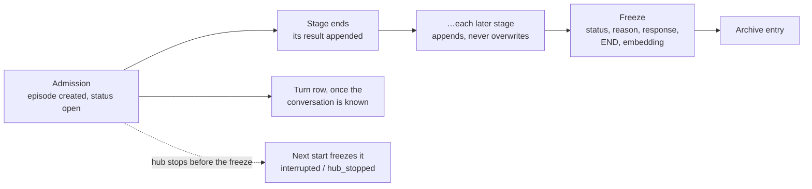

# One episode, open while the activation runs and frozen when it ends

**The question:** should the working episode and the saved episode be one
record, stored from admission, added to as each stage ends and frozen when
processing ends, instead of an in-memory working set that is saved once at the
end?

Tracked by [#2613](https://github.com/leonapivato/ai-assistant/issues/2613)
(milestone M36, reopened 2026-09-30). This proposal also covers
[#2608](https://github.com/leonapivato/ai-assistant/issues/2608), which saves
each phase's reads with the episode, because both need the same schema cutover.

## Baseline

Wiki, read at revision `ea98b15`:

- [Episodes](https://github.com/leonapivato/ai-assistant/wiki/Episodes): an
  episode is "written once, when processing ends, and never changed
  afterwards"; the page also says "an activation cut short by a crash may leave
  no episode". Its rule "A log, read through current views" already describes
  phases appending results that are never overwritten.
- [Controller](https://github.com/leonapivato/ai-assistant/wiki/Controller) and
  its child page Concurrent activations: other channels should be able to see
  activations that are still in progress.
- [Episode window](https://github.com/leonapivato/ai-assistant/wiki/Episode-window),
  [Recall](https://github.com/leonapivato/ai-assistant/wiki/Recall),
  [Activations](https://github.com/leonapivato/ai-assistant/wiki/Activations),
  [Stories](https://github.com/leonapivato/ai-assistant/wiki/Stories).

Code, at `5d872812`:

- **The working set.** `ActivationState` plus its `_ActivationPass` hold the
  working episode (ADR-0282 §2) only in memory.
- **Capture.** `ActivationCoordinator.finish` → `ActivationWriter.write` saves
  it once. That write has five steps:
  1. a preflight size check;
  2. `ConversationStore.append`, which allocates `conv:<cid>:<ordinal>`;
  3. an output check;
  4. the archive write;
  5. a `MemoryStore.write_atomic` insert-if-absent, then deletion verification
     and compensation.
- **Standalone episodes** use `activation:<id>`.
- **The saved record.** `EpisodeProcessingRecord` is frozen, at
  `schema_version` 4 and `EPISODE_RECORD_FORMAT` 4. `ProcessingStatus` has no
  running state. Both stores refuse any change to `processing_record` or
  `outcome` once written.

ADR clauses this would supersede or amend:

| ADR | Clause | What it says today |
| --- | --- | --- |
| ADR-0275 | §1 | M36 "adds no live activation log". |
| ADR-0275 | §2 | Activation ID and start time are "call-local state, with no durable start row". |
| ADR-0275 | §3 | "A later resumption … never rewrites the earlier episode's processing history". This one stands; noted only because an open episode is added to while running. |
| ADR-0275 | §6 | A conversational episode's address is the one `ConversationStore.append` allocates, and no standalone fallback after a refused append. |
| ADR-0275 | §8 | Capture happens once. "No captured processing envelope is updated in place afterward". "Restart never fabricates interrupted episodes". "Not a durable live-progress record". |
| ADR-0275 | §9 | Retention is stamped at capture. |
| ADR-0275 | §12 | Format 4, and the rule that "store updates … preserve that record's activation envelope". |
| ADR-0276 | §4 | The episode window reads with "no status filter". |
| ADR-0276 | §7 | Understanding versions are retained at capture. |
| ADR-0280 | §6 | Stage entries are "written **once**, at capture … nothing is written durably before finalization". |
| ADR-0282 | §1 | "Nothing this decision adds to the working episode is saved with the episode"; format stays 4. |

## The change

What a reader of those pages would find different afterwards.

### 1. One identity, from admission

Every episode's ID is `activation:<activation_id>`. The ID is allocated at
admission, where the activation ID already is (`admit_channel`, and
`_admit_control` for resume).

A conversation's turn row keeps its own place, `(conversation_id, ordinal)`.
The row's `episode_id` column holds the episode's ID instead of an address
derived from the ordinal. `conv:<cid>:<ordinal>` stops being an episode ID, and
the check that the stored ID equals the ordinal's spelling goes away.

The activation ID and the episode ID then name the same thing. The activation
ID stays as the field. M40's story members already point at the activation ID,
so they need no change.

### 2. Written through as each stage ends

The stored episode is created at admission with status `open`. It holds:

- the trigger (input, attached context, channel);
- `started_at`;
- the expiry, stamped from the episode retention period at creation.

As each stage ends, its result is appended in order and nothing is overwritten:

- the stage entry (ADR-0280 §6);
- an understanding version;
- recall's result;
- links;
- the conversation, once the begin stage allocates or resolves it;
- and, from #2608, the stage's reads: the window IDs understanding was shown,
  the IDs a stage fetched and those that returned nothing, and recall's score
  for each item it kept.

The open episode has one shape for every activation, whatever its channel.
#2598 sets the direction that new phases live on one shared working set,
rather than on today's separate conversation-turn and event classes
(`_TurnPass` and `_EventPass`). What is written through follows that: the
saved parts are the shared ones, so the stored format does not fork by channel
kind for good. Anything specific to one channel kind is recorded as a fact that
channel declares, not as a separate shape.

The working-set objects themselves stay in memory for the pass. ADR-0282 §2
stands: a stage's part holds IDs, never copies of records. The records a stage
fetched are never written into the episode.

### 3. Frozen by one last write

A new `ProcessingStatus` value, `open`, is the only status the store accepts
additions for. The freeze is the final write. It sets:

- the ending status (completed, waiting, failed or interrupted) and the reason;
- `ended_at`;
- the response;
- the END stage entry;
- the conversational `content` projection (asked/replied) and its embedding;
- the capture stamps.

From then on the record is exactly as immutable as a format-4 record is today.

So the store has two record shapes behind one ID: open, where appends are
allowed, and frozen, where nothing may change. It gains one narrow operation
for each, both refused on anything but an open episode.

The conversation turn row is written as soon as the conversation is known.
For an existing conversation that is admission; for a new one it is the begin
stage that allocates it. The row points at the open episode, so its ordinal
follows arrival order, not finish order. This reserves no ordinal that would
otherwise go unused: capture already appends a turn for every conversational
activation, including a failed or no-words pass that names a conversation
(ADR-0275 §6). The one exception is a crash, and the restart freeze (§5) turns
that into an interrupted turn.

The archive entry is still written at the freeze, after the episode's final
write, as today.

### 4. Who sees an open episode

| Reader | Sees open episodes? |
| --- | --- |
| Episode window | Yes, other activations' open episodes, marked **in progress**. Never its own. This is the concurrency direction's cross-channel view. |
| Channel window | Other activations' open turns, marked **in progress**, with their input and no response. Never its own. |
| Conversation history and export | Frozen turns only. |
| Recall | No. Recall searches frozen episodes; an open one has no embedding yet. |
| Planner, observer, consolidation, export | Frozen only. |
| Inspection (`assistant episode`, the episodes list) | Yes, with its status. The list gains a status filter. |
| Retention purge | Skips open episodes. The restart freeze (below) makes sure no episode stays open forever. |

### 5. Restart freezes what was left open

When the hub starts, it freezes every open episode as `interrupted`, reason
`hub_stopped`, keeping everything appended before the stop. This is not
fabrication: the record exists, and only the ending is supplied. It is honest
about what is unknown: the reason says the hub stopped, not that processing
ended normally. It does not replay input or resume work.

This replaces the wiki sentence "An activation cut short by a crash may leave
no episode". A crash before the admission write still leaves none.

### 6. Forgetting while open

Forgetting an episode or deleting its conversation while the activation runs
deletes the open episode. The activation's later appends and its freeze then
find no open episode. That degrades capture, as a refused append does today,
and never changes the answer or repeats processing.

Because the turn row exists as soon as the conversation is known (§3),
deleting a conversation finds its open episodes the way it finds frozen ones:
through its turn rows. Deletion keeps today's index-first order and
verification, with no new query on the store, and a deleted conversation's
content does not survive in an open episode, even for the rest of the pass.

Between admission and the begin stage, a new conversation does not exist yet,
so there is nothing to delete.

### 7. A turn naming a conversation that does not exist

Today such a turn is refused, and its capture then fails at the index append,
so no episode records even the refusal (#2592). Under this change the episode
already exists when the turn-row write is refused, and it is kept. It becomes a
standalone failed episode, `activation:<id>` with no conversation. It records
which conversation ID the input named and that the name was refused, but it
does **not** keep the context the client attached to the input.

This relaxes ADR-0275 §6's rule against falling back to standalone storage
after a refusal. That rule exists so a deleted conversation's context cannot
escape its deletion through a new episode, and an unknown conversation cannot
be told apart from a deleted one because nothing records deletions. Dropping
the attached context keeps what the rule protects: the only content the kept
episode holds is the new input itself, which arrived with this activation and
not from the conversation.

A conversation deleted after its turn row is written is §6's case, not this
one.

### 8. A cutover

- `EpisodeProcessingRecord.schema_version` 5 and `EPISODE_RECORD_FORMAT` 5.
- A conversation-schema change: the turn row's `episode_id`, and its open or
  frozen mark.
- A `PROTOCOL_VERSION` bump.
- A fresh data directory on the hub, as M36 and M39 each needed.

It changes **two Protocols**:

- `MemoryStore` gains the operations to create, append to and freeze an open
  episode.
- `ConversationStore` writes a turn row before the freeze, marks it open or
  frozen, and points it at the episode's ID.

For each one, the contract, conformance suite and canonical fake land together
with the primary implementation (ADR-0015, ADR-0137 §2). Both are decided in
the one ADR.

## Bounds

The episode is added to as the activation runs, so bounds are checked on each
append and not once at the end.

- **Stage entries** (`STAGE_RECORD_LIMIT`, 64) and **understanding versions**
  (8, the latest never dropped) are saved in full while the episode is open.
  The freeze trims them to today's shape: the first half and the last half of
  the stage entries with `stages_elided` counting the rest, and the END entry
  never elided. The restart freeze trims them the same way. A frozen record is
  exactly what it would be today, so no reader of frozen episodes changes.
  Rewriting the lists at the freeze is allowed because the episode is still
  open until that write lands. Inspecting an open episode shows every entry.
- **A ceiling on the open record.** Saving in full needs its own limit, or a
  pass stuck in a loop grows the open record until the freeze. The open record
  stops taking entries past a ceiling (proposed: four times each cap). After
  that, new entries stay in memory and the freeze writes the tail from there.
  An ordinary pass never reaches the ceiling; a runaway one degrades instead of
  growing.
- **Size preflight:** the 8·P + 65536 check applies per append against the
  record's running size. The final check at the freeze keeps its current shape.

## Options considered

**A. Keep the working episode in memory and save it once (today, plus
#2608).** This is the cheapest and it is already built. But nothing is visible
before the end, a crash leaves nothing, and the episode's ID is not known until
capture, so stories, effects and timers can't point at it while the activation
runs. Every later feature that wants those (concurrency, #2584's durable
effects, M40's mechanical links) would have to build around it, and the longer
that goes on, the more there is to undo.

**B. A separate live journal, with the episode still written once at the end.**
This keeps ADR-0275 §8 as it is. The cost is two records of one activation,
which is exactly the split this change removes: readers would pick one or the
other, and the journal's lifecycle and deletion would copy the episode's.

**C. One episode, open then frozen (this proposal).** It gives one identity, one
lifecycle and one deletion path. The costs are a new status, a narrow append
path in the store, a reader-by-reader decision about open episodes, and a
cutover.

**The ID.** The alternative was to keep `conv:<cid>:<ordinal>` for
conversational episodes. That gives episodes two naming schemes. It also
leaves an activation that starts a new conversation with no ID until the begin
stage allocates one, which is after the episode has to exist. A single
`activation:` namespace is simpler, and the turn row already has its own
`(conversation_id, ordinal)`.

**The capped lists.** Three other ways were weighed:

- Saving the first half as it happens and writing the tail at the freeze.
  This loses the tail in a crash and shows an open reader no recent entries
  once the cap is reached.
- Keeping only the first N and counting the rest. This drops the latest
  entries and breaks the "latest understanding is never dropped" rule.
- Turning the caps into limits the controller enforces, ending the pass at 64
  stages. This keeps the record strictly append-only, but it ends passes that
  run today and needs a new end reason.

Saving in full and trimming at the freeze changes nothing a reader can see.

**Deleting a conversation mid-activation.** Three other ways were weighed:

- A store query for episodes by conversation. This adds store surface and a
  second path for deletion to find episodes.
- Cleaning up at the freeze: the turn write is refused and the episode is
  deleted. This leaves the deleted conversation's content readable in the open
  episode for the rest of the pass.
- Cancelling the conversation's running activations first. This ties deletion
  to concurrency work that has not been designed.

## What it adds from #2608

These are saved with the episode and rendered by `assistant episode`, both the
human detail and `--json`:

- the window IDs understanding was shown, not only the ones it cited;
- the IDs each stage fetched, and those that returned no record;
- recall's score for each kept item, which is what tuning the threshold needs
  (#2601).

## What changes for readers of the wire

- `ChannelResult.capture` and `TurnOutcome` carry the episode ID
  `activation:<id>`.
- `SpokenTurn.episode_id` becomes the episode ID, no longer the index-row
  address.
- A `recorded` capture report means the episode was frozen and verified.
- Inspection results can carry an open episode.

## Delivery

One ADR, then four implementation lanes, in order:

1. **The ADR.** The number is assigned at conversion. It is merged on its own
   before anything implements against it.
2. **Memory-store contract lane (core + memory):**
   - the new status and record shapes;
   - the `MemoryStore` open/append/freeze members with their conformance suite
     and canonical fake;
   - the sqlite implementation, format 5;
   - the wire additions.
3. **Conversation-store contract lane (core + memory):**
   - the turn row's `episode_id` holds the episode's ID;
   - rows are written when the conversation is known and carry an open/frozen
     mark;
   - history reads only frozen rows;
   - the conformance suite and canonical fake;
   - the conversation schema is bumped.
4. **Orchestration:**
   - admission creates the episode;
   - stages write through;
   - `ActivationWriter` becomes the freeze;
   - the restart freeze;
   - the deletion path;
   - keeping a refused turn's episode (#2592);
   - the channel window marking other activations' open turns;
   - #2608's reads.
5. **Interfaces:** `assistant episode` shows open episodes, the status filter,
   and #2608's rendering.

After lane 5 the hub moves to a fresh data directory.

## Left open

- **The open-record ceiling's value:** four times each cap is a first guess,
  to be set from live runs.
- **Whether the channel window shows other activations' open turns** or skips
  them. Proposed: shows them, marked in progress, to match the episode window.
- **Which stages write through, and when.** Proposed: at every stage end. An
  alternative is only at the end of stages whose results matter to another
  reader (understanding, recall, effects). That writes less but leaves gaps.
- **What an in-progress episode renders in the episode window.** Proposed: the
  input, the channel, "in progress", and the latest understanding if there is
  one. No partial response.
- **Whether the legacy `ConversationLifecycle.capture` path** (unused in
  production) is retired in lane 4 or left to its own issue.
- **Effects and timers (#2584)** are written to the story, not the episode
  (wiki Episodes). This proposal makes the episode durable while it runs but
  does not decide where effects live.
