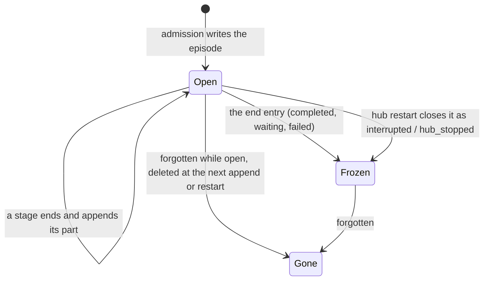

# The episode is open while its activation runs and frozen when it ends

**The question.** Today an episode is written once, after processing ends, and until
then it exists only in memory. Should it instead be written when its activation is
admitted, extended as each stage ends, and frozen by its end entry?

**The answer proposed.** Yes. The episode at `activation:<id>` is stored open at
admission. Each stage appends to it as the stage ends. The end entry freezes it. An
open episode is never shown to a model, and it is placed owner-only until it freezes.
A hub that restarts closes every episode it finds open as `interrupted`, before it
admits anything. This is step 3a of #2613: the owner's direction of 2026-09-30, that
"the working episode and the saved episode should be the same thing", built at the
minimum ruled on 2026-10-03.

## Baseline

The wiki, [Episodes](https://github.com/leonapivato/ai-assistant/wiki/Episodes), read
at `e316810`:

- **"Written once.** An episode is recorded when processing ends and never updated."
- **"A log, read through current views.** While the activation runs, each phase's
  result is added in the order it arrived and nothing is overwritten."
- **"What must survive a crash is not left to the episode.** An activation cut short by
  a crash may leave no episode, and a restart never invents one."

The code, at `6b41b305`:

- `orchestration/activation_writer.py` writes the episode after the pass ends, with one
  `MemoryWriteMode.INSERT_IF_ABSENT` write. It then writes the archive entry and calls
  `ConversationStore.record_turn` as the deletion check. The address is already fixed
  at admission: `activation:<activation_id>` (ADR-0283 §7). The writer already has a
  `forgetting(address)` mark for a forget that lands during a capture.
- The working episode (ADR-0282) is the activation's in-memory state. The stages read
  it, and the writer turns it into the record at the end.
- The memory store offers a conditional replacement, `MemoryWriteMode.IF_UNCHANGED`
  (ADR-0219 §2), which applies only while the stored row still carries the revision the
  caller read.

ADRs it would touch:

- ADR-0275 §8: written once, after processing ends, and "no captured processing
  envelope is updated in place afterward". Also its §1 exclusion of a live activation
  log, §3:4's "never rewrites the earlier episode's processing history", which is kept,
  and §9's placement and disclosure at capture.
- ADR-0282: the working episode stays the stages' input; this adds its durable copy.
- ADR-0283 §5 and §7: the writer's sequence and the forget mark.
- ADR-0204 §2 and ADR-0217: placement is evaluated at the end over the turn supply.
  That stays; only what an open episode carries before then changes.
- ADR-0284 §5 and §9: the stage record the appends go through, and its record format.

## The change

### Admission writes the episode

At admission, the episode is written at `activation:<id>` with what the activation
already has: its trigger (channel, origin, input), its admission time, and an empty
stage record. The write is `INSERT_IF_ABSENT`, as today, so a collision is still a
capture failure and never an overwrite.

### Each stage appends; nothing is rewritten

When a stage ends, the writer replaces the stored record with one that extends it,
under `IF_UNCHANGED` against the revision it last wrote. A stage appends its stage
entry and whatever it produced: understanding versions, the recall result, a route,
the response. The record's own validation admits a new revision only if it extends
the stored one: every earlier part is unchanged and in place, and something was added.
One row and one conditional write per stage end. No append table, and no merge on
read.

Appends go through the stage record ADR-0280 and ADR-0284 already define. The proposal
adds no per-stage shapes, because the legacy stages are replaced as the phases are
built. Writes happen at stage ends, not per effect: durable effects as they happen are
#2584.

### The end entry freezes it

The end entry is the last append: status, reason, end time and response. At freeze,
the writer also:

- derives `content` from `episode_content` and embeds it. An open episode has no
  `content` and no embedding, because the rule needs the final understanding;
- evaluates the episode's placement over the turn supply, as today (ADR-0204 §2), and
  sets it;
- writes the archive entry and calls `record_turn`, in today's order. Step 3b retires
  the archive.

After the end entry, nothing appends. Delivery stays the annotation it already is.

### An open episode is owner-only and never a model input

An open episode is stored with the narrowest placement, owner-only, until freeze sets
its real placement. So nothing an open episode holds can reach anyone the finished
episode would not.

Every read that feeds a model passes over open episodes: conversation history, the
episode window, recall, the citation hop and consolidation. Once activations run
concurrently, other activations' open episodes can be made visible; that is not built
here. The CLI's episode inspection shows open episodes, labelled as in progress. It
reads the store for the owner and is not a model input.

### A restart closes what it finds open

Before the hub admits its first activation, it appends an end entry to every episode
it finds open: `interrupted`, reason `hub_stopped`, no response. Freeze then runs as
for any other ending: `content`, embedding, placement and archive. The engine's
existing first-call recovery scan is the place this runs. This is not inventing an
episode: the episode was written at admission, and the restart only records how it
ended.

### Forgetting an open episode

A forget that names an open episode marks it. The writer's next append sees the mark,
deletes the episode instead of extending it, and stops capturing. A restart does the
same for a marked episode it finds open. This extends the `forgetting` mark the writer
already has, and a forget never races a write. Refusing to forget an open episode was
considered: it would make "forget that" fail during a long activation.

### Resumes

A resume is its own activation, so it gets its own episode: open at admission, its
stages appended as they end (ADR-0284 §5:4), frozen by its end entry. Nothing about
the earlier episode it continues changes (ADR-0275 §3:4).

### The working episode

ADR-0282's working episode stays the stages' input, held in memory. The open episode
is its durable copy, written as stages end. Having the controller and the stages read
the stored episode instead is #2598's work, not this.

## What a reader of the wiki would find different

- "Written once" becomes **built while the activation runs and frozen when it ends**.
  The end entry is the last change, and a later activation still never rewrites it.
- "An activation cut short by a crash may leave no episode" becomes **a crash leaves the
  episode as far as it got, closed as interrupted on restart**. "A restart never invents
  one" still holds: it closes only an episode that admission wrote. Effects and timers
  are still not left to the episode (#2584).

## Delivery

One ADR, then lanes, all behind the cutover that #2613's steps share. The record shape
changes, so the episode format advances again, with no migration.

1. **`core`**: the open and frozen states on the record; the validation that a revision
   extends the stored one; an open episode with no `content` and owner-only placement.
2. **`memory`**: the conditional replacement for episodes; reads that feed models pass
   over open episodes; finding open episodes for the restart.
3. **`orchestration`**: write at admission, append at each stage end, freeze, the
   restart close and the forget mark.
4. **`interfaces`**: the in-progress label in episode inspection.

## Options considered

- **An append table merged on read.** Each stage end inserts a row, and readers
  assemble the episode. It gives the same guarantee with more machinery, and every
  reader pays for the merge.
- **Keep writing once, and add a crash marker.** A small "activation started" row,
  turned into a stub episode on restart. That is the `EpisodeEnding` approach of the
  first ADR-0283 draft, which was closed unmerged (#2614). It leaves two records, and the episode still has no identity in the store
  until the end.
- **Real placement from admission.** Evaluate placement as the supply grows. That ties
  every append to the disclosure rules, which #2643 has not settled. Owner-only until
  freeze is the narrowest choice and defers nothing that matters.

## What it leaves open

- Whether the conditional replacement retries once on a revision mismatch, or treats
  it as a capture failure. Nothing else writes an open episode, so a mismatch means a
  bug or a forget.
- How the in-progress label reads in the CLI.
- The bound on how much one stage may append, beyond the record's existing size
  checks.
