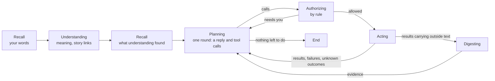

# The phases after understanding

**The question.** How does an activation go from understood to done: what the assistant
plans, how each call is checked and carried out, how outside content becomes evidence, and
how the old turn loop gives way to it?

## The baseline

The wiki at [6ccbabd](https://github.com/leonapivato/ai-assistant/wiki) describes the
phases this proposal builds:
[Controller](https://github.com/leonapivato/ai-assistant/wiki/Controller),
[Recall](https://github.com/leonapivato/ai-assistant/wiki/Recall),
[Understanding an activation](https://github.com/leonapivato/ai-assistant/wiki/Understanding-an-activation),
[Planning](https://github.com/leonapivato/ai-assistant/wiki/Planning),
[Authorizing](https://github.com/leonapivato/ai-assistant/wiki/Authorizing),
[Acting](https://github.com/leonapivato/ai-assistant/wiki/Acting),
[Digesting](https://github.com/leonapivato/ai-assistant/wiki/Digesting) and
[Model calls](https://github.com/leonapivato/ai-assistant/wiki/Model-calls), as revised in
the owner's review of 2026-10-05 against ADR-0292–ADR-0297. What the assistant keeps about
a matter (a story's page, its tidy-up, linking and starting stories) is
[#2747](https://github.com/leonapivato/ai-assistant/pull/2747)'s, and this proposal builds
the parts of it #2747 declares for the phases.

What is built at `8fe54b36`: the controller (ADR-0280), recall once before understanding
(ADR-0281), understanding (ADR-0276), the story store (ADR-0289), the conversation medium
(ADR-0293) and stop (ADR-0295, ADR-0297). After understanding, the old machinery runs as
controller stages: goal association and the turn loop (goals and attempts,
ADR-0248–ADR-0273; the planner's read rounds, ADR-0226, ADR-0228, ADR-0251; the step
runner), parked confirmations (ADR-0052, ADR-0148, ADR-0244), and a compose stage
(ADR-0170).

Every ruling below is the owner's, from the walk-through of 2026-10-05 to 2026-10-07.

Every arrow is a rule the controller applies to the episode's working set; no phase calls
another.

## 0. The milestone

| Milestone | What it builds |
| --- | --- |
| **What the assistant keeps about a matter** ([#2747](https://github.com/leonapivato/ai-assistant/pull/2747)), first | A story's page and its tidy-up, linking and starting stories, story candidates for understanding |
| **The phases after understanding** (this proposal) | Planning, authorizing, acting and digesting, recall's second run, the cutover from the old turn loop |
| **Authority** (next) | Approvals: reading your yes, storing it, matching it to a call, limits and conditions, memory the policy asks about |
| **Timers, watches, events and concurrency** (later) | Things that fire later, events as their own spokes, activations side by side, writing into other places |

**One cutover.** #2747, the phases and the authority milestone go live together, in one
deploy on a fresh data directory. Until then the live hub keeps today's behaviour, and the
new work runs on a test hub.

**How it is built.**

- **Replace, don't adapt.** The new phases are built as new controller stages beside the
  old ones, in lanes that each merge with nothing switched on. The cutover switches the
  controller's rules over and deletes the old path.
- **One module per phase** in `orchestration/`, implementing ADR-0280's stage interface.
  Phases never import each other; they meet only in the episode's working set
  ([#2598](https://github.com/leonapivato/ai-assistant/issues/2598)), and an import-linter
  contract forbids one phase module importing another. `engine.py` only builds the phases
  and hands them to the controller; primitives inside `engine.py`, `loop.py` and
  `runner.py` move into their own modules in the lanes that need them.
- **One run of a phase is one short step**, such as one planning round or one digest, so a
  stop lands after the current step (ADR-0297's stage boundary).

**Done**, on the test hub, when:

- a quick question ("what time is it?") is answered in two model calls;
- a web lookup ("compare these two campsites") runs its searches in parallel, digests the
  pages and answers from the evidence;
- a task whose second call needs the first's result works across rounds;
- a stop mid-task lands at the next step;
- a follow-up days later is linked to its story and planning picks the matter up;
- a call that needs your yes is declined plainly, saying it cannot be done yet;
- recall's closeness threshold is measured and set for the default embedder
  ([#2601](https://github.com/leonapivato/ai-assistant/issues/2601)).

## 1. Recall

- **Two runs, one after the other.** The first, before understanding, searches with your
  words, as built. The second, once understanding has recorded what the input means,
  searches with its meaning and with each phrase it placed or could not place, each as its
  own cue, so a name finds its memory. Same closeness threshold and per-cue limit, a cap on
  the total, and nothing the first run already found.
- **Stories come with the finds.** For each episode recall finds, the story store's
  `stories_of` says which stories it belongs to, by lookup, never by search; those stories
  are understanding's candidates (#2747).
- **What the second run finds** joins the working set for planning. Understanding does not
  see it, so understanding never runs twice because of recall.
- **Outside content still passes through a reader.** A fact stored word for word from
  outside content reaches planning only through a digest (section 6).
- **Failure-tolerant**, as built.

Deferred: recall running again on everything new, contesting a reference, a hook running
alongside the phases ([#2591](https://github.com/leonapivato/ai-assistant/issues/2591)),
and memories cited by a story's earlier episodes
([#2528](https://github.com/leonapivato/ai-assistant/issues/2528)).

## 2. Understanding

Unchanged in this milestone, and used as it is: one model call, nothing looked up, its
record (meaning, references, relationships, grounds, unresolved matters). Linking an input
to stories, and starting a story when it links to an earlier episode in none, are
#2747's. Reading your yes as an approval is the authority milestone's; relating an input
to activations still running is the concurrency milestone's.

**Planning always runs after understanding.** There is no rule skipping it for outside
content: deciding that nothing is due is planning's own judgment, and the saving is an
optimisation a kind's push filter (ADR-0292 §6) or a cheaper model can make later.

## 3. Planning

**A round is the model's own response**, in its native tool-calling shape:

| Part | What it is |
| --- | --- |
| **Its text** | The message, written into the place the input came from. Planning writes the words itself; no compose step follows it. Replies arrive whole, with no streaming for now. |
| **Its tool calls** | What to do: searches, forecasts, bookings, emails, writing a note on a story's page, remembering something. Calls in one response run in parallel. |
| **Scratch notes** | Notes for this activation only, read by its next round. |
| **Another round needed** | A mark that a later step depends on this round's calls, so planning must run again once they finish. |

There are no kinds of step. What a call does is declared by its **capability** (section 5),
and every rule reads that declaration.

- **Calls that depend on each other go in different rounds.** A call needing another's
  result, or its success, waits for the next round, which sees the result; no call ever
  refers to another's output.
- **The round is recorded in the episode**, naming the round it follows. Claims point at
  it by id.
- **The tidy-up is planning's call.** For each story it is handed, planning is told when
  the page was last tidied and how many changes have come since (from the page's version
  log), and calls the tidy-up when it judges the page behind. The tidy-up never brings a
  round, even when it fails; its outcome is recorded in the page's version log, not the
  episode, so the activation can end while it runs (#2747). That is ADR-0292 §12:2 as
  written: planning chooses it.
- **Messages go only into the place the input came from** in this milestone; the hub
  refuses any other. Writing into other places and starting conversations come with the
  timers and proactivity milestone, with the audience rules they need
  ([#2590](https://github.com/leonapivato/ai-assistant/issues/2590)).

**What it is given**: understanding's record and its story links; what both recall runs
found, under the reader rule; for each story it belongs to, the full page, what is newer
than it, when it was last tidied and how many changes have come since, the short views of
the stories it is part of, where the matter stands and the latest episodes (#2747); the channel window and the episode window; the capability names;
the channel kind's description (ADR-0292 §8); digested evidence; acting's outcomes; earlier
rounds and their scratch notes; the current time.

**What it may look up itself**, as calls on the assistant's own records: a memory search,
any story's page, and pulls such as your calendar (a reader's context facet becomes a
pull, ADR-0292 §13).

**Rounds** run one per stage, with a round limit, an end when no progress is made and the
deadlines; the numbers are [#2589](https://github.com/leonapivato/ai-assistant/issues/2589)'s.
**A new round runs when**:

- a result arrives (after digesting, where it carries outside text);
- a call fails or comes back unknown, whatever the call;
- the round marked that it needs another round, once its calls finish. Planning marks it
  when a later step depends on this round's calls; a mark on a round with no calls waits
  for nothing, and the no-progress rule ends it.

Otherwise the activation ends after the round: a note, a memory, a link, or an effect in
the world that succeeded with nothing to follow brings no round. When a round runs because
the calls are done, its text is the **report**, written from acting's outcomes and claiming
no more than they show. When processing cannot finish, the fixed *couldn't finish* message
is written (ADR-0293 §9).

**Rules**: it proposes and never permits; it never reads raw outside content; it cites what
it relies on; it never substitutes for what you asked; a call that comes back *needs you*
is answered, in this milestone, by telling you plainly that it cannot be done yet.

## 4. Authorizing

For each call, by rule, with no model:

1. **Policy.** The permission policy rules allow, confirm or deny; a standing grant you gave
   counts. Deny runs nothing and asks nothing.
2. **Where the values came from.** If outside content chose what, where or to whom, the call
   needs you, with those values shown.
3. **The message place.** Only the place the input came from.
4. **Confirm means *needs you*.** In this milestone that goes back to planning, which tells
   you it cannot be done yet; the authority milestone gives it an answer.

Tool selection runs first, so authorizing rules on the actual call and its values. The
decision is recorded and read back before anything runs.

The permission policy loses its goal authorizations and goal quotes (ADR-0254) as inputs.
Quotes, stated bounds and charges retire, and are redone as limits on approvals in the
authority milestone; so is the recipient grant's establishing act, which rides recorded
confirmations. **Memory the memory policy says to ask about is not written**, by planning
or by consolidation, until the authority milestone.

## 5. Acting

Acting runs the round's allowed calls in parallel, with no model, and records each
outcome: **done**, **not done** with its reason, or **unknown**.

**What each capability declares**, set by the hub and never taken from a tool on trust (an
MCP server's annotations are hints only). Every capability declares every property; the
hub does not offer planning a capability until it has, so a newly connected tool is usable
only once declared:

| Property | Values | What reads it |
| --- | --- | --- |
| **Effect** | none / the assistant's own records / the world | Claims, unknown outcomes and the report apply to effects in the world |
| **Leaves the hub** | yes / no | Whether it goes out through a channel's actuator (ADR-0292 §7) or runs directly (§12) |
| **Result** | none / no outside text / may carry outside text | A result that may carry outside text takes a *looking for* argument; when it arrives, the text someone other than you or the assistant wrote goes to a digest, record by record, and the rest goes to planning |
| **Outcome can be unknown** | yes / no | An unknown outcome is never retried or done another way, and never reported as done |
| **Safe to repeat** | yes / no | The duplicate backstop |

- **Effects in the world** are claimed before they run, so a stop refuses them (ADR-0297),
  and written durably the moment they happen, **pointing at the activation that made
  them**. A story finds its effects through its current episodes, so a split, a merge or a
  corrected link moves them with their episode.
- **The duplicate backstop.** A call with the same capability and values as an effect of
  the episodes in this activation's stories, or of this activation alone when it has none,
  is refused as *already done* unless planning marks it a deliberate repeat. It is ADR-0259
  and ADR-0265's effect key, scoped by the stories' episodes instead of the goal.
- **Who wrote the text decides digesting, record by record.** For a web search that is all
  of it; for a memory search, only the records whose stored source is outside.
- **The assistant's own records** are #2747's story capabilities (starting a story with its
  first notes and, optionally, the story it sits inside; a note on a story's page, which
  must name a story that exists; linking; the tidy-up; reading a page) and remembering, all
  with the assistant's own records as their effect (ADR-0292 §12). Several new stories in
  one round are several start calls.
- **What runs finishes** when a stop arrives; nothing new starts. No locks in this
  milestone; they come with the concurrency milestone.

## 6. Digesting

- **One model call per result carrying outside text**, in parallel, with no tools.
- **Each digest answers a question.** The hub adds a required *looking for* argument to
  every capability whose result may carry outside text, so the call carries the question
  and the digest answers it. An outside fact that **recall** finds has no call behind it;
  its digest answers what understanding said the input means.
- **A follow-up** is a call on the assistant's own records: ask again about a stored result,
  with a new question. Nothing is remembered between calls.
- **Long content** is split into parts digested in parallel, and their evidence merged; the
  part size is a number for #2589.
- **Evidence** is a list, each item its text, its source and a mark that it came from outside
  content, and nothing more. It lives in the episode, and reaches a story's page only
  through planning's notes, keeping its mark.
- **A digest that fails** tells planning it could not read that result; planning never gets
  the raw content.

It is not built on ADR-0252's evidence record, whose sufficiency tests serve the retiring
goal model.

## 7. What retires, and the cutover

From a read-only survey of `8fe54b36`, each confirmed by the lane that removes it.

**Engine surface.** Retire: `converse`; `resume`, `pending_confirmations`, `cancel_read`;
`goals`, `withdraw_clarification`, `abandon_goal`; `standing_authorizations`,
`revoke_authorization`; and `answer` with `questions`, `interrupted_questions` and
`forget_question` (ADR-0078's deferred memory questions, and the deferral store with them).
`learn` and `converse_streaming` are already gone. Reworked: `converse_spoken`,
`grantable_decisions`, `establish_recipient_grant`, `purge_expired`, `start`.

**`receive` stays.** ADR-0292 §13 retires a mechanism only when its replacement is built,
and events' replacement, a spoke per source, is the events milestone's. Events run through
the new phases like any activation; the event-summary stage retires because planning does
that work; an event cannot message you in this milestone, but planning can write notes and
memories from it. The notification route, the upcoming-events producer and the delivery
outbox survive the cutover for the same reason.

**Orchestration.** Retire: `loop`, `composing`, `goals`, `interpretation`, `questions`,
`parked_reads`, `routing` (with `permissions/routing`), `reconciling`, `verification`,
`charges`, `quotes`, `stated_bounds`, `validating`, and today's `authorizing` and
`authorization_surface` (whose name the new phase module must not reuse); in `planning/`,
`associator` and `goals`. Reworked: `engine`, `runner`, `executor`, `reads`, `writes`,
`consolidation`, `recipient_grants`, `effects`, `disclosure`, `chat`, `conversations`,
`activation_state`, `speech`, `controller`, `understanding`.

**Stores.** Retire: the deferral store; parked reads; goal authorizations, quotes and
coverage; the routing trail; `PlanStore`'s goal, attempt, interpretation, intended-action,
quote, question and evidence members. Reworked: `save_plan`, `get_plan`, `claim_effect`,
`commit_transition`, `export`; the permission policy; the audit trail's goal fields.

**Types, interfaces.** The goal, attempt, intended-action, quote, goal-authorization, park,
turn-outcome, routing, deferral-question and verification families, with their codecs and
fakes. CLI: `ask`, `resume`, `cancel-read`, `goals`, `withdraw-clarification`,
`abandon-goal`, `questions`, `answer`, `forget-question`, `authorizations`,
`revoke-authorization`. Gateway: the Ask, What happened, confirmations, questions, goals and
authorizations panels and their routes.

**The controller's dead members.** `ControllerStage` and `ControllerRule` are "added to and
never renamed", but routing, event summary, goal association, disambiguation, reconcile,
turn loop, drive and compose, with their rules, are **removed**, as a recorded exception:
the data directory is fresh, so nothing stored names them.

## What it would supersede

To be confirmed clause by clause when each section becomes its ADR:

- ADR-0170, "a reply is not a tool": the reply is planning's own text.
- ADR-0052, ADR-0244 and ADR-0148's parked call resumed on the answer; ADR-0078's deferred
  questions and `answer`, with ADR-0293 §11's clause retiring `answer` "once question
  messages and their answers (§6) are built", which never fires now that question messages
  are dropped.
- ADR-0293 §6, its options on a question and an answer naming its question: questions and
  answers are ordinary messages.
- ADR-0248–ADR-0273, the goal and attempt model; ADR-0226, ADR-0228 and ADR-0251's turn
  loop; ADR-0252's evidence record; ADR-0254's goal authorizations; ADR-0259 and
  ADR-0265's effect key in its goal scope.
- ADR-0197 and ADR-0198, routing; ADR-0274 §7's informational processing, in its summary
  stage.
- ADR-0280 §1:4, `resume` outside the controller, and the closed `ControllerStage` and
  `ControllerRule` in the removal above.

## Options considered

- **Kinds of step** (read, act, inside action, message). Rejected: every difference between
  them is a property of the capability called, and the model's native tool calls express a
  plan more reliably than a custom schema.
- **Planning's intents**, turned into calls by the hub. Rejected: a second judgment, and
  authorizing would check something planning never said.
- **Adapting the turn loop step by step.** Rejected: every step would keep goals, attempts
  and parks consistent with the new pieces.
- **Authority in this milestone.** Moved to its own, next.
- **Skipping planning for outside content that needs nothing.** Dropped: an optimisation
  that moves planning's judgment into understanding.
- **Writing into any place now.** Deferred: almost nothing needs it before timers, and it
  needs audience rules at delivery.
- **A separate writing step**, so replies stream. Not now: streaming is not needed, and a
  writer can be added later without changing a round's shape.
- **A separate closing phase.** Folded into planning's last round.
- **The tidy-up added by planning's code, by rule.** Replaced by planning's own call, given
  how far behind each page is: it fits ADR-0292 §12:2 as written.
- **A result's shape (structured or unstructured)** deciding what is digested. Replaced by who
  wrote the text: shape mislabels your own free-text notes and an invite's outside title.
- **Every round after calls bringing another round.** A round that only writes a note would
  bring a second planning call with nothing to plan from, and risk a second message.
- **Effects pointing at the story.** A split would leave them behind and let the duplicate
  backstop miss a second booking.
- **Leaving duplicates to planning alone.** Rejected: a mistake costs money or sends
  something twice.

## What it leaves open

- Timers and watches pointing at what set them and found through the story, as effects
  now are (the timers milestone).
- Approvals found through a story that later merges or splits (the authority milestone).
- Whether the lineage rule (ADR-0181 §5, and the direction "never what, where or to whom")
  should relax toward the owner's principle for outside content recorded on #2747 (the
  authority milestone, where asking the user is designed).
- The numbers: rounds, no progress, deadlines, digest part size, the second recall run's
  total cap ([#2589](https://github.com/leonapivato/ai-assistant/issues/2589)).
- Which read capabilities survive, and the unbounded-audience gate on reads
  ([#2593](https://github.com/leonapivato/ai-assistant/issues/2593)).
- Durability of effects and unknown outcomes in detail
  ([#2584](https://github.com/leonapivato/ai-assistant/issues/2584)).
- Phase-level carry-overs: quoted text, forget over recalled copies, audience at delivery
  ([#2590](https://github.com/leonapivato/ai-assistant/issues/2590)).
