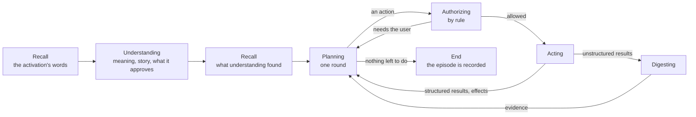

# The phases after understanding

**The question.** How does an activation go from understood to done: what the
assistant plans, how each action is checked and carried out, how it asks the user and
how their answer becomes authority, and how the old turn loop gives way to it?

## The baseline

The wiki at [fba378d](https://github.com/leonapivato/ai-assistant/wiki) describes the
design this proposal builds: [Controller](https://github.com/leonapivato/ai-assistant/wiki/Controller),
[Recall](https://github.com/leonapivato/ai-assistant/wiki/Recall),
[Understanding an activation](https://github.com/leonapivato/ai-assistant/wiki/Understanding-an-activation),
[Planning](https://github.com/leonapivato/ai-assistant/wiki/Planning),
[Authorizing](https://github.com/leonapivato/ai-assistant/wiki/Authorizing),
[Acting](https://github.com/leonapivato/ai-assistant/wiki/Acting),
[Digesting](https://github.com/leonapivato/ai-assistant/wiki/Digesting),
[Stories](https://github.com/leonapivato/ai-assistant/wiki/Stories),
[Concurrent activations](https://github.com/leonapivato/ai-assistant/wiki/Concurrent-activations)
and [Model calls](https://github.com/leonapivato/ai-assistant/wiki/Model-calls). Those
pages were brought in line with ADR-0292–ADR-0297 on 2026-10-05, in the owner's review
of the earlier phase design ("pass 0"), and they carry the owner's rulings from it. This
proposal does not reopen them; it turns them into a plan of work.

What is built at `8fe54b36`:

- **Before planning:** the controller (ADR-0280), recall once before understanding
  (ADR-0281), understanding (ADR-0276), the story store with no producer (ADR-0289), the
  conversation medium with its reader and writer (ADR-0293), and stop (ADR-0295,
  ADR-0297).
- **After understanding,** the old machinery runs as controller stages: goal
  association and the turn loop (goals and attempts, ADR-0248–ADR-0273; the planner and
  its read rounds, ADR-0226, ADR-0228, ADR-0251; the step runner), parked confirmations
  answered through `answer` and `resume` (ADR-0052, ADR-0148, ADR-0244), and a compose
  stage that writes the reply afterwards (ADR-0170).

## The change, in short

The old stages after understanding are replaced by the phases the wiki describes, built
as separate controller stages and switched on in one cutover. Approvals become records
stored when the user gives them, questions and answers are ordinary messages, stories
start being produced, and closing is planning's last round.

Every arrow is a rule the controller applies to the episode's working set; no phase
calls another.

## Scope: three milestones, this is the first

| Milestone | What it builds |
| --- | --- |
| **The phases after understanding** (this proposal) | The phases, stories produced, approvals as records, questions as ordinary messages, the cutover. Approvals are **exact**: a yes approves exactly the actions and values the question showed. |
| **Authority by outcome** (next) | Limits and conditions on the same approval record: "up to $40", "if the weekend is dry", each part spent by its own effect, conditions checked fresh when acting. |
| **Timers, watches, events and concurrency** (later) | Timers and watches, events as activations, activations side by side with takeover, the lock and recheck. |

So in this milestone, "book it if the weekend is dry" is asked again when the assistant
is about to act; it cannot be approved ahead.

## How the work is done

**Replace, don't adapt.** The new phases are built as new stages beside the old ones,
in lanes that each merge on their own, with nothing switched on. A cutover lane then
switches the controller's rules over and deletes the old path, on a fresh data
directory, as the M36–M41 cutovers did. The hub is not redeployed until then.

What the phases reuse as they are: tool selection and the tool registry, the fetching
inside read servicing, startup recovery of running steps, memory, recall, understanding,
the controller, the story store and the conversation medium. What they reuse **reworked**,
because each is scoped by goals today: the step executor and its claims (ADR-0192, with
ADR-0297's stop refusal), which claim under an attempt and resolve a goal from the plan;
and the permission policy, which reads goal authorizations and goal quotes. The survey
below lists the rest.

What retires at the cutover is surveyed in full under [What retires](#what-retires).

**One module per phase.** Each phase is its own module in `orchestration/`,
implementing the controller's stage interface (ADR-0280). Phases never import each
other; they meet only in the episode's working set
([#2598](https://github.com/leonapivato/ai-assistant/issues/2598)), and the controller
alone knows the order. `engine.py` only builds the phases and hands them to the
controller. An import-linter contract forbids one phase module importing another.
Primitives that live inside `engine.py`, `loop.py` and `runner.py` today move into
their own modules as the phases need them, which is also what lets the cutover delete
those files' old paths whole.

**One planning round per stage.** A phase run is one short step, so a stop lands after
the current step and the controller decides every further round (ADR-0297's stage
boundary, unchanged).

## The pieces, in the order they are designed

Each piece becomes one ADR, in this order, each started once the one before it has
merged. The order follows what each piece reads.

### 1. The plan

A plan is what one planning round proposes. It is a new record each round, naming the
plan it replaces (as `supersedes` does today, ADR-0228).

| Step | What it names |
| --- | --- |
| **Read** | What to fetch and why: the kind (search, forecast, file, memory), its query, and the question a digest should answer. |
| **Act** | A capability and its values, such as a booking with site, date and price. |
| **Inside action** | An action on the assistant's own records: start or link a story, write or forget a memory (ADR-0292 §12:1–§12:2). |
| **Message** | Its text and the place to write it in. A message that asks the user for approval also names the actions it asks about, with their values; that request is kept in the plan, beside the message, not in the message. |

**Proposed: a round plans only what can run now.** Steps that need an earlier step's
result are not planned ahead; the result brings the next round, and that round plans
the next step. Rounds replace references between steps (ADR-0014 §7 and #2171–#2173's
question), at the cost of one model call per dependent step.

When there is nothing to do in the world, the plan is a single message: the reply.

### 2. Understanding: stories and approvals

Understanding stays one model call and gains three things in its record:

- **The story it belongs to**, or none. The hub gives understanding candidate stories:
  the stories of the episodes in its windows and of the episodes recall found.
  Understanding picks one, several, or none; it never invents one. Finding none for a
  short reply such as "yes" means it asks what the reply refers to.
- **What an answer approves.** For a message answering a question, which question it
  answers (the assistant's message), and which of the actions that question asked about
  it approves, or that it is unclear. Unclear approves nothing. A narrowing beyond the
  actions shown, such as a lower price, is recorded as not approving them in this
  milestone, so the assistant asks again.
- **What an instruction names.** For a direct instruction, the action it names with the
  values the user stated, which becomes an approval in the same way.

Only input the channel kind declares able to carry authority can produce an approval
(ADR-0292 §5); understanding's reading never makes other input authoritative.

### 3. Starting and linking stories

A story starts when something is left pending: the plan asks the user a question, or
starts an action whose result comes back later. Planning then includes an inside action
that starts a story and links the activation's episode to it. Understanding links later
input by judgment (piece 2). An action's effects point at the story they belong to
(ADR-0289's store, unchanged).

**Proposed:** a story is started only by an inside action in a plan, never by
understanding, so a story always exists because the assistant left something open.

### 4. Recall's second run

One controller rule: when understanding has recorded a version recall has not yet
searched with, recall runs again with what understanding found (its meaning and the
phrases it placed). Same thresholds and limits as the first run; what it finds joins the
working set. Facts stored word for word from outside content reach planning only through
digesting (piece 9).

### 5. Acting's record

For each action, one outcome: **done**, **not done** with its reason, or **unknown**.

- **Reads** return their result. **Proposed:** each read kind declares whether its
  result is structured, going straight to planning (a forecast, a calendar entry, the
  user's own and the assistant's own memories), or unstructured, going to digesting
  first (a web page, an email body, a memory fact stored from outside content).
- **Acts** are claimed before they are invoked and spend their approval
  (ADR-0192, reused); their effects are written durably the moment they happen, as their
  own records pointing at the story.
- **Messages** are written by the place's writer (ADR-0293), sent once the place has
  recorded them.
- **Unknown** is never retried and never done another way until a read checks it or the
  user is asked.

### 6. Approvals

An approval is a record stored when the user gives it, kept beside the claims that spend
it.

| Field | What it holds |
| --- | --- |
| **What was asked** | The question message, and the actions with their values the plan asked approval for; none for a direct instruction. |
| **What gave it** | The user's message: the answer or the instruction. |
| **What it approves** | The actions, with their values, exactly as shown or stated. |
| **When** | Given at; expires at. How long an approval lasts is one of the controller's numbers ([#2589](https://github.com/leonapivato/ai-assistant/issues/2589)). |
| **Its state** | Open, spent (by which effect), withdrawn (by which message) or expired. |

It is found through the activation's story. A later message may withdraw it, by
understanding's judgment; nothing widens it.

**Proposed:** the record lives in the plan store (`planning/`), where claims already
spend authorisations (ADR-0192), rather than in a store of its own.

### 7. Authorizing

For each action, by rule, with no model:

1. **Policy.** The existing permission policy rules allow, confirm or deny. Deny runs
   nothing and asks nothing.
2. **Where the values came from.** If outside content chose what, where or to whom, the
   action needs the user with those values shown (outside-content lineage, unchanged).
3. **The user's authority.** Where the policy says confirm, an open approval must match
   the action and its values exactly. No match means back to planning, which asks.

**Proposed: tool selection runs before authorizing.** Planning names a capability and
values; selection turns it into one concrete call; authorizing rules on that call, and a
question shows its values. That keeps ADR-0148's whole-call ruling meaningful in this
milestone, where an approval is exact.

The decision is recorded and read back before the action runs, as today.

### 8. Planning: what it is given, its rounds and the report

**Given:** the latest understanding with its story links; what recall found, under the
reader rule; the story's earlier episodes (their plans, questions and answers); the open
approvals found through the story; the capability names; the channel kind's description
(ADR-0292 §8); evidence from digesting; acting's outcomes so far; the current time.

**Rounds:** one per stage, with a limit on rounds and an end when no progress is made
(the same plan twice, or a set number of rounds with no new result); the numbers are
[#2589](https://github.com/leonapivato/ai-assistant/issues/2589)'s. ADR-0251's four calls
and three minutes are the nearest built bound.

**The report:** when the plan's actions are done, the next round writes the report as a
message, from acting's outcomes, and claims no more than they show. No separate closing
call and no hub-enforced check of its wording (owner, 2026-10-05).

**When processing cannot finish** where a reply is expected, the fixed *couldn't
finish* message is written, listing effects (ADR-0293 §10, as built for the chat).

### 9. Digesting

One model call per unstructured result, run in parallel, each given the question the
read was for. It returns evidence: what the content says that bears on the question,
each item marked with its source. A follow-up question is another digest call on the
same stored result; nothing is remembered between calls. **Proposed:** ADR-0252's
evidence record is the starting point for its output.

## What retires

From a read-only survey of `8fe54b36` on 2026-10-05. Each is confirmed when the lane that
removes it is written.

**Engine surface.** Retires: `converse`, `converse_streaming`, `receive`,
`receive_streaming`; `resume`, `pending_confirmations`, `cancel_read` (parked
confirmations and parked reads, ADR-0052, ADR-0244); `goals`, `withdraw_clarification`,
`abandon_goal`; `standing_authorizations` and `revoke_authorization` (goal
authorizations, ADR-0254, which approval records replace); `learn`; and `answer` with
`questions`, `interrupted_questions` and `forget_question`. **`answer` is ADR-0078's
deferred memory question**, not the confirmation path, so retiring it takes the deferral
store with it. Reworked: `converse_spoken`, `grantable_decisions` and
`establish_recipient_grant` (they ride recorded confirmations), `purge_expired` and
`start`. Unchanged: stories, episodes, beliefs and forgetting, the conversation medium,
source and recipient grants, destination trust, connections, the trail's reads, spend
totals and `stop_activation`.

**Orchestration modules.** Retire: `loop`, `composing`, `goals`, `interpretation`,
`questions`, `parked_reads`, `routing` (with `permissions/routing`), `reconciling`,
`verification`, `charges`, `quotes`, `stated_bounds`, `validating`, and today's
`authorizing` and `authorization_surface` (ADR-0254's goal authorizations, whose name the
new phase module must not reuse); in `planning/`, `associator` and `goals`. Reworked:
`engine`, `runner`, `executor`, `reads` (its parks and goal references), `writes` and
`consolidation` (their deferral half), `recipient_grants`, `evidence` and `effects`
(goal-scoped today), `disclosure` (it sits in front of today's planner), `chat` (its
adapter writes the compose stage's reply), `conversations` (resume association),
`activation_state` (parked binding), `speech` (the spoken park sentence), `controller`
and `understanding`.

**Stores.** Retire: the deferral store; parked reads; goal authorizations, quotes and
coverage (`permissions/goal_authorizations`, `_coverage`); the routing trail; the
`PlanStore` goal, attempt, interpretation, intended-action, quote and question members.
Reworked: `save_plan`, `get_plan`, `claim_effect`, `commit_transition` and `export`
(each tied to a goal today), and the evidence members; the permission policy; the audit
trail's goal fields.

**Types.** The goal, attempt, intended-action, quote, goal-authorization, park,
turn-outcome, routing, deferral-question and verification families in `core/types.py`,
with their wire codecs and canonical fakes.

**Interfaces.** CLI: `ask`, `resume`, `cancel-read`, `goals`, `withdraw-clarification`,
`abandon-goal`, `learn`, `questions`, `answer`, `forget-question`, `authorizations`,
`revoke-authorization`. Gateway: the Ask, What happened, confirmations, questions, goals
and authorizations panels and their routes.

**Decisions the survey raises** (taken in the walk-through):

1. Where a deferred memory question goes once `answer` retires: the memory policy's
   ask-the-user ruling has no destination. Proposed: it becomes an ordinary message, and
   the user's reply is read like any answer.
2. `ControllerStage` and `ControllerRule` are "added to and never renamed", and eight
   stages with their rules go dead: kept as values nothing produces, or retired by an
   explicit exception.
3. What follows understanding on the event path, where `informational_events`' summary
   stage runs today: proposed, events go to planning like any activation, which may
   decide nothing is due.
4. The notification route, the upcoming-events producer and the delivery outbox: they
   retire only once their replacements exist (ADR-0292 §13), and the upcoming push needs
   the timers milestone, so they **survive this cutover**.
5. The recipient-grant establishing act, which rides recorded confirmations, against
   approval records.
6. Quotes, stated bounds and charges: retired now and redone with authority by outcome,
   or carried until then.

## What it would supersede

To be confirmed clause by clause when each piece becomes its ADR:

- ADR-0170, "a reply is not a tool": the reply becomes a message step in the plan.
- ADR-0052, ADR-0244 and ADR-0078 §8: parked questions, `resume` and `answer`, already
  marked to retire by ADR-0292 §13 and ADR-0293 §11.
- ADR-0293 §6, in its options on a question and an answer naming its question: questions
  and answers are ordinary messages (owner, 2026-10-05).
- ADR-0248–ADR-0273, the goal and attempt model, and ADR-0226, ADR-0228 and ADR-0251's
  turn loop, as they reach the replaced stages.
- ADR-0280 §1:4, `resume` keeping its own path outside the controller.
- ADR-0148's parked call resumed on the answer; its whole-call ruling stays.

## Options considered

- **Adapting the turn loop step by step**, keeping it working throughout. Rejected: every
  step would have to keep goals, attempts and parks consistent with the new pieces, the
  kind of interaction that made the stop lane's review run nine rounds.
- **Authority by outcome in this milestone.** Rejected for size: conditions bring the
  hardest judgment, and are easier once exact approvals work end to end.
- **Question messages with options**, binding an answer to its question exactly, as
  ADR-0293 §6 decided. Set aside by the owner: ordinary messages and understanding's
  reading are simpler and match how people talk.
- **Deferring stories** to the timers milestone, linking an answer to its recent
  question directly. Rejected: it would build a temporary path stories replace, and
  short replies depend on stories.
- **A separate closing phase.** Folded into planning's last round.

## What it leaves open

- The numbers: rounds, no progress, approval lifetime, deadlines
  ([#2589](https://github.com/leonapivato/ai-assistant/issues/2589)).
- Which read kinds survive, and the unbounded-audience gate on reads
  ([#2593](https://github.com/leonapivato/ai-assistant/issues/2593)).
- Whether standing grants (ADR-0193) and configured-provider allows keep their form, and
  the web-search exemption (#2593).
- Durability of effects and unknown outcomes in detail
  ([#2584](https://github.com/leonapivato/ai-assistant/issues/2584)).
- Memories cited by a story's earlier episodes reaching planning, which needs citations
  recorded as memory ids ([#2528](https://github.com/leonapivato/ai-assistant/issues/2528)).
- Phase-level carry-overs: quoted text, forget over recalled copies, audience at
  delivery ([#2590](https://github.com/leonapivato/ai-assistant/issues/2590)).
- Which memory may fill in what, where or to whom
  ([#2582](https://github.com/leonapivato/ai-assistant/issues/2582)), and actions with
  nobody present ([#2583](https://github.com/leonapivato/ai-assistant/issues/2583)).
