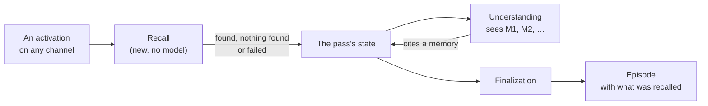

# Recall runs before understanding, and understanding reads what it found

**The question:** how does an activation get the long-term memories that bear
on it to understanding, what does the episode record of that, and how does
understanding cite a memory?

**Recall belongs to the activation, not to a conversation.** Every activation
gets it the same way, whatever channel it arrived on: a typed message, an
email, a calendar change or any later sensor. A conversation is one channel
among them. Nothing in this design reads the channel type.

Milestone: [M39 — Recall into understanding](https://github.com/leonapivato/ai-assistant/milestone/6).
It builds on the M38 controller proposal (#2577, read at `6d09e914`). This
proposal can be discussed now, and it is ratified after M38's ADR merges.

## Baseline

- **Wiki:** [Recall](https://github.com/leonapivato/ai-assistant/wiki/Recall),
  [Controller](https://github.com/leonapivato/ai-assistant/wiki/Controller) and
  [Understanding an activation](https://github.com/leonapivato/ai-assistant/wiki/Understanding-an-activation),
  read at wiki revision `f18ccf6`. Recall there is owner direction, not
  ratified. This proposal builds the first cut of it: the recall stage without
  the recall hook.
- **Code:** `main` at `8265b204`, plus the controller #2577 proposes.
  - `UnderstandingStage` (`orchestration/understanding.py`) renders the input,
    the channel window (labels `H1…`) and the episode window (labels `P1…`),
    and nothing else.
  - `MemoryStore.search` (ADR-0237) is the relevance read the turn loop already
    uses twice before planning (`loop.py`, the belief composition and the
    episodic supplement). It costs one embedding and a `sqlite-vec` lookup, and
    no model call.
- **ADRs whose clauses this touches:**
  - ADR-0276 §1: the understanding stage receives "no retrieved memory".
    **Superseded** for recalled memory.
  - ADR-0276 §2: a referent's `kind` is `input`, `channel_item` or `episode`.
    It gains a kind for a memory.
  - ADR-0276 §5 (as #2577 changes it): understanding is the first stage that
    reads an activation's input. Recall now comes before it.
  - ADR-0275 §4: `EpisodeProcessingRecord` gains a field for what recall
    found, with a schema version bump.
  - ADR-0237: unchanged. Recall is one more caller of `MemoryStore.search`.

## What the owner has already settled

- **Shape first.** No rabbit holes on specifics; the milestone is about the
  shape.
- **Simple recall search.** Not much should be new. **Episodic and semantic
  memory only**: preferences aren't populated yet, and procedural memory waits
  for the phases after understanding.
- **No recall hook** in this milestone.
- **Forget** over copies already recalled into episodes is not designed here.
  It comes when routing and the memory commands return at the end of the
  controller work.
- **Basic audience and provenance.** Getting them right is a later milestone.
- **Only this stage matters.** Things may break elsewhere, as long as each
  break is listed.

## The change

### Recall is a stage the controller runs

Recall is a new stage in the controller #2577 proposes. It is due by one new
readiness rule, **`not_recalled`**: the activation has no recall result yet,
and its channel window is available. The rule sits before `not_understood`,
so recall runs before understanding on every activation.

The rule reads the pass's state, not the channel type. Its one prerequisite is
the activation's channel window, because that is one of its cues. On most
channels the window arrives with the activation. On a channel whose window is
built from stored history, as a conversation's is today, recall waits until
that history is resolved (#2577's `conversation_unresolved`). That is a detail
of how that channel builds its window, not a step recall owes.

Recall is the second stage, after understanding, that does exactly one phase's
job and nothing else, so under #2577's naming rule it takes the phase's name:
the stage is `recall`, and its record entry reads `recall` due
`not_recalled`.

It lives in a new module `orchestration/recall.py` as `RecallStage`, holding
an injected `MemoryStore`, the same way the loop holds one. It calls no model.
There is no Protocol: it is one of orchestration's own stages.

### What it searches with, and what it searches

**Two cues, one search each:**

| Cue | The query |
| --- | --- |
| **The activation's words** | The input text, as the pass holds it |
| **The channel window** | The text of the most recent items on the channel the activation came on, joined and cut to a fixed bound |

The second search is skipped when the window holds no text. The cues are the
same for every activation. For a message they are the words and the exchange
before it; for an email, its text and the recent mail on that channel.

**Each search** asks `MemoryStore.search` for episodic and semantic records,
with `episode_model_eligible=True` (the same eligibility the loop's own reads
use), up to a fixed per-search limit.

**The results are merged:**

- deduplicated by record id, keeping the better rank and noting every cue that
  found it;
- episodes already in the episode window, or stored behind a channel window
  item, are dropped, because understanding already sees them;
- the rest are cut to a fixed total, best first.

The constants live beside `UNDERSTANDING_EPISODE_LIMIT` at the composition
root. The initial values are an ADR detail. Something like 6 per search and 8
in total keeps the prompt small.

**Recall interprets nothing.** It doesn't decide that a memory answers
anything, is out of date or settles a reference. `capped` is unwrapped and not
acted on, as the loop's reads leave it.

### Basic audience and provenance

- **Audience.** The found records pass through the same disclosure predicate
  the two windows already use (`admitted_to_understanding`), before anything
  is kept. Under #2577's assumption that every reply's audience is the owner,
  this withholds nothing today. It is there so the audience milestone changes a
  predicate, not the stage.
- **Provenance.** Each found item records one of two sources:
  - **the user**;
  - **outside content**: a semantic record that
    `rests_on_recorded_external_content` places there, or an episode whose
    trigger was an informational event.

  Nothing finer (bands, attestation source, who connected it) in this
  milestone.

### What recall adds to the episode

Recall's result is episode content, like understanding versions, so it cannot
live in #2577's working set, which is never persisted. And #2577's record
points rather than copies. So it gets its own place:

- **`ActivationState`** holds the recall result once the stage ends, so
  understanding can read it in the same pass.
- **Finalization** copies it into a new field,
  `EpisodeProcessingRecord.recall`, and bumps `schema_version` again.

The result is one of three outcomes, and **nothing found is distinct from
failed**:

| Outcome | What it holds |
| --- | --- |
| `found` | The cues, and the found items |
| `nothing_found` | The cues. The searches ran and returned nothing that survived the merge |
| `failed` | The cues, and the error class. A search raised or timed out |

Each **found item** carries:

- its memory kind, `episodic` or `semantic`;
- its stored id, exactly as stored;
- a short excerpt, bounded like a referent's (240 characters);
- its provenance, `user` or `outside`;
- the cues that found it.

The excerpt is the fact for a semantic record, and the input for an episode. For
an **episode whose input was outside content**, the excerpt comes from its
latest understanding's meaning, never its raw input. If it has no
understanding, the excerpt says only that it was a report received on a named
channel. That way, whoever later reads the record doesn't read outside content
through it.

Rendering and choosing are not repeated in the record: the excerpt is enough
to read it after the memory is deleted, which is what the wiki asks for.

A field that is absent on an older episode means "recorded before recall".

### Understanding reads what was found

ADR-0276 §1's "no retrieved memory" is superseded for **recalled memory
only**. Understanding still receives no goal, plan, context-provider state or
memory from any other read.

- **The prompt gains a third labelled section**, `recalled`, with labels
  `M1, M2, …` in recall's order:
  - a recalled **episode** renders with the same projection as an
    episode-window item, including its "a report received" attribution and its
    provisional "understood then";
  - a recalled **semantic record** renders its fact, its recorded time and a
    plain attribution: something the user said, something the assistant worked
    out, or something a source reported.
- **The instruction gains one paragraph:** a recalled memory is what the
  assistant remembers. It is provisional, it may be out of date, and being
  recalled does not make it relevant. Citing an `M` label is `supplied`, like
  any labelled item.
- **When recall found nothing or failed**, the section says so ("missing:
  nothing was recalled" / "missing: recall failed"), in the same way the
  windows already state their absence.
- **Referents.** A cited recalled **episode** resolves to the existing
  `episode` referent: it is the same kind of thing, with the same id space,
  wherever it was found. A cited **semantic record** resolves to a new
  referent kind, **`memory`**, with its stored id, a `source` naming the
  memory kind, and its excerpt.

`understanding_omitted` is unchanged.

### Failure and the deadline

#2577's fixed default ends the pass on any failed stage. **Recall is the first
stage with a different default:** a `failed` or `timed_out` recall is recorded
(the stage entry's outcome, and a `failed` recall result), and understanding
runs anyway with the section marked as failed. A memory store that can't be
searched shouldn't stop the assistant from reading its input.

Recall runs under a short budget of its own, inside the pass deadline, so a
slow embedder can't eat understanding's time. The value is an ADR detail.

### Outside content as a cue

When an activation's input is outside content, such as an email, it is still a
cue. That doesn't break the two-readers rule: recall calls no model, so nothing
reads the outside content except understanding, which is already allowed to.
The cost is that outside content chooses which memories understanding is
shown. That is acceptable, because understanding only describes and grants
nothing.

### What is expected to break

- **Understanding's prompt changes**, so tests asserting its exact rendering
  are rewritten.
- **The recorded path per activation kind** (#2577's baseline tests) gains a
  `recall` entry before `understanding` on every path.
- **Episode inspection** shows the new field. On the wire that is a protocol
  version bump.
- **Anything that exhaustively matches `UnderstandingReferent.kind`** must
  handle `memory`.

The loop's own relevance reads before planning stay as they are. They are
planning's inputs, and folding them into recall belongs to the milestone that
reshapes planning.

### How it is checked

- **The stage,** against the canonical `MemoryStore` fake:
  - both cues are searched;
  - the second cue is skipped on an empty window;
  - merging and deduplication work, as do dropping window episodes and the
    total cut;
  - the audience predicate is applied;
  - provenance is recorded for each source;
  - an outside episode's excerpt never carries its raw input;
  - `found`, `nothing_found` and `failed` are recorded.
- **The controller:** `not_recalled` makes recall due before understanding,
  and a failed recall still leads to understanding.
- **Understanding,** against the scripted model fake:
  - `M` labels render;
  - a cited recalled episode resolves to `episode`, and a cited semantic
    record to `memory`;
  - the missing and failed sections render.
- **The recorded path** for each activation kind #2577 tests, each gaining
  the same `recall` entry.
- **The gate,** as always.

## Options considered

- **Recall inside the understanding stage.** The stage would search before
  rendering. That is fewer moving parts, but the record would no longer show
  that recall ran or failed separately from understanding. The recall hook
  also needs recall to be its own stage the controller can run again. Rejected.
- **One cue, the input only.** Simpler, but a short input finds nothing on
  its own: a reply of a few words, or an email that says only "see below". The
  channel window is what it refers to. Rejected; two searches still cost
  milliseconds.
- **One referent kind `memory` for everything recalled, episodes included.**
  It would tell a reader the item came through recall, but the recall record
  already says that. A recalled episode and a window episode would then be the
  same thing under two kinds. Rejected.
- **Recording only the found ids**, without an excerpt. Smaller, but the
  record becomes unreadable once a memory is deleted, and the wiki asks for
  it to stay readable. Rejected.
- **Letting a failed recall end the pass**, #2577's default. Rejected: the
  input can be understood without memories, and a broken store would then stop
  every activation.
- **Recall only for some channels**, such as skipping it for a busy inbox.
  Cheaper, but it makes recall depend on the channel type, and outside content
  is where remembering the sender and the matter helps most. Rejected. If
  volume on some channel makes the cost matter, that is a readiness rule
  added later, not a different shape.

## What it leaves open

- **The recall hook**: searches during processing, contests, and "planning
  waits for a pending run". The controller #2577 proposes runs one stage at a
  time, so the hook will need a stage that runs alongside the others. That is
  flagged against #2577, not designed here.
- **Preferences and procedural memory**, when they are populated and when the
  task is named.
- **Forget over recalled copies**, when routing and the memory commands return.
- **Audience and provenance done properly**, in their own milestone.
- **The exact constants** (per-search limit, total, window-cue bound, budget),
  settled in the ADR.
- **Folding the loop's own relevance reads into recall**, in the milestone
  that reshapes planning.
