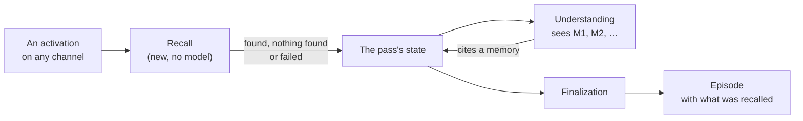

# Recall runs before understanding, and understanding reads what it found

**The question:** how does an activation get the long-term memories that bear
on it to understanding, what does the episode record of that, and how does
understanding cite a memory?

**Recall belongs to the activation, not to a conversation.** Every activation
gets it the same way, whatever channel it arrived on: a typed message, an
email, a calendar change or any later sensor. A conversation is one channel
among them. Nothing in this design reads the channel type.

Milestone: [M39 — Recall into understanding](https://github.com/leonapivato/ai-assistant/milestone/6).
It builds on ADR-0280 (the activation controller, merged `Accepted` from
#2577), and is written against it as it now stands.

## Baseline

- **Wiki:** [Recall](https://github.com/leonapivato/ai-assistant/wiki/Recall),
  [Controller](https://github.com/leonapivato/ai-assistant/wiki/Controller) and
  [Understanding an activation](https://github.com/leonapivato/ai-assistant/wiki/Understanding-an-activation),
  read at wiki revision `f18ccf6`. Recall there is owner direction, not
  ratified. This proposal builds the first cut of it: the recall stage without
  the recall hook.
- **Code:** `main` at `8265b204`, plus the controller ADR-0280 decides.
  - `UnderstandingStage` (`orchestration/understanding.py`) renders the input,
    the channel window (labels `H1…`) and the episode window (labels `P1…`),
    and nothing else.
  - `MemoryStore.search` (ADR-0237) is the relevance read the turn loop already
    uses twice before planning (`loop.py`, the belief composition and the
    episodic supplement). It costs one embedding and a `sqlite-vec` lookup, and
    no model call.
- **ADRs whose clauses this touches:**
  - ADR-0276 §1: the understanding stage receives "no retrieved memory".
    **Superseded** for recalled memory.
  - ADR-0276 §2: a referent's `kind` is `input`, `channel_item` or `episode`.
    It gains a kind for a memory.
  - ADR-0280 §4: `ControllerStage` gains `recall`, `ControllerRule` gains
    `not_recalled`, and the table gains one row. No other row moves.
  - ADR-0280 §5: the fixed defaults gain a failure-tolerant stage (below).
  - ADR-0280 §7: `schema_version` becomes `Literal[4]`, with the format
    marker's advance on the same fresh-state mechanism.
  - ADR-0276 §5: understanding is no longer the first stage to read the input.
    Recall runs before it.
  - ADR-0275 §4: `EpisodeProcessingRecord` gains a field for what recall
    found, with a schema version bump.
  - ADR-0275 §7: "all automatic model-facing episodic reads request
    eligibility `True`". **Superseded for recall**, as ADR-0276 §4 already did
    for the episode window (below).
  - ADR-0275 §9: the trigger's raw input text stays out of automatic model
    inputs. ADR-0276 admitted it to the episode window alone. Recall's
    rendering of a recalled episode needs the same admission.
  - ADR-0237: unchanged. Recall is one more caller of `MemoryStore.search`.

## What the owner has already settled

- **Shape first.** No rabbit holes on specifics; the milestone is about the
  shape.
- **Simple recall search.** Not much should be new. **Episodic and semantic
  memory only**: preferences aren't populated yet, and procedural memory waits
  for the phases after understanding.
- **No recall hook** in this milestone.
- **Forget** over copies already recalled into episodes is not designed here.
  It comes when routing and the memory commands return at the end of the
  controller work.
- **Basic audience and provenance.** Getting them right is a later milestone.
- **Only this stage matters.** Things may break elsewhere, as long as each
  break is listed.

## The change

### Recall is a stage the controller runs

Recall is a new stage in ADR-0280's controller. It is due by one new readiness
rule, **`not_recalled`**: *the recall stage is wired and there is no recall
decision*. The row goes after `route_taken` (3) and before `not_understood`
(4). Rows 1–3 only answer for conversation turns and are there to be retired
(ADR-0280 §2), so on every activation recall is the first stage to read the
input. The rule reads the working set, never the channel type.

Like every ADR-0280 decision, **a recall that found nothing, or failed, is
still a decision**, so the rule never answers twice (ADR-0280 §3). The stage
always records one before it returns.

Recall is the second stage, after understanding, that does exactly one phase's
job and nothing else, so under ADR-0280 §1 it takes the phase's name: the stage
is `recall`, and its entry reads `recall` due `not_recalled`.

It lives in a new module `orchestration/recall.py` as `RecallStage`, holding
an injected `MemoryStore`, the same way the loop holds one. It calls no model.
There is no Protocol: it is one of orchestration's own stages.

### Recall is thin

Recall runs before anything is understood, so all it has are the activation's
raw words. That is a good cue for a long input with content in it, and a poor
one for a short input such as "yes" or "same as before": a similarity search
on those returns noise that looks relevant, and understanding would have to
read past it.

So the first recall adds **only a few items, and only strong matches**. It
leaves room for the two things that do the real work of connecting an
activation to what came before:

- **Short-term memory.** The channel window and the episode window, which
  understanding already reads directly.
- **Later recall with better cues**, once something about the activation is
  known: recall cued by understanding's references and meaning, and the
  candidate stories described under "What it leaves open".

**Nothing found is the normal result for a short input**, not a failure.

### What it searches with, and what it searches

**One cue, one search:** the activation's own words, as the pass holds them.
The channel window is not searched with. Understanding already sees it as
short-term memory, so searching with it mostly repeats that context and adds
loosely related items.

The cue is the same for every activation, whatever channel it came on: a
typed message's words, an email's text, a calendar change's description.

**The search** asks `MemoryStore.search` for episodic and semantic records,
and **requests no eligibility**.

`model_eligible` (ADR-0275 §7) is not an audience or relevance filter. It is a
compatibility flag: it exists so that the model reads from before M36 keep
seeing what they saw (ADR-0276 §4's own reading). It marks newly captured
events, pre-result failures and interruptions as ineligible. Requesting `True`
would hide every episode that arrived on a channel other than the
conversation, which is the channel-centric bias this design avoids. So recall
ignores the flag, as the episode window already does. The data directory is
fresh since M37, so there is no older material the flag still protects.

**What is kept:**

- only records whose relevance score clears a **fixed threshold**;
- not episodes already in the episode window or stored behind a channel window
  item, because understanding already sees them;
- at most a **small cap**, best first.

A record the store returns without a score does not clear the threshold.

**The threshold depends on the embedder.** Scores are cosine similarities, and
they are not comparable between `FastEmbedEmbedder` and `HashingEmbedder`. So
the threshold is not one constant: `RecallStage` takes it as a constructor
argument, and the composition root sets it **for the embedder it wires**,
beside that embedder. The production value is tuned for FastEmbed, and tests
set their own, against the embedder or fake they use. The cap (around 3) is an
ordinary constant beside `UNDERSTANDING_EPISODE_LIMIT`. The threshold should
be set so that a short input normally clears nothing.

**Recall interprets nothing.** It doesn't decide that a memory answers
anything, is out of date or settles a reference. `capped` is unwrapped and not
acted on, as the loop's reads leave it.

### Basic audience and provenance

- **Audience.** The found records pass through the same disclosure predicate
  the two windows already use (`admitted_to_understanding`), before anything
  is kept. On a bounded-audience channel it withholds nothing. On the spoken
  operation's unbounded audience, which ADR-0280 §2 keeps, it withholds every
  record it does not place, silently, as it does for the windows. No rule
  reads the audience. The audience milestone changes the predicate, not the
  stage.
- **Provenance.** Each found item records one of two sources:
  - **the user**;
  - **outside content**: a semantic record that
    `rests_on_recorded_external_content` places there, or an episode whose
    trigger was an informational event.

  Nothing finer (bands, attestation source, who connected it) in this
  milestone.

### What recall adds to the episode

Recall's result is episode content, like understanding versions, so it cannot
live only in ADR-0280's working set, which is never persisted. And ADR-0280
§6's stage entries carry no results. So it is kept the way understanding
versions are:

- **The working set** holds the recall decision, which is what
  `not_recalled` reads.
- **`ActivationState`** holds the recall result, so understanding can read it
  in the same pass.
- **Finalization** copies the result into a new field,
  `EpisodeProcessingRecord.recall`, with `schema_version` at 4 and the format
  marker advanced (ADR-0280 §7's mechanism).

The result is one of three outcomes, and **nothing found is distinct from
failed**:

| Outcome | What it holds |
| --- | --- |
| `found` | The cue, and the found items |
| `nothing_found` | The cue. The search ran and nothing cleared the threshold |
| `failed` | The cue, and the error class. The search raised or timed out |

Each **found item** carries:

- its memory kind, `episodic` or `semantic`;
- its stored id, exactly as stored;
- a short excerpt, bounded like a referent's (240 characters);
- its provenance, `user` or `outside`;
- **how it was found.** In this milestone that is always the search on the
  activation's words. The field exists so that later sources can add items
  to the same record: a search cued by understanding, and candidate stories.

The excerpt is the fact for a semantic record, and the input for an episode. For
an **episode whose input was outside content**, the excerpt comes from its
latest understanding's meaning, never its raw input. If it has no
understanding, the excerpt says only that it was a report received on a named
channel. That way, whoever later reads the record doesn't read outside content
through it.

Rendering and choosing are not repeated in the record: the excerpt is enough
to read it after the memory is deleted, which is what the wiki asks for.

A record whose trigger is a `RecordedResumeTrigger` carries no recall result,
as it carries no stage record, because resume keeps its own path.

### Understanding reads what was found

ADR-0276 §1's "no retrieved memory" is superseded for **recalled memory
only**. Understanding still receives no goal, plan, context-provider state or
memory from any other read.

- **The prompt gains a third labelled section**, `recalled`, with labels
  `M1, M2, …` in recall's order:
  - a recalled **episode** renders with the same projection as an
    episode-window item, including its "a report received" attribution and its
    provisional "understood then";
  - a recalled **semantic record** renders its fact, its recorded time and a
    plain attribution: something the user said, something the assistant worked
    out, or something a source reported.
- **The instruction gains one paragraph:** a recalled memory is what the
  assistant remembers. It is provisional, it may be out of date, and being
  recalled does not make it relevant. Citing an `M` label is `supplied`, like
  any labelled item.
- **When recall found nothing or failed**, the section says so ("missing:
  nothing was recalled" / "missing: recall failed"), in the same way the
  windows already state their absence.
- **Referents.** A cited recalled **episode** resolves to the existing
  `episode` referent: it is the same kind of thing, with the same id space,
  wherever it was found. A cited **semantic record** resolves to a new
  referent kind, **`memory`**, with its stored id, a `source` naming the
  memory kind, and its excerpt.

`understanding_omitted` is unchanged.

### Failure and the deadline

ADR-0280 §5's fixed default ends the pass on any `failed` or `timed_out`
stage, and re-raises. **Recall is the first stage that should not end the
pass:** a memory store that can't be searched shouldn't stop the assistant from
reading its input.

**The mechanism: amend §5 so a stage can declare that it tolerates failure.**
A **failure-tolerant** stage owes two things:

1. **It catches its own failure.** It records its decision (a `failed` recall
   result) before it returns.
2. **It returns the failure rather than raising it.** It returns a
   `StageResult` of `failed` or `timed_out` carrying the error.

For such a result, the controller appends the stage's entry with that outcome
and **carries on evaluating the rules** instead of ending the pass. Because
the decision is present, `not_recalled` doesn't answer again, and understanding
is due next. It is shown the recall section marked as failed.

The alternative is for the stage to catch its error and return `done`. It
needs no amendment, but the stage entry would then read `done` for a recall
that failed, and the record would only be right in the recall field. The
amendment keeps the stage record honest, which is ADR-0280's point.

An error that escapes the stage anyway, such as a bug raising outside its
catch, is an ordinary `failed`: the fixed default applies and the pass ends.
Tolerance covers the failures the stage chose to handle, not everything.

**Two deadlines, kept apart:**

| What ran out | What happens |
| --- | --- |
| **Recall's own budget**, a short timeout inside the stage | Recall records `failed` (timed out), returns `timed_out`, and the pass continues to understanding |
| **The activation's deadline** | The activation ends, as ADR-0280 §5 decides for every stage: the end entry `stage_timed_out`, and the error re-raised |

The controller tells them apart itself: once the pass's deadline has passed,
tolerance does not apply, whatever the stage returned. Recall's budget is the
smaller of its own value and the time the pass has left, so recall can't use
up understanding's time. The budget's value is an ADR detail.

### Outside content as a cue

When an activation's input is outside content, such as an email, it is still a
cue. That doesn't break the two-readers rule: recall calls no model, so nothing
reads the outside content except understanding, which is already allowed to.
The cost is that outside content chooses which memories understanding is
shown. That is acceptable, because understanding only describes and grants
nothing.

### What is expected to break

- **Understanding's prompt changes**, so tests asserting its exact rendering
  are rewritten.
- **The recorded path per activation kind** (ADR-0280 §8's baseline tests)
  gains a `recall` entry wherever `understanding` appears.
- **Episode inspection** shows the new field. On the wire that is a protocol
  version bump (ADR-0280 §7's rule).
- **A store written before this change** is refused at startup, by the format
  marker's advance, as ADR-0280 refused the one before it.
- **Anything that exhaustively matches `UnderstandingReferent.kind`** must
  handle `memory`.

The loop's own relevance reads before planning stay as they are. They are
planning's inputs, and folding them into recall belongs to the milestone that
reshapes planning.

### How it is checked

- **The stage,** against the canonical `MemoryStore` fake:
  - the one search uses the activation's words;
  - the threshold, the cap and dropping window episodes all work;
  - a short input normally records `nothing_found`;
  - the audience predicate is applied;
  - provenance is recorded for each source;
  - an outside episode's excerpt never carries its raw input;
  - `found`, `nothing_found` and `failed` are recorded.
- **The controller,** over fake stages:
  - `not_recalled` makes recall due before understanding;
  - a tolerated `failed` or `timed_out` leads to understanding, with the
    stage entry carrying that outcome;
  - an error escaping a tolerant stage ends the pass;
  - an expired activation deadline ends the pass even from a tolerant stage;
  - no path reaches `stage_repeated`.
- **Understanding,** against the scripted model fake:
  - `M` labels render;
  - a cited recalled episode resolves to `episode`, and a cited semantic
    record to `memory`;
  - the missing and failed sections render.
- **The recorded path** for each activation kind ADR-0280 §8 tests, each
  gaining the same `recall` entry.
- **The gate,** as always.

## Options considered

- **Recall inside the understanding stage.** The stage would search before
  rendering. That is fewer moving parts, but the record would no longer show
  that recall ran or failed separately from understanding. The recall hook
  also needs recall to be its own stage the controller can run again. Rejected.
- **A second search cued by the channel window**, so that a short input still
  finds something. Rejected: understanding already reads the window directly,
  so this mostly adds loosely related items. What connects a short input to
  the past is structure (the story it continues), not similarity (see "What it
  leaves open").
- **A thick first recall**, around 8 items with no threshold. Rejected: before
  understanding, the only cue is the raw words, and on a short input most of
  what comes back is noise that understanding has to read past.
- **One referent kind `memory` for everything recalled, episodes included.**
  It would tell a reader the item came through recall, but the recall record
  already says that. A recalled episode and a window episode would then be the
  same thing under two kinds. Rejected.
- **Recording only the found ids**, without an excerpt. Smaller, but the
  record becomes unreadable once a memory is deleted, and the wiki asks for
  it to stay readable. Rejected.
- **Letting a failed recall end the pass**, ADR-0280 §5's default. Rejected:
  the input can be understood without memories, and a broken store would then
  stop every activation.
- **The stage catching its error and returning `done`**, with no amendment to
  ADR-0280. Rejected: the stage record would say `done` for a recall that
  failed.
- **Recall only for some channels**, such as skipping it for a busy inbox.
  Cheaper, but it makes recall depend on the channel type, and outside content
  is where remembering the sender and the matter helps most. Rejected. If
  volume on some channel makes the cost matter, that is a readiness rule
  added later, not a different shape.

## What it leaves open

- **Candidate stories.** Once stories exist, recall can suggest the stories an
  activation might belong to, one or several, from two places. Both are
  link-following, not extra searches:

  | Where the candidates come from | What it reaches |
  | --- | --- |
  | **The stories of the short-term windows' episodes** | Short replies, such as "yes" or "same as before", that continue what was just happening |
  | **The stories of the episodes the search found** | An older matter named in the words, which only recall can reach before understanding |

  For each candidate, recall can show the story's recent episodes and the
  memories they cited. **Recall suggests candidates. It never chooses:**
  understanding decides whether and how the activation links to one. This is
  what will connect short inputs to long-term memory, because the connection
  is structural, not a matter of similarity. It arrives with the stories
  milestone, as a second source into the same recall record.
- **Recall cued by understanding.** A search built from understanding's
  references and meaning finds far more than raw words do. It is the recall
  hook's first form, and it stays with the hook.

- **Retiring `model_eligible`.** Once recall and the episode window both
  ignore it, only the loop's own reads and the conversation history still
  request it. Removing the flag altogether is its own small change, outside
  this milestone.

- **The recall hook**: searches during processing, contests, and "planning
  waits for a pending run". ADR-0280's controller runs one stage at a time and
  each at most once, so the hook will need a stage that runs alongside the
  others. It will also need the no-progress limit that replaces the loop
  guard. That is for the hook's own decision.
- **Preferences and procedural memory**, when they are populated and when the
  task is named.
- **Forget over recalled copies**, when routing and the memory commands return.
- **Audience and provenance done properly**, in their own milestone.
- **The exact constants** (the production threshold for FastEmbed, the cap,
  the budget), settled in the ADR.
- **Folding the loop's own relevance reads into recall**, in the milestone
  that reshapes planning.
