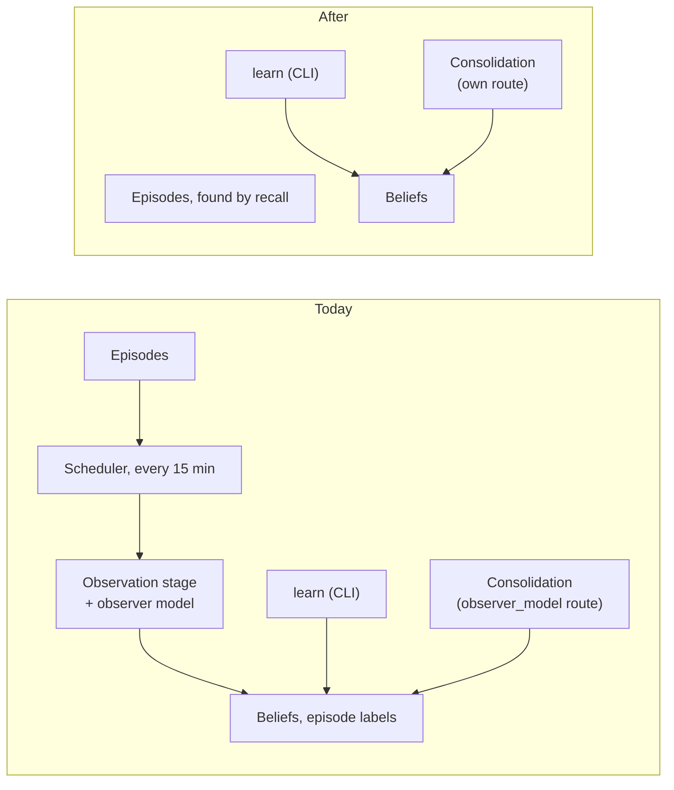

# Retire the current observer, and the benchmark harness with it

**The question.** The observation milestone (#2528) will rebuild observation from
scratch, as an observer plus a coordinator, once episodes carry what it needs. Should
the observer that runs today keep being carried until then?

**The answer proposed.** No. Remove the observer now, together with its schedule,
cursor, settings, surfaces and contracts, and delete the benchmark harness, which
cannot run without it. Until the observation milestone lands, the hub stores what
the user tells it as episodes and finds it again by recall; a belief is written only
when someone asks for one explicitly. Consolidation stays, and its model route gets
a name of its own.

The owner ruled on 2026-10-03 that the in-between state does not matter. Anything
whose only job is to keep the system working until its replacement arrives is
removed when that is cheapest, not maintained. The observer meets that test, and
it is cheap to remove now. Unlike goals, parks and resumes, nothing that will be
rebuilt grows around it. Those three wait for the planning and authorizing phases
to replace the turn loop (#2613, 2026-10-03).

## Baseline

The milestone: [Observation across activation episodes](https://github.com/leonapivato/ai-assistant/milestone/3),
blocked, with the design discussion on #2528. It keeps the observer's job, which is to
interpret supplied episodes and propose evidence-backed beliefs, and gives batching,
progress and retries to a new coordinator. Its stated scope says "no historical
backfill" and "consolidation redesign" is out.

The wiki describes no observer page. [Controller](https://github.com/leonapivato/ai-assistant/wiki/Controller),
read at `dd7d3e4`, names "the observer or consolidation" as what may learn what tells
two contested memories apart. That stays true of the future observer.

The code, at `ee659a12`:

- **The producer.** `learning/observer.py`: `ModelBackedObserver` behind the
  `Observer` Protocol (`core/protocols.py`), with the fake `FakeObserver` in
  `testing/observation.py` and the conformance suite
  `tests/learning/observer_contract.py`. It is the only implementation of
  `ObservationOutcome` and `EpisodeLabelling`.
- **The stage.** `orchestration/observation.py`: `ObservationStage` selects due
  conversations, batches their episodes, calls the observer, routes the proposals
  through the memory-write policy and labels the episodes it read. The engine wraps
  it as `observe` (on the `AssistantEngine` Protocol, so on the wire) and
  `observe_due`.
- **The schedule.** `service/scheduler.py` arms the `observation` job every
  `observation_interval`, which defaults to 15 minutes (ADR-0218 §5).
- **The cursor.** `Conversation.observed_through`, written by
  `ConversationStore.record_observed` (ADR-0212, ADR-0220).
- **The settings.** `observation_interval`, `observation_quiet_window`,
  `observation_max_unobserved_age`, `observation_batch_size`,
  `observation_max_proposals` and `observer_model`.
- **The surfaces.** `assistant observe` in the CLI, `POST /observe` and its button in
  the gateway, and the `observe` and `observe_due` seams in `evaluation/`.
- **The benchmark harness.** `benchmarks/memory/` ingests conversations and distils
  them through `ObservationStage` and `ModelBackedObserver`. Its tests sit under
  `tests/benchmarks/`, which the gate collects. mypy checks `benchmarks/` too.
  Ingest has been unrunnable since ADR-0283 (#2626), and benchmarking is paused.

ADRs it would touch:

- **Whole:** ADR-0077 (the observer proposes beliefs), ADR-0212 (the cursor), ADR-0218
  (quiet window and backstop), ADR-0220 (the contiguous walk) and ADR-0239 (episode
  labels from the pass).
- **In part:**
  - ADR-0162 §1–§2: complete intake, as it applies to the observer;
  - ADR-0222 and ADR-0284: their observer read-back clauses;
  - ADR-0221 §8 and ADR-0283 §11: the observer reading every episode;
  - ADR-0083 §7: the job row;
  - ADR-0085: `observe` in the engine surface;
  - ADR-0120 §6: the observe seams;
  - ADR-0106 §12: consolidation shares the observer's route.

  The benchmark ADRs (0143's batch completer among them) are touched where they assume
  a runnable harness.

## The change

### What goes

- The observer: `ModelBackedObserver`, the `Observer` Protocol, its fake and suite,
  `ObservationOutcome` and `EpisodeLabelling`, and the stage with its report types.
- The engine's `observe` and `observe_due`. Taking `observe` off `AssistantEngine` is
  a breaking change to that Protocol and to the wire, so `PROTOCOL_VERSION` advances.
- The scheduler's `observation` job.
- The cursor: `Conversation.observed_through` and `ConversationStore.record_observed`,
  with the store's column and its fake.
- The `observation_*` settings. The settings ignore unknown names (`extra="ignore"`),
  so a hub environment that still sets them starts as before.
- The CLI `observe` command, the gateway's `/observe` route and button, and the
  evaluation seams.
- The benchmark harness: `benchmarks/` and `tests/benchmarks/`, and their entries in
  `pyproject.toml`. "Stop maintaining" has to mean deleting it, because it imports the
  stage and cannot be skipped into compiling. Its history keeps it, and the observation
  milestone or a resumed benchmark effort can bring back what it needs.

### What stays

- **`learn`**, the explicit write (`learning/processor.py`, `Engine.learn`, the CLI
  command). `learning/` shrinks, but its import-linter contracts stay as they are.
- **Consolidation.** It reuses the observer's model route today, on purpose: ADR-0106
  §12 refused a separate route family while the two shared a job. With the observer
  gone, that route belongs to consolidation alone, and `observer_model` is renamed
  `consolidation_model`.
- **Belief reconciliation** (`memory/_reconciler.py`). Consolidation's proposals,
  which are not user-asserted, still reach it.

### What the user notices

- What they say in conversation is no longer turned into beliefs in the background.
  It is still recorded: every episode keeps the user's words, and recall (ADR-0281)
  finds them. Once step 3 keeps episodes until forgotten, nothing said is lost when
  the 30-day horizon passes. ADR-0162's principle, that what the user tells the
  assistant is recorded, holds through the episode. The distilled layer of beliefs
  returns with the observation milestone.
- The browser and voice have no way to write a belief, because the gateway has never
  offered `learn`. That is accepted as part of the in-between state.
- Episodes get no automatic topic or participant labels. The owner's relabel remains.
  The ADR-0284 proposal also named the episode's belief-shaped fields, topics among
  them, as leaving the episode in step 3.
- The Observe button and the `assistant observe` command go.

## Delivery

One ADR, then lanes, all behind the shared cutover of #2613's steps 2 and 3:

1. **The ADR**, docs only. It supersedes the clauses above, names the Protocol
   removals and the protocol bump, renames the consolidation route, and rules that
   the benchmark harness is deleted.
2. **`benchmarks`**: delete the harness and its tests, and their `pyproject.toml`
   entries. A large deletion, but a trivial review. It lands before lane 4, because the
   harness imports the stage.
3. **`interfaces`**: the CLI command, the gateway route and button.
4. **`orchestration` with `app` and `service`**: the stage, `Engine.observe` and
   `observe_due`, the scheduler job, the composition wiring and the consolidation
   route's rename. `AssistantEngine.observe`, the wire client method, the fake engine
   and `PROTOCOL_VERSION` go in the same change, under ADR-0137 §2's contract-plus-
   primary-implementation widening.
5. **`learning`, `core` and `testing`, a triad**: the observer, the `Observer`
   Protocol, its fake and suite, the observer-only types and the settings.
6. **`memory`, a triad**: the cursor, its column and its contract and fake.
7. **`evaluation`**: the observe seams.

Lanes 5–7 can run in parallel after lane 4.

## Options considered

- **Keep the observer running, at the minimum.** That is what step 2 did (lane 4
  rewired its renderer). Every later change to episodes or memory pays for it again,
  for a component that the milestone replaces whole.
- **Switch it off but keep the code.** Disarm the job, keep everything else. That
  costs almost nothing now, but the code still has to compile and pass its tests
  through every change, which is the cost this proposal removes.
- **Keep the benchmark harness, rewired to `learn`.** The harness measures belief
  distillation. Without the observer it would measure something else, and it would
  still need porting (#2626).

## What it leaves open

- Whether the conversation store drops the `observed_through` column or just stops
  reading it. The data directory is fresh at the cutover either way.
- What happens to `observe` rows that old trace stores still hold (they stay readable
  as history, or the evaluation reads ignore them).
- `BatchCompleter` (ADR-0143) has no consumer besides the harness. Whether it goes too
  is a follow-up issue, not this change.
