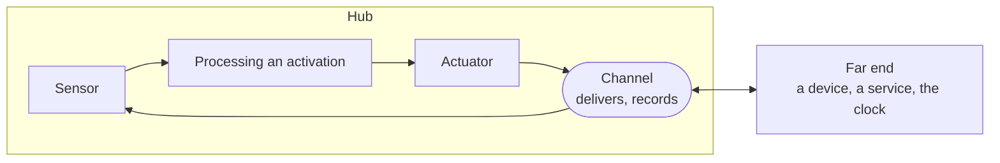

# Sensors and actuators live in the hub

**The question.** Where do sensors and actuators run, what does a channel do between
them and the world, and which directions may a channel kind carry?

This is a general change to the channel model, between ADR-0290 (what a channel is
and where one is needed) and the conversation channel
([#2680](https://github.com/leonapivato/ai-assistant/pull/2680)), which applies it to
one kind. It came out of reviewing the conversation channel with the owner on
2026-10-04: two questions raised there turned out to be about every channel, not the
conversation, so they are settled here first, as ADR-0291 was.

## Baseline

Wiki pages, read at wiki revision
[`b95617b`](https://github.com/leonapivato/ai-assistant/wiki/Channels/b95617b24abc2f1bbef5997ecf4b36eb6056bbc6):
[Channels](https://github.com/leonapivato/ai-assistant/wiki/Channels),
[Sensors](https://github.com/leonapivato/ai-assistant/wiki/Sensors),
[External sensors](https://github.com/leonapivato/ai-assistant/wiki/External-sensors),
[Internal sensors](https://github.com/leonapivato/ai-assistant/wiki/Internal-sensors) and
[Actuators](https://github.com/leonapivato/ai-assistant/wiki/Actuators).

They, and ADR-0290 §3 and §4, place sensors and actuators **by where they run**: an
external sensor or actuator runs on a device outside the hub, an internal one inside
it. The sensor brings input onto a channel; the actuator carries output out from one.
Nothing says which directions a channel kind carries.

| ADR | What it decides today | What this proposal would do |
| --- | --- | --- |
| ADR-0290 §1:3, §1:7 | Every channel has a kind, an identity, and what its kind declares; a kind declares a description and requirements. | Amend: a kind also declares its directions, exactly one of in, out or both (§4). |
| ADR-0290 §3:1 | "A sensor brings new input into the hub, always onto a channel and never to the rest of the hub directly." Its prose places an external sensor on a device. | Supersede: a sensor is in the hub and takes in new input that a channel delivers (§1, §2). |
| ADR-0290 §4:1 | "An actuator carries output out of the hub, always from a channel." Its prose places an external actuator on a device. | Supersede: an actuator is in the hub and puts output on a channel, which delivers it (§1, §2). |
| ADR-0290 §3:2, §4:2–§4:5, §5–§7 | Reading is not sensing; an action uses an actuator iff its output leaves; requirements apply; the actuator reports; a model call is processing; inside actions and hub operations run directly. | Kept as they are. |
| ADR-0291 §1–§3 | A channel is a medium tied to neither end; its record is its own; what it keeps is its kind's choice. | Kept. Recording what crossed is the channel's, which this proposal relies on (§2). |
| ADR-0094 §1–§9 | A spoke is one kind of attachment; "client", "sensor" and "actuator" are profile names no rule may be conditioned on; a spoke dials out, releases before sending, detects but does not distil. | Kept. Every obligation binds the spoke as the channel's far end (§3). The profile names stay vocabulary for spokes and no longer coincide with what this proposal calls a sensor or actuator. |
| ADR-0093 §1, read under ADR-0095 §1 | A `Reader` runs in the hub and reads a source. | Kept. A reader already has the shape of a sensor here; how its channel works stays open (ADR-0290, Consequences). |

## The change

### 1. Sensors and actuators are the hub's

A **sensor** is the hub's part that takes in new input a channel delivers. An
**actuator** is the hub's part that puts output on a channel. Both always run in the
hub, whatever is at the channel's other end.

The planned action asks for one thing: **send this on that channel.** The actuator
does that and nothing more.

### 2. The channel delivers, and records what crossed

The **channel** is what carries input from its other end to its sensor and output
from its actuator to its other end. Where its kind keeps a record (ADR-0291 §3), the
channel records what crossed it, in both directions. Neither the sensor nor the
actuator keeps it.

| Part | Where | Its one job |
| --- | --- | --- |
| Sensor | Hub | Take in new input the channel delivers |
| Actuator | Hub | Put output on the channel |
| Channel | Hub, reaching its other end | Deliver both ways, and record what crossed where its kind keeps a record |
| Far end | A device, a service, or something inside the hub | Whatever is on the other side of the channel |

The actuator reports what happened to the output (ADR-0290 §4:4), and what it can
report is what the channel tells it: that the channel took and recorded the output,
that the service answered, or that the outcome is unknown. What counts as *sent* is
the kind's to declare. For a conversation it is the message being recorded on it,
whether or not any device is showing the conversation at that moment.

### 3. Internal or external is about the far end

"Internal" and "external" stop describing where a sensor or actuator runs and describe
the channel's **far end**:

| Channel | Its far end | In | Out |
| --- | --- | --- | --- |
| A conversation | The user's devices | A message the user typed | A message to the user |
| A timer | The hub's clock | A reminder coming due | None |
| An inbox | A mail server | An email arriving | Optional, the kind's choice |
| A search service | The search provider | The results | The query |
| A desktop spoke ([#1595](https://github.com/leonapivato/ai-assistant/issues/1595)) | The user's computer | What it observes | "Click this", "open that" |

A timer stays on a channel although its far end is inside the hub: new input gets a
channel wherever it comes from, so a reminder is structurally a reminder and never the
user (ADR-0290 §2).

A **device** is a far end and nothing more. It sends what it captured and shows or
does what it is given. ADR-0094's obligations bind it there unchanged: it opens the
connection, releases before sending, and detects without distilling. A device that
carries out an act, such as the desktop spoke clicking a button, is a far end
receiving an instruction from the hub's actuator, not an actuator itself.

### 4. A kind declares its directions, exactly

> A channel kind declares exactly one of: **in only**, **out only**, or **both**.
> Every instance of the kind carries what the kind declares, and no instance varies it.

- **No "any".** A direction that varied by instance would make every rule and every
  planning question about a channel ("can I send here?") depend on which instance it
  is, against ADR-0290 §1:2's "every channel of one kind follows the same rules".
- **Declaring a direction does not oblige using it.** A conversation carries both, and
  one nobody ever types into is still a conversation. A kind declares the most it can
  carry.
- **Where two instances really differ in direction, they are two kinds.** An
  integration whose directions are not known in advance registers as its own kind
  with its own declaration, rather than one catch-all kind.
- **Permission is not direction.** A connected inbox with read-only access is still
  of a kind that carries out; authorizing refuses the send because nothing was
  granted. What a channel can carry is its kind's; what the assistant may do on it is
  authority's.

### 5. A far end uses some of the kind's directions

Within its kind's directions, each far end that reaches a channel may use one or both:
a phone may send into a conversation and show it, a watch may only show it. Which
far ends may reach a channel, and for which direction, is the kind's to declare; the
conversation's rule is in its own proposal.

## Options considered

**Keep sensors and actuators on devices** (ADR-0290 as written). It matches ADR-0094's
profile names. Declined: the parts that apply a kind's rules would sit in device code
the hub does not control, a device would be two things (a far end and an actuator),
and "internal or external" would describe a component's location instead of what the
channel reaches.

**Sensors on devices, actuators in the hub.** Considered on 2026-10-04 while reviewing
the conversation. Declined for the asymmetry: the two halves of the same channel would
be modelled differently for no gain, and a device showing a message would still need a
special word.

**A direction of "any", decided per instance.** Declined (§4): it moves the shape of a
channel from its kind to its instance.

## What it leaves open

- **Where the kind's requirements are applied inside the hub**: by the sensor and
  actuator, or by the channel. This proposal fixes only that they are applied in the
  hub and never left to a far end.
- **Push, doorbell and pull** (ADR-0094 §1:3) are how a far end reaches its channel.
  How each maps onto a sensor taking input in, a pull in particular, is the device
  session's.
- **Readers' channel**, still open from ADR-0290.
- **Terms.** ADR-0094's profile names "sensor" and "actuator" keep their meaning for
  spokes. Whether they should be renamed to stop the clash with this proposal's terms
  is not decided here.
