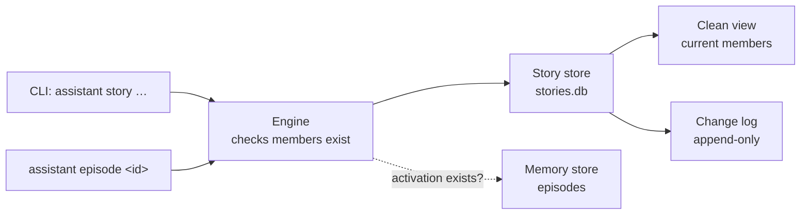

# A story store: which experiences belong to the same matter

**The question.** What does M40 build so the hub can hold stories, as the
[Stories](https://github.com/leonapivato/ai-assistant/wiki/Stories) page describes
them, before any phase reads or writes one?

**The answer proposed.** A store of its own, with a small surface. It holds which
members belong to each story, as a clean view and an append-only change log. Behind it
sit three more things:

- an engine surface over it that checks members exist;
- a CLI group to create, link, unlink, merge, split and show stories;
- the episode detail naming the stories an episode belongs to.

Nothing in processing reads or writes a story. The CLI is the only writer, and the
owner is the only actor the log records.

This is [M40](https://github.com/leonapivato/ai-assistant/milestone/7). The design was
worked out with the owner between 2026-10-02 and 2026-10-04 and is on the wiki as
direction.

## Baseline

The wiki, read at `1ea646c`:

- **[Stories](https://github.com/leonapivato/ai-assistant/wiki/Stories)** says:
  - A story is the assistant's memory of which experiences belong to the same matter.
  - A link says only that a member belongs, who linked it and when.
  - Members are activations' episodes and other stories, and nothing else.
  - A merge keeps the absorbed story's identity. A split moves some members to a new
    story. A link that would close a loop is refused.
  - Each story has a clean view and an append-only change log of identities only,
    with no free text.
  - A story holds no text, no state and no authority.
  - What is learned about a story is a belief about it, kept outside it.
  - Membership changes nothing about who may see an episode.
- **[Episodes](https://github.com/leonapivato/ai-assistant/wiki/Episodes)** says an
  episode exists from admission at `activation:<id>`, is open while its activation
  runs, and is kept until forgotten.

The milestone, as last edited on 2026-10-04:

- **Forgetting stories is delayed** to a later milestone on forgetting, together with
  the deferred cascade to beliefs (ADR-0287 §4).
- **Until then, a forgotten episode leaves its id** in the stories it belonged to, as
  a belief citing it does, and the story view shows that member as forgotten.

The code, at `fd5fd228`:

- **Each store is its own SQLite file** in the data directory, built in
  `app/composition.py` (`deferrals.db`, `parked_reads.db`, `plans.db` and so on),
  behind a Protocol in `core/protocols.py`.
- **An episode is the record at `activation:<activation_id>`** in the memory store,
  written open at admission (ADR-0286 §2). `MemoryStore.get` reaches open episodes
  (§6), so an activation can be checked to exist while it runs.
- **`ActivationLinks`** on the processing record carries the goal, attempt, question
  and park relationships of today's turn loop. It is untouched here. The wiki's
  direction moves those relationships to stories when the planning and authorizing
  phases replace the turn loop.
- **Episode inspection** is `AssistantEngine.episodes` and `episode_chunk`, rendered by
  `interfaces/episode_inspection.py`. An open episode is labelled in progress (ADR-0286
  §11).

ADRs it would touch: none superseded. It adds a store, engine methods and CLI
commands. ADR-0275's `ActivationLinks` stays as it is.

## The change



### The store

A new `StoryStore` Protocol, implemented in `memory/` (stories are memory) on its own
file, `stories.db`.

**A story** has an id (`story:<uuid>`, minted by the store), the instant it was
created, and at most one "merged into" story id. It has no title, summary, state or
owner field. Showing what a story is about is the job of its episodes, and later of a
belief about it.

**A member** is one of:

- an activation, named by its activation id, standing for its episode open or frozen;
- another story, named by its story id.

The store holds identities only. It does not read the memory store, so it never checks
that an activation exists; the engine does (below).

**The clean view** is the current members of each story, each with when it was linked
and by whom. It is kept as its own table, written in the same transaction as the log
line that changes it, so a reader never has to replay the log.

**The change log** is one append-only line per change:

| Field | What it holds |
| --- | --- |
| Sequence | Its place in the log, across all stories |
| Story | The story changed |
| What happened | `created`, `added`, `removed`, `merged_into`, `absorbed`, `split_off` |
| Member | The activation or story added or removed, where there is one |
| The other story | For a merge or split, the story on the other side |
| By whom | A closed enumeration, added to and never renamed. M40 has one member, `owner`. `rule`, `understanding`, `observer` and `consolidation` are added by the milestones that build them. |
| What triggered it | An optional activation id, such as the activation whose understanding made the link. None from the CLI. |
| When | The store's clock reading |

No field holds free text, so the log can never keep content that forgetting would need
to reach.

### Operations

All of them are atomic: either the view and the log both change, or neither does.

- **Create** a story with one or more members. Whether something connects moments is
  the linker's judgment, not the store's: the store does not require two members.
- **Link** a member to a story. Linking a member that is already there changes
  nothing and writes no log line.
- **Unlink** a member. A story left with no members stays, empty, in M40. Removing a
  story is forgetting it, which is delayed.
- **Merge** story A into story B:
  - A's members are added to B, each logged as `added` with B's side of the merge.
  - A is marked as merged into B and logged as `merged_into`, and B logs `absorbed`.
  - Every story that had A as a member has B instead.
  - A keeps its id and its log, takes no new links, and resolves to B when read, so
    anything that names A still finds the matter.
  - Where B was itself a member of A, that link is dropped rather than making B
    contain itself.
  - A merge that would close any other loop is refused.
- **Split** some members off story A into a new story C. They are removed from A and
  added to C, both logged with the other side. C is not made a member of A; the
  linker links it if the smaller matter is part of the larger one.
- **Read a story's view**: its members in the order they were linked, page by page,
  with its "merged into" target where it has one.
- **Read a story's log**, page by page.
- **List stories**, newest first, page by page.
- **Stories of a member**: every story an activation or story belongs to directly.
  This is the reverse lookup that the episode detail, and later the forgetting
  milestone and the readers of beliefs about a story, need.

**No story contains itself.** A link from a story to a story is refused where it
would close a loop, directly or through any chain of stories. The refusal names the
loop. The store does not decide what the loop means, because it cannot tell the cases
apart: the two may be one matter, share only some moments, be two intertwined matters,
or the link may be a mistake. The linker decides.

### The engine

New `AssistantEngine` methods over the store, on the wire, with a `PROTOCOL_VERSION`
advance. Before a write, the engine checks:

- **An activation member has an episode,** open or frozen, through `MemoryStore.get`.
  An activation with no record, never captured or already forgotten, is refused.
- **A story member, or the story written to, exists** and has not been merged. A write
  to a merged story is refused, naming the story it was merged into.

Every write the engine makes records `owner` as the actor, because the CLI is the only
caller in M40.

### The CLI

A `story` command group, for testing rather than as a user feature:

```text
assistant story new <member>…           create a story; prints its id
assistant story link <story> <member>…  add members
assistant story unlink <story> <member>…
assistant story merge <from> <into>
assistant story split <story> <member>… create a new story from these members
assistant story list
assistant story show <story>            the story view
```

A member is written as an activation id or a story id.

**The story view** (`story show`) reuses episode inspection's rendering:

- **Each activation member** is shown by the one-line summary the episode list already
  shows: in progress where its episode is open, and **forgotten** where no record
  exists any more.
- **Each story member** is shown nested under it, to one level, by its id and member
  count, so a reader can `show` it in turn.
- **The change log** follows the members, oldest first: who, what, when.
- **A merged story** shows only the line naming the story it was merged into.

The episode detail (`assistant episode <id>`) gains one line naming the stories the
episode belongs to.

There is no browser or gateway view.

## What a reader of the wiki would find different

Nothing in the design. The [Stories](https://github.com/leonapivato/ai-assistant/wiki/Stories)
page's sources would record the store, merge, split, the loop refusal and the change
log as built, and record that no phase reads or writes a story yet.

## Delivery

An ADR, then three implementation lanes:

1. **`core`, `memory` and `testing`**: the `StoryStore` Protocol, its SQLite
   implementation, its conformance suite and its canonical fake. They are one change,
   as a new Protocol's triad with its primary implementation (ADR-0137 §2).
2. **`orchestration`, `wire` and `app`**: the engine methods and their checks, the
   `AssistantEngine` additions with the fake engine and the wire client, a
   `PROTOCOL_VERSION` advance, and the composition building `stories.db`.
3. **`interfaces`**: the `story` command group, the story view, and the episode
   detail's line.

Lane 2 waits for lane 1, and lane 3 for lane 2.

The deploy adds a file and changes no existing record, so the hub's data directory is
kept.

## Options considered

**Stories in the memory store.** It already holds episodes and beliefs, and a forget
cascade would be one transaction there. Rejected for now:

- The story store is a graph with its own log. The memory store is already the largest
  contract (`MemoryStore` alone is about 1,400 lines of Protocol).
- Forgetting is delayed, so the one transaction it would buy is not needed yet.

The forgetting milestone can revisit this. A separate store is what the owner's
direction already says.

**The store checks members exist.** Rejected, because the story store would have to
be built with the memory store injected, coupling two stores that are otherwise
independent. The engine already holds both, and it already knows how an open episode
is read (ADR-0286 §6).

**The log as the only record, with the view replayed from it.** Rejected, because
every read would replay. Writing both in one transaction keeps them equal.

**A loop refused, or a loop merged automatically.** Owner direction, 2026-10-03: a
loop can mean four different things, and only the linker can tell them apart.

**Planning as M40's first producer.** The milestone's scope names "planning can start
a story, linking the activation it runs in", but the planning phase is not built and
today's turn loop will be replaced rather than extended. So that producer has nothing
to run in. Recommended: drop it from M40's scope. The first producers then arrive with
the planning phase, timers and watches, and understanding, each adding its member to
the "by whom" enumeration.

## What it leaves open

- **Forgetting stories, and forgetting reaching into them.** Delayed to the forgetting
  milestone, with the rules already on the wiki. Until then:
  - forgetting an episode leaves its activation id in its stories;
  - forgetting a conversation does the same for each of its episodes;
  - no story is ever deleted.
- **Readers.** Which phase reads a story, and how much, is that phase's design. The
  store offers members in order, page by page, and the reverse lookup.
- **Beliefs about a story.** They need a belief to be able to name a story as its
  subject. That is the memory side's change, made when observation is rebuilt.
- **Export and backups.** `stories.db` sits in the data directory and goes wherever
  the data directory goes. Whether the owner's export includes stories is left to the
  forgetting milestone, which decides how a story leaves.
- **Members ordered by when they happened, rather than when they were linked.** The
  store keeps link order, because it cannot see episodes. A reader that wants time
  order sorts by each episode's own `occurred_at`.
