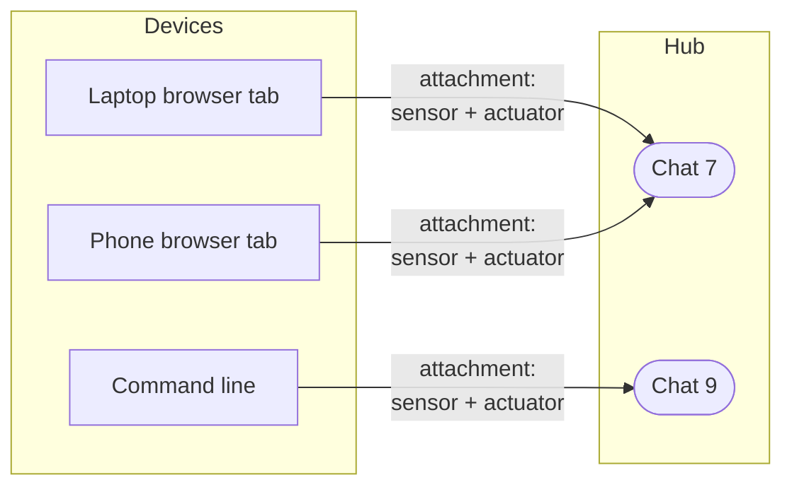
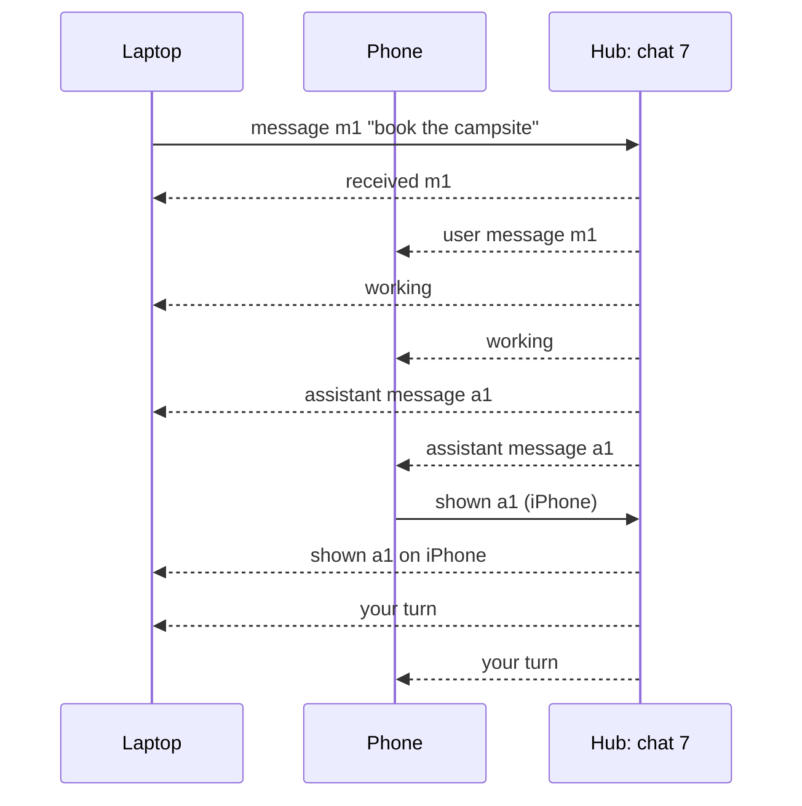

# The text chat channel

**The question.** What is the most basic channel for talking with the user,
text in and text out, once a channel is a medium held by the hub rather than a
name the caller sends with each request?

This is the second of four proposals for the channel redesign
([#2578](https://github.com/leonapivato/ai-assistant/issues/2578)). It applies
the channel model of the first
([#2678](https://github.com/leonapivato/ai-assistant/pull/2678), accepted
2026-10-04 and being converted into ADR-0290): new input arrives on a channel
through a sensor, output that leaves goes out on a channel through an actuator,
and hub operations come from devices with no channel. How a device's connection
carries all this is the third proposal, the device session; how a running
activation is stopped is the fourth.

## Baseline

Wiki pages, read at wiki revision
[`4e47132`](https://github.com/leonapivato/ai-assistant/wiki/Channels/4e47132):
[Channels](https://github.com/leonapivato/ai-assistant/wiki/Channels),
[Channel window](https://github.com/leonapivato/ai-assistant/wiki/Channel-window),
[Push](https://github.com/leonapivato/ai-assistant/wiki/Push),
[External sensors](https://github.com/leonapivato/ai-assistant/wiki/External-sensors),
[Actuators](https://github.com/leonapivato/ai-assistant/wiki/Actuators) and
[Episodes](https://github.com/leonapivato/ai-assistant/wiki/Episodes).

What the code does at `main`, and the ADRs that decide it:

| ADR | What it decides today | What this proposal would do |
| --- | --- | --- |
| ADR-0274 §2–§4, §6 | A `ChannelInput` names its target channel (`conversation`, with the conversation id as instance) and declares the reply it accepts (`ReplyCapability`: whole text, streaming text or spoken); the reply returns on the same request. | Supersede for the text chat: the device attaches to a chat, the message no longer names its channel, and the reply is output on the chat rather than the answer to the request. |
| ADR-0274 §5 | The caller may supply context: history items and a replied-to item, rendered as quoted data. | Drop supplied history for the text chat (the hub holds the window); keep "this replies to item X" as a reference into the window. |
| ADR-0074 | A conversation is a first-class entity; the store mints its id. | Kept. A chat is a conversation; it becomes a channel instance with a lifecycle of hub commands. |
| ADR-0283 §1, §4, §6 | A conversation's history is the episodes on its channel; the conversation store keeps the conversation and its delivery rows, and no history. | Kept and built on: message text stays in the episodes, and the chat's log is rows in the conversation store pointing at them (§4 below). |
| ADR-0286 §2–§4, §6 | An episode opens at admission, each stage appends, the end entry freezes it; an open episode is owner-only and never a model input. | Kept. An assistant message sent mid-activation is appended to the open episode as it is sent. |
| ADR-0173 §1–§3 | A streamed answer is chunks of one reply, and the result frame is still the answer. | Kept in spirit: an actuator may receive pieces, and only the finished message is recorded (§6). |
| ADR-0205 §1, §3 | A spoken answer's delivery is a fact the device reports, stamped once; unreported is never assumed heard. | Generalised to the text chat's *shown* receipt (§7). |
| ADR-0280 §4, row 11 | `reply_owed`: a conversation turn with no composed reply makes `compose` due. | Not amended here. The chat declares that it expects a reply (§8); rewording row 11 to read that declaration waits for the first milestone where an event can reach a reply ([#2598](https://github.com/leonapivato/ai-assistant/issues/2598) item 3). |
| ADR-0170 | A reply is not a tool; the turn composes its answer. | Not decided here ([#2593](https://github.com/leonapivato/ai-assistant/issues/2593)). The chat offers *send a message*; until the phases call it, today's compose stage does (§10). |

Unchanged: the spoken path (`converse_spoken`), which stays fenced at the
channel's edge until voice returns as its own channel; informational events
(`receive`); and every query and command of the engine surface.

## The change

### 1. A chat is a channel instance the hub holds

The text chat is an **activating** channel kind. Each **chat** is one instance:
a conversation in ADR-0074's sense, with the id the store mints. A chat exists in
the hub whether or not any device is attached to it, and outlives every device.

Starting, listing and forgetting chats are **hub operations**, not chat input:
starting and forgetting are commands, listing is a query. Forgetting keeps
ADR-0283 §8's meaning: every episode the chat's channel holds is destroyed.

The chat carries **text only**: one message in is text, one message out is text.

### 2. Devices attach

A device reaches a chat by **attaching** to it. An attachment is a sensor, an
actuator, or both, bound to one chat:

- A device may hold many attachments, each to its own chat: a browser gateway
  holds one per open tab.
- A chat may have many attachments, from any devices: a phone and a laptop can be
  in the same chat at once.
- The hub admits an attachment only for an admitted device and a chat that
  exists. That check is where "which chat" is decided; nothing typed into a
  message can move it to another chat.
- An attachment carries a **label** the device declares, such as "iPhone" or
  "laptop browser". It is shown to the user and used in receipts, and it grants
  nothing.

Which chat a person types into is the interface's choice: a chat list in the
browser, `assistant chat --conversation <id>` on the command line.

### 3. A message in

A message from an attached sensor carries its text and a **message id the
device chose**. It names no channel; the hub takes the chat from the attachment
it arrived on.

- **Sending is safe to repeat.** A device that does not know whether its message
  arrived sends it again with the same id, and the hub treats a repeat as the
  same message: one admission, one episode.
- **Received.** When the hub has admitted the message and opened its episode
  (ADR-0286 §2), the chat records *received*, and the device can show its
  message as no longer *sending*.
- **A reply reference.** A message may name one earlier item of the chat it
  replies to, as a reference into the window. Supplied history is gone: the hub
  holds the chat's window (ADR-0276 §3, ADR-0283 §4).

### 4. The chat's log

Every chat keeps a **log**: the ordered list of what happened on it, which every
attached device follows and catches up from.

| Entry | What it records |
| --- | --- |
| A user message | Its message id, the attachment it came from, and its episode |
| An assistant message | Its episode, and the user message it replies to, if any |
| Received | The hub admitted a user message |
| Shown | An attachment reports an assistant message was on screen, and when |
| Working / your turn | An activation on this chat started / ended |
| Couldn't finish | An activation ended without sending anything, and the fixed message that went out instead |

**Entries carry sequence numbers the hub assigns**, increasing across every chat
the hub holds. A device follows any set of chats with **one cursor**: "the last
entry I have is N". Reconnecting, it asks for everything after N in the chats it
follows. A cursor too old to replay in full is answered with a **snapshot** of
each chat's recent window, then new entries from there.

**The log holds no message text of its own.** The text of every message, both
directions, is in the episodes, where it already is today: a user message is the
input its episode opened with, and an assistant message is appended to its
episode as it is sent. The log's rows live in the conversation store beside its
delivery rows, which is already the store that holds late facts about an episode
because episodes are frozen (ADR-0068, ADR-0283 §6). A device reads the text
through the episode a row names.

Two things follow:

- **Forgetting stays whole.** Forgetting a message or a chat destroys the
  episodes; the log's rows that point at them go with them, and no second copy
  of the text is left behind.
- **The log is a view a device follows, not a second history.** Understanding
  still reads the chat's window from its episodes, as today.

### 5. A message out

An assistant message is output on the chat: the action **send a message**,
carried by the chat's actuator. When it runs:

1. the message is appended to the activation's open episode;
2. an *assistant message* entry is logged;
3. it is pushed to every attachment with an actuator that is connected.

**The action is done when steps 1–3 have happened.** Whether anyone saw it is a
later fact (§7) and never holds the activation up. An activation may send more
than one message: "looking into it" and then the answer.

An assistant message may name the user message it replies to. Planning sets it;
an interface may show it.

### 6. Streaming

An actuator may declare that it takes a message in pieces. It is then sent the
pieces as they are produced and the finished message at the end. **Only the
finished message is recorded.** A stream cut off before the end is recorded as
cut off, with the text that was sent, and is never recorded as a complete
message.

### 7. Receipts

- **Received** (§3) is the hub's own fact.
- **Shown** is reported by an attachment's actuator when the message was on
  screen. It is recorded once per attachment, with the attachment's label and the
  time. An assistant message nobody has reported is *not shown yet*, never
  assumed seen: ADR-0205 §1's rule, extended from speech to text.
- **Read** is not part of this proposal; it needs a signal no device gives yet.

Receipts are log entries, so every device sees them: "shown on iPhone" appears on
the laptop too.

### 8. What the chat declares

- **Its description**, given to planning: a private text chat with the user, in
  which the user's own messages are input that carries their authority, and which
  expects a reply, a question or a notice to each of them.
- **Its requirements**, enforced by rule whatever a model produces:
  - **Audience: the owner only.** What may be said on the chat is what may be
    said to the owner (ADR-0199). An attachment may declare a narrower audience,
    never a wider one; a chat that others can see is a different kind.
  - **Size.** A message in or out is bounded; an input over the bound is refused
    rather than cut.
  - **Turns** (§9).

### 9. Turns

**The user may send when no activation on this chat is running.**

- The assistant may send any number of messages during its activation. The
  user's turn opens when the activation ends.
- *Working* and *your turn* are log entries, so every attached device locks and
  unlocks its input together.
- A message sent while an activation runs is **refused**, not queued, with a
  status the interface can show. Queuing would break the alternation, and
  deciding whether a new message should take over the running work is the
  concurrency milestone's.
- **An activation that ends having sent nothing sends the fixed message**: it
  could not finish, listing any effects that did happen. A user's turn never
  opens on silence.

Stopping a running activation is a hub command, the fourth proposal's subject.
Interrupting or cancelling with words is out of scope.

### 10. Until the phases send messages

Under the wiki's direction, planning chooses *send a message*, authorizing
checks it and acting runs it. None of that is built, and whether a reply is
delivered as an action is open (#2593). So the first build uses an **adapter**:
the reply today's compose stage produces is sent as one assistant message on the
chat, and the adapter sends the fixed message when a pass ends without one.

The chat therefore works before the phases are rebuilt, and the controller work
replaces the adapter without changing the chat.

### What the engine surface becomes

- `converse` and `converse_streaming` are replaced, for the text chat, by
  attaching to a chat, sending a message, and following the chat's log. How
  those travel to a device is the device session proposal's; this proposal
  fixes what they are.
- `recent_conversations` and `conversation` remain queries; `forget_conversation`
  remains the command that forgets a chat; starting a chat becomes a command of
  its own instead of a side effect of the first `converse`.
- A new query reads a chat's log after a cursor, and a new command reports
  *shown*.

These are changes to `AssistantEngine` and to the conversation store's
Protocol, so the ADR this becomes is a contract change: its triad (Protocol,
conformance suite, canonical fake) lands in one change with the store's primary
implementation (ADR-0137 §2).

## Options considered

**The log as its own store with the message text in it.** Simplest to read:
one place holds the transcript as the user saw it. Declined because the text
would then exist twice, in the log and in the episodes, and every forgetting
path would have to reach both; a missed copy is a forgotten message that is
still on disk.

**One cursor per chat instead of one per device.** Simpler sequence numbers,
but a device following ten chats would track ten cursors and make ten catch-up
requests. A hub-wide sequence gives a device one number and one request.

**Queue a message sent while the assistant works.** Friendlier in the moment,
but the queued message would be processed against a reply the user had not seen
when they wrote it, and the order of turns would no longer be the order of the
log. Declined until the concurrency milestone can judge takeovers.

**Keep the reply on the request.** No transport change at all. Declined: the
reply would reach only the device that sent the message, input and output stay
welded, and "any order" would need a second cutover later.

## Out of scope

Voice, and the spoken path generally; interrupting or cancelling with words;
messages the assistant starts on its own, and merging notifications into the
chat; editing or unsending a message; composing while offline; typing
indicators; more than one person in a chat; a native phone app and push
notifications; and [#2520](https://github.com/leonapivato/ai-assistant/issues/2520)'s
question of separate chats versus one continuous one. One chat stays one channel
instance.

## What it leaves open

- **Naming.** Today's channel type is `conversation`. Whether the kind keeps
  that name or becomes `chat` is a naming choice for the ADR; this proposal says
  "chat" for readability.
- **Retention of log rows.** Rows go when their episodes are forgotten (§4).
  Whether *received*, *shown* and turn entries are kept as long as the episodes
  they name, or trimmed sooner, is left to the ADR.
- **Snapshot size.** How much of a chat's window a snapshot carries.
- **What a device sees of an open episode.** A user's own message and the
  assistant's sent messages are shown at once; the rest of an open episode stays
  owner-only inspection (ADR-0286 §6). Whether anything else of a running
  activation is shown in the chat (a progress line, for example) is left open.
