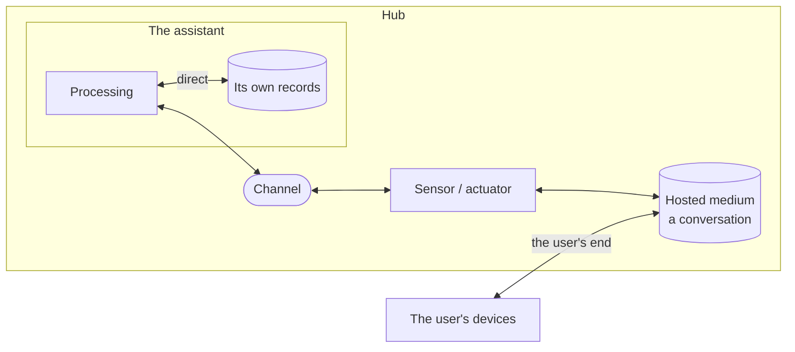

# The assistant's end of a channel

**The question.** Where does a channel run: between the assistant and its sensors and
actuators, or between them and the world? And what follows for what a device is, what
a channel keeps, and where a conversation's text lives?

This is a general change to the channel model, between ADR-0290 (what a channel is
and where one is needed) and the conversation channel
([#2680](https://github.com/leonapivato/ai-assistant/pull/2680)), which applies it to
one kind. It came out of reviewing the conversation channel with the owner on
2026-10-04: the questions raised there turned out to be about every channel, so they
are settled here first, as ADR-0291 was. It reverses most of ADR-0291, decided the
same day, for the reason given under "Why ADR-0291 changes".

## Baseline

Wiki pages, read at wiki revision
[`b95617b`](https://github.com/leonapivato/ai-assistant/wiki/Channels/b95617b24abc2f1bbef5997ecf4b36eb6056bbc6):
[Channels](https://github.com/leonapivato/ai-assistant/wiki/Channels),
[Channel window](https://github.com/leonapivato/ai-assistant/wiki/Channel-window),
[Sensors](https://github.com/leonapivato/ai-assistant/wiki/Sensors),
[External sensors](https://github.com/leonapivato/ai-assistant/wiki/External-sensors) and
[Actuators](https://github.com/leonapivato/ai-assistant/wiki/Actuators).

Today a channel is drawn as the medium itself, held by the hub, with devices as its
presence outside. ADR-0290 §4's prose counts a device that shows a reply as an
external actuator (*"An external actuator is on a device and shows or says what it is
given"*), and ADR-0291 gives each channel a record of its own, which for the chat is
the chat's text.

| ADR | What it decides today | What this proposal would do |
| --- | --- | --- |
| ADR-0290 §1:1 | A channel is held by the hub; *"a device that reaches a channel is that channel's presence outside the hub"*. | Amend the second sentence: a device is the assistant's organ or a party's end of a medium (§3). |
| ADR-0290 §1:3, as amended by ADR-0291 | A channel has a window only where its kind offers one, read from the channel's record. | Supersede: the window is read from the hosted medium where there is one, otherwise from the channel's episodes (§6). |
| ADR-0290 §1:7 | A kind declares a description and requirements. | Amend: a kind also declares its directions (§4) and its medium (§2). |
| ADR-0290 §2:1, §6:1 | Input and output cross *"the hub's edge"*; reading *"the hub's own records"* is direct. | Amend: the edge is the assistant's, and the records read directly are the assistant's own. A hosted medium is outside the assistant though it runs in the hub (§2). |
| ADR-0290 §3, §4 | A sensor brings input onto a channel and an actuator carries output from one; either runs in the hub or on a device. | Kept, normative clauses and location reading alike. One sentence of §4's prose is corrected: a device showing a medium to its party is not an actuator (§3). |
| ADR-0291 §1–§7 | A channel's record is its own, separate from memory; what it keeps is its kind's choice; forgetting never reaches it; deleting from it is the user's command; it is the user's data. | Supersede. Channels keep nothing (§5). The rules about forgetting, deleting and the user's data are carried over to hosted media (§5). |
| ADR-0283 §1:2 | *"A channel's order is its episodes' numbers, ascending."* ADR-0291 limited it to a channel's episodes. | Restated for every channel: a channel's history is its episodes, in that order. A hosted medium's own order is its kind's. |
| ADR-0094 §1 | *"A client carries a person, a sensor reads the world, an actuator acts on it"*, as profile names for a spoke; no rule may be conditioned on them. | Kept, and it now lines up with §3: a party's end of a medium is what ADR-0094 calls a client. No rule here is conditioned on a spoke's profile name; the kind's declaration decides. |

## The change

### 1. A channel is the assistant's line to its sensor or actuator

A **sensor** is where the assistant perceives a medium; an **actuator** is where it
acts or speaks into one. The **channel** runs from the sensor or actuator to the
assistant. The **medium** is on the sensor's or actuator's far side: the room, the
air, a mail system, a chat.

```text
the assistant ═══ channel ═══ sensor / actuator ─── medium ─── the world
```

This is how ADR-0290 §3:1 and §4:1 already read: a sensor brings input *onto* a
channel, and an actuator carries output *from* one. The channel is on the
assistant's side of both.

What the channel is for is unchanged: the hub states its identity, so where input
came from is structural; its kind's requirements apply to what goes out on it; its
actuator reports what happened. Its kind still **describes the medium** at the far
end, "a private chat with the user" or "a speaker anyone in the room hears", which is
where its description, audience and expectations come from.

| Channel | Sensor or actuator | Runs | Medium on the far side |
| --- | --- | --- | --- |
| A conversation | Reading the chat; writing into it | Hub | The conversation, hosted by the hub |
| A timer | Noticing a moment has come | Hub | The clock |
| A search or email service | Making the call; taking the answer | Hub | The provider |
| A camera or microphone | The device, as the assistant's eye or ear | Device | The room |
| A room speaker | The device, as the assistant's mouth | Device | The room's air |
| A desktop spoke ([#1595](https://github.com/leonapivato/ai-assistant/issues/1595)) | The device, as the assistant's hand and eye | Device | The user's computer |

### 2. The edge is the assistant's

ADR-0290 places channels at *"the hub's edge"*. The edge that matters is the
**assistant's**: the hub runs things that are not the assistant, such as the clock and
any medium it hosts. The assistant's own records (its memory, goals, stories,
grants) are inside the edge and read directly, as ADR-0290 §6 says. A medium the hub
hosts is outside it, on the same machine.

A **hosted medium** is a medium the hub holds itself, so that both the assistant and
another party read and write it there. The conversation is the first. A kind whose
medium is hosted declares so.



### 3. A device is the assistant's organ, or a party's end of a medium

A device is one of two things, and the channel's kind says which:

- **The assistant's organ**: the sensor or actuator itself, on a device. The camera is
  the assistant's eye, the speaker its mouth. Whoever is in range perceives what the
  speaker says.
- **A party's end of a medium**: the user's phone in a conversation. The user writes
  from it and reads on it. It is not the assistant's sensor or actuator, and it does
  not reach the assistant's channel: it reaches the medium.

This corrects one sentence of ADR-0290 §4's prose. A device that **says** what the
assistant gives it into a room is an actuator. A device that **shows** a party the
medium they share with the assistant is that party's end, not an actuator.

The difference decides audience:

- On an **organ**, the audience is whoever perceives it: a room speaker's is unbounded
  (ADR-0199 §1).
- On a **medium**, it is whoever holds an end of it, which the kind's own rules
  decide. For the conversation, the user chooses which devices are theirs on it.

### 4. A kind declares its directions, exactly

A channel kind declares exactly one of: **in only**, **out only**, or **both**. Every
instance of the kind carries what the kind declares, and no instance varies it.

- **No "any".** A direction that varied by instance would make every rule and every
  planning question about a channel ("can I send here?") depend on which instance it
  is, against ADR-0290 §1:2's "every channel of one kind follows the same rules".
- **Declaring a direction does not oblige using it.** A conversation carries both,
  and one nobody ever types into is still a conversation. A kind declares the most it
  can carry.
- **Where two instances really differ in direction, they are two kinds.** An
  integration whose directions are not known in advance registers as its own kind.
- **Permission is not direction.** A connected inbox with read-only access is still of
  a kind that carries out; authorizing refuses the send because nothing was granted.

A party's device may use one direction or both: a phone may write into a conversation
and read it, a watch may only read it.

### 5. Channels keep nothing; a hosted medium keeps its own content

A channel keeps no record. Everything a channel record would have held is already held
elsewhere:

| What | Where it is held |
| --- | --- |
| A conversation's text | The conversation, the hosted medium |
| What the assistant perceived and did on any channel | Its episodes (memory) |
| An email's content | The mail server, the medium; the assistant's reading of it is in episodes |
| A search's query and results | The activation's episode |

ADR-0291's rules move from a channel's record to a **hosted medium**:

- **Separate from memory.** A hosted medium is not the assistant's memory. Recall does
  not search it and consolidation does not read it. One message can be both in the
  conversation and in an episode; they answer different questions and are never kept
  in step.
- **What it holds is its kind's.** Its shape, order, retention, and whether it can be
  deleted from, are declared by the kind.
- **Forgetting never reaches it.** Forgetting is the assistant's act on its own memory.
  Forgotten content can come back through the window (§6), as a person who forgot a
  night can still find the texts they sent (owner, 2026-10-04); the interface shows
  that rather than hiding it.
- **Deleting from it is the user's command** (ADR-0290 §7), on the medium, where its
  kind allows it. The assistant has no action that deletes from a hosted medium.
  Deleting does not forget.
- **It is the user's data.** It is Tier 1 data under ADR-0004 §1, viewable, exportable
  and deletable under ADR-0004 §6; deleting the user's data purges it whole, whatever
  its kind's retention. It inherits its kind's audience requirements.

### 6. The window

Understanding's "what came before on this channel" is read:

- **from the hosted medium**, where the channel's medium is hosted: the sensor brings
  the recent part of the medium in alongside the new input, so it crosses the edge on
  the channel like everything else from the medium; and
- **otherwise from the channel's episodes**, in their order (ADR-0283 §1), a direct
  read of the assistant's own memory.

A kind declares how much its window holds.

## Why ADR-0291 changes

ADR-0291 was right that a conversation's text is not the assistant's memory. It put
the text on the channel because the channel was then drawn as the chat itself. With
the channel as the assistant's line to the medium (§1), the text belongs to the
medium, and a separate channel record would hold nothing that the medium or the
episodes do not. What ADR-0291 protected, forgetting not reaching the text, deletion
by the user alone, and the user's right to their data, is kept, on the hosted medium.

## Options considered

**The channel is the medium** (the wiki's drawing, and ADR-0291's reading). It works
where the hub holds the medium, as with the chat, but not where the medium is a room
or a mail system the hub cannot hold. It would need two meanings of "channel".

**Every device that shows or says output is an external actuator** (ADR-0290 §4's
prose). Declined: it makes the user's own phone the assistant's organ, so who sees a
conversation would be a fact about the assistant's outputs rather than about who is in
the conversation.

**Sensors and actuators always run in the hub** (this proposal's first draft). Declined
(owner, 2026-10-04): a camera is the assistant's eye and a speaker its mouth.

**Channels keep a record where their kind chooses** (ADR-0291). Declined (owner,
2026-10-04): under §1 it would hold nothing the medium or the episodes do not.

**A direction of "any", decided per instance.** Declined (§4).

## What it leaves open

- **Media the hub does not host**, such as an email thread or a messaging app group:
  whether each thread is a channel instance or one inbox channel carries many is each
  kind's.
- **One conversation across media.** Talking aloud in the kitchen and continuing by
  text is two media; what connects them is memory (episodes, recall, stories), not a
  conversation above channels. [#2520](https://github.com/leonapivato/ai-assistant/issues/2520)
  stays open.
- **Readers' channel**, still open from ADR-0290.
- **The kinds that exist today.** Informational events and the quarantined spoken path
  keep nothing, and the conversation keeps reading its history from its episodes
  (ADR-0283 §4:1), until the conversation channel's ADR makes it a hosted medium.
