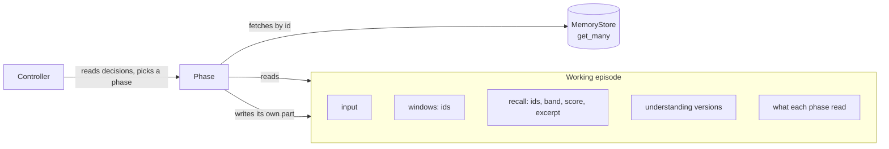

# Phases are functions of the working episode

**The question.** How should the phases of an activation hand each other what they
found, so that no phase knows about another or about the workflow, and the record
of the pass shows what actually happened?

**The answer proposed.** Each phase reads the working episode and writes only its own
part of it. The working episode holds decisions and references (stored memory ids),
not copies of memory contents. A phase that needs a memory's contents fetches it by
id, and records what it fetched. The first two uses: the windows are assembled onto
the working episode before recall, and recall's result shrinks to ids.

## Baseline

Wiki, read 2026-09-29:

- [Controller](https://github.com/leonapivato/ai-assistant/wiki/Controller): "It
  only reads … everything it decides on is what the phases have added to the
  episode", and "What a phase is given is assembled by the hub".
- [Episodes](https://github.com/leonapivato/ai-assistant/wiki/Episodes): "A log,
  read through current views", direction, not ratified (owner, 2026-09-29).
- [Recall](https://github.com/leonapivato/ai-assistant/wiki/Recall) and
  [Understanding an activation](https://github.com/leonapivato/ai-assistant/wiki/Understanding-an-activation).

ADRs, at `d974519b`:

- ADR-0276 §4: the episode window is produced by "one orchestration-local
  **episode selector** that the composition root wires into the stage". The
  understanding stage calls it while building its prompt.
- ADR-0281 §3 (recall's searches and limit), §6 (the saved `ActivationRecall`),
  §7 (understanding renders what recall kept, and a record already in a window is
  rendered only there).
- ADR-0280 §3 (rules read decisions) and ADR-0275 §8 (an episode is written once,
  when processing ends).

Issues: #2598 (one shared working set; item 1 landed in M39 as `_ActivationPass`),
#2591 (recall running again as the episode gains cues), #2601 (recall threshold).

## What M39 showed

On the redeployed hub (`d974519b`), "My dentist is Dr Rao." followed, in a new
conversation, by "Remind me, who is my dentist?" recorded `Recall: found` with the
Dr Rao episode. But understanding shows both found episodes as `P1` and `P2`: they
were already in the episode window, so recall added nothing. Three things in the
build cause this.

1. **The episode window is fetched inside understanding, after recall.** Recall
   cannot avoid what the window holds, because when recall runs the window does
   not exist yet. Overlap is detected afterwards, when understanding drops an `M`
   record already shown as `P`.
2. **Recall's slots are filled before the overlap is known.** Each band's search
   asks the store for `RECALL_ITEM_LIMIT` (3) results and filters afterwards. When
   the window's episodes are the closest matches, they take the slots, and a
   fourth, useful match is never returned.
3. **Recall's result exists twice.** The working set holds `Recalled.records` (the
   full records, for this pass only) beside `ActivationRecall` (the summary that is
   saved). The engine passes the full records to understanding as an argument. What
   understanding acts on is not what the episode records.

A related cause is not this proposal's to fix: every episode is stored with source
`observed`, so every episode is in the derived band and searched last. Facts produced
by consolidation are what recall is meant to find first.

## The change

### The rule

- **A phase is a function of the working episode.** It reads what it needs from the
  working episode, does its work, and writes its result into its own part. It knows
  nothing of any other phase or of the order phases run in. The controller decides
  which phase runs; the hub runs it over the working episode.
- **One writer per part.** Each part of the working episode has exactly one phase
  that writes it. Anyone may read it. A phase that runs again adds a result beside
  the earlier one, as understanding adds versions, rather than overwriting.
- **References, not copies.** Where a phase's result is about stored memories, the
  working episode holds their stored ids, with the few fields needed to read the
  record later without the memory: kind, band, excerpt and, for recall, the score.
  Content that arrived with the activation (the input, supplied context) is already
  in the working episode and needs no id.
- **Fetch what you need, and record it.** A phase that needs a memory's contents
  fetches it with `MemoryStore.get_many`, which exists, so `MemoryStore` gains no
  member. The phase records in its own part which ids it fetched and which were no
  longer there. A fetch returns the memory's current version. A memory changed or
  forgotten since it was found is normal, not an error: a forget made mid-pass is
  honoured.
- **Audience at entry.** An id enters the working episode only after the audience
  rules have admitted it, as recall and the window already apply them today. A phase
  fetches only ids the working episode holds, so fetching by id never bypasses the
  audience rules.

With this, the working episode is the log the Episodes page describes: each phase's
result, in order, with what it read. What is saved at capture is taken from it, and
what a phase acted on and what the episode records are the same thing.

### First use: the windows before recall

Window assembly becomes its own step, due before recall. It writes the channel
window and the episode window's ids onto the working episode. The episode selector
(ADR-0276 §4) moves from inside the understanding stage to this step, unchanged: the
same bound, the same recency order, the same audience predicate.

Understanding stops fetching. It reads the window ids from the working episode,
fetches the records, and renders them exactly as today.

### Second use: recall reduced to ids

Recall reads the episode window's ids from the working episode, and **searches past
them**. Each band's search asks for `RECALL_ITEM_LIMIT` plus the window's size, drops
what the window holds, and keeps up to `RECALL_ITEM_LIMIT`. Recall then writes
`ActivationRecall` and nothing else: `Recalled.records` goes away.

Understanding reads recall's ids from the working episode and fetches them with the
windows' ids in one `get_many`. The rule that a record already in a window is shown
only there stays, but it now rarely has anything to do.

`RecalledItem` gains the score. It records why a memory was kept, which is what
tuning the threshold needs (#2601).

## Options considered

**How phases get their inputs.**

- *Arguments, as today.* The engine reads the working set and passes each stage its
  inputs. It keeps each stage testable on its own, but every new phase needs engine
  wiring, phases can fetch out of sight (the window), and a phase rerunning on new
  cues (#2591) has no natural way to see what is new.
- *The working episode holds full records.* Phases read contents straight from it.
  Nothing is fetched twice, but the working episode then carries a second copy of
  memory that is not what the episode saves, which is the double record above.
- *Ids, and fetch what you need (proposed).* One record of what happened, and a
  fetch costs one local `get_many`. The cost is that a phase sees the current
  version, not the one found. That is handled by recording what was fetched.

Stages keep testable cores either way: each stage's logic still takes explicit
inputs, and a thin adapter reads them from the working episode and writes the result
back. The adapter is what the controller runs.

**How recall searches past the window.**

- *Exclude ids in the query.* Exact, but `MemoryStore.search` gains a parameter: a
  Protocol change, with its own ADR merged first (golden rule 5).
- *Ask for more, then drop (proposed).* No contract change. The window holds at
  most `UNDERSTANDING_EPISODE_LIMIT` (10) episodes, so the extra rows are few.
- *Search only episodes older than the window.* The window is a count, not a time
  span, so the cut would be approximate.
- *Search semantic records only.* The cleanest split, but recall would find nothing
  until consolidation produces facts, and episodes it has not consolidated would be
  unreachable.

## How much change this is

The rule itself changes no code. It governs new phases, and the legacy stages
(routing, goal association, the turn loop, driving a step, composing, the event
summary) retire as #2598 describes rather than being rewritten to it.

Its two first uses are all in `orchestration`, with no Protocol change:

| Piece | Size |
| --- | --- |
| Window assembly as a step before recall, with its controller rule | New stage and rule; the selector moves, unchanged |
| Understanding reads ids and fetches | `_brief` loses its selector call; the rendering is unchanged |
| Recall searches past the window and writes only ids | Over-fetch and drop; `Recalled.records` removed |
| Engine | The working set gains the window part; the understanding adapter reads ids |

There are two ways to deliver it:

- **Without a schema change (recommended now).** The window ids and "what each phase
  read" live on the working episode in memory, and the saved episode is unchanged.
  One ADR, then about two orchestration PRs. No protocol bump and no fresh data
  directory.
- **With the log saved.** The processing record also saves the window ids, what each
  phase fetched, and recall's scores. That is the audit made durable, but it is a
  schema cutover (processing record 5, episode format 5, a protocol bump, a fresh
  data directory): M39's five-PR shape again.

The recommendation is the first now, and the saved log folded into the next
milestone that owes a cutover anyway. The planner work consuming understanding is
the likely one.

## What it leaves open

- Whether window assembly is a controller stage with its own rule, which gives it an
  entry in the stage record, or part of preparing the pass. A stage is proposed,
  because it is then recorded like any other step. Its failure takes the fixed
  default, as a failed window fetch inside understanding does today.
- The value of `RECALL_ITEM_LIMIT` once the window no longer takes its slots, tuned
  with the threshold under #2601.
- Recall running again on understanding's cues (#2591). This proposal is what it
  builds on: a rerun reads what the working episode holds now.
- How later phases, the planner first, read understanding and recall. They follow
  the same rule, but what they read is the planner design's question.
- Which parts of the working episode each future phase writes. The rule is one
  writer per part; the parts are named as the phases are designed.
